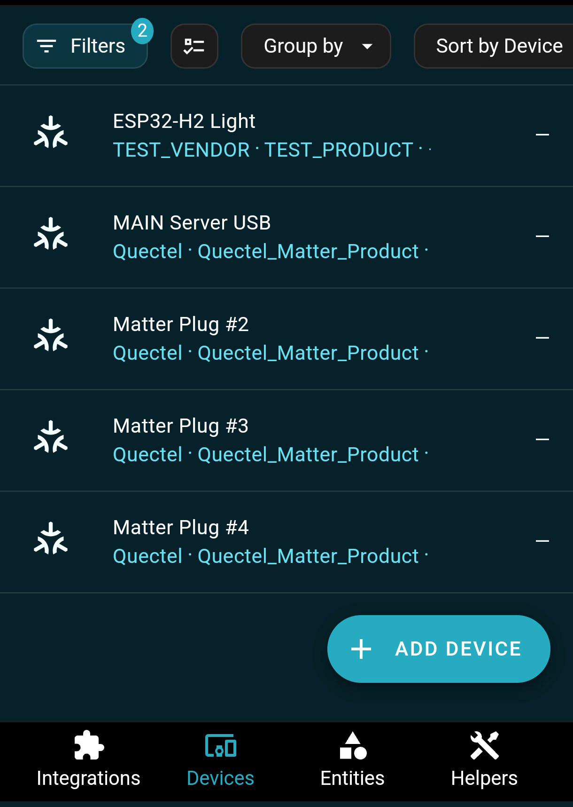
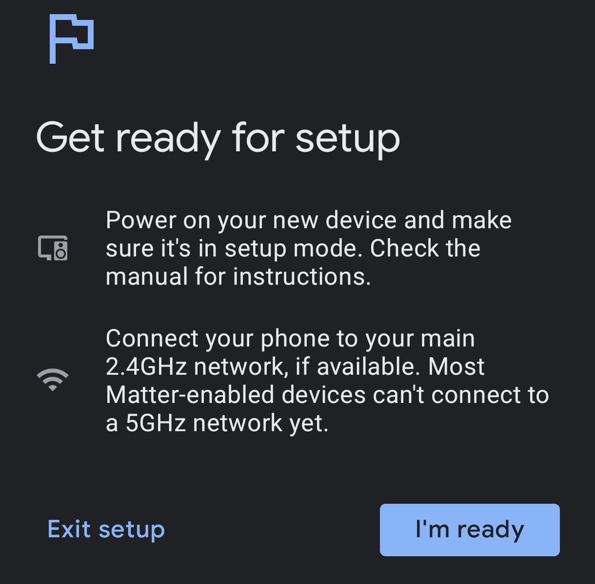

# Home Assistant Integration
https://docs.espressif.com/projects/esp-thread-br/en/latest/codelab/home_assistant.html  

## Installation (Ubuntu Desktop 22.04 on Raspberry Pi 4B+)
- RaspberryPi 4B+ flash with Ubuntu 22.04.5 LTS Desktop
- Prerequisites
~~~
apt install apparmor bluez cifs-utils curl dbus jq libglib2.0-bin lsb-release network-manager nfs-common systemd-journal-remote udisks2 wget -y
~~~
*The "systemd-resolved" should be removed from the default list - there is no package like this*
~~~
curl -fsSL get.docker.com | sh
~~~
- get the last version https://github.com/home-assistant/os-agent/releases like "os-agent_N.N.N_linux_aarch64.deb"
*Here: N.N.N = 1.7.2 (as an example)*
~~~
dpkg -i os-agent_1.7.2_linux_aarch64.deb
~~~
- get "homeassistant-supervised.deb" from https://github.com/home-assistant/supervised-installer/releases/, but ver 2.0.0
~~~
sudo BYPASS_OS_CHECK=true dpkg -i --ignore-depends=systemd-resolved ./homeassistant-supervised.deb
~~~
Run Home Assistant: http://localhost:8123/  

## Install Portainer
~~~
sudo docker pull portainer/portainer-ce:latest
sudo docker run -d -p 9000:9000 --name=portainer --restart=always -v /var/run/docker.sock:/var/run/docker.sock -v portainer_data:/data portainer/portainer-ce:latest
~~~
Run portainer: http://localhost:9000/  
  
  
  
  
  
  
  
  
  
  
  
  
  
  
  
  
  
  
  
  
  
  
  
  
  
  
  