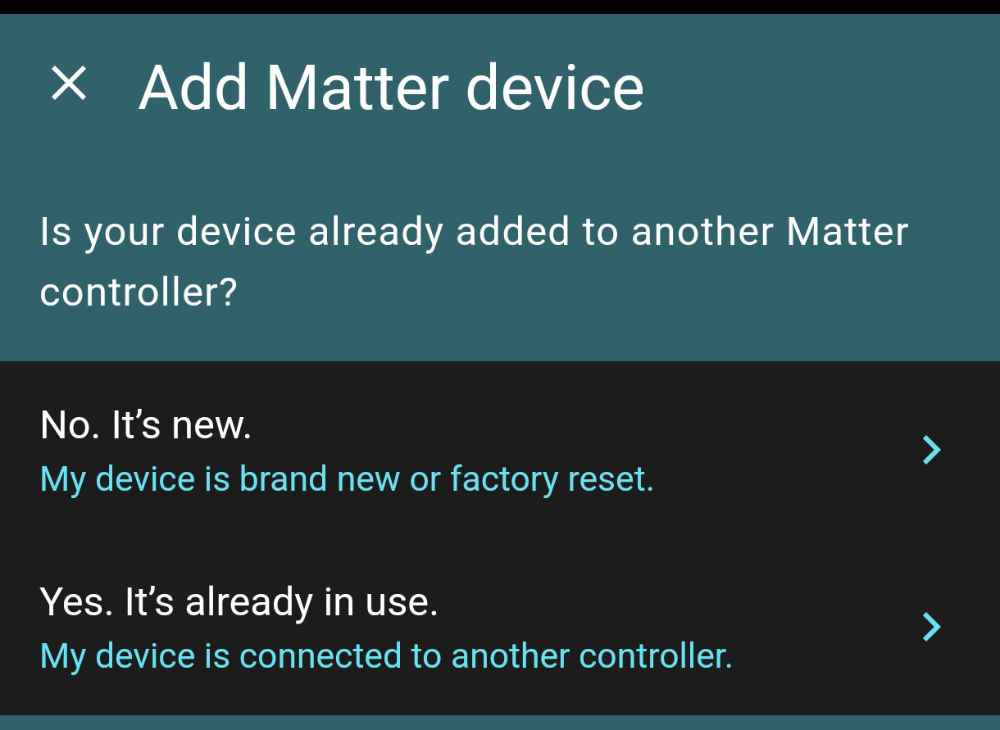
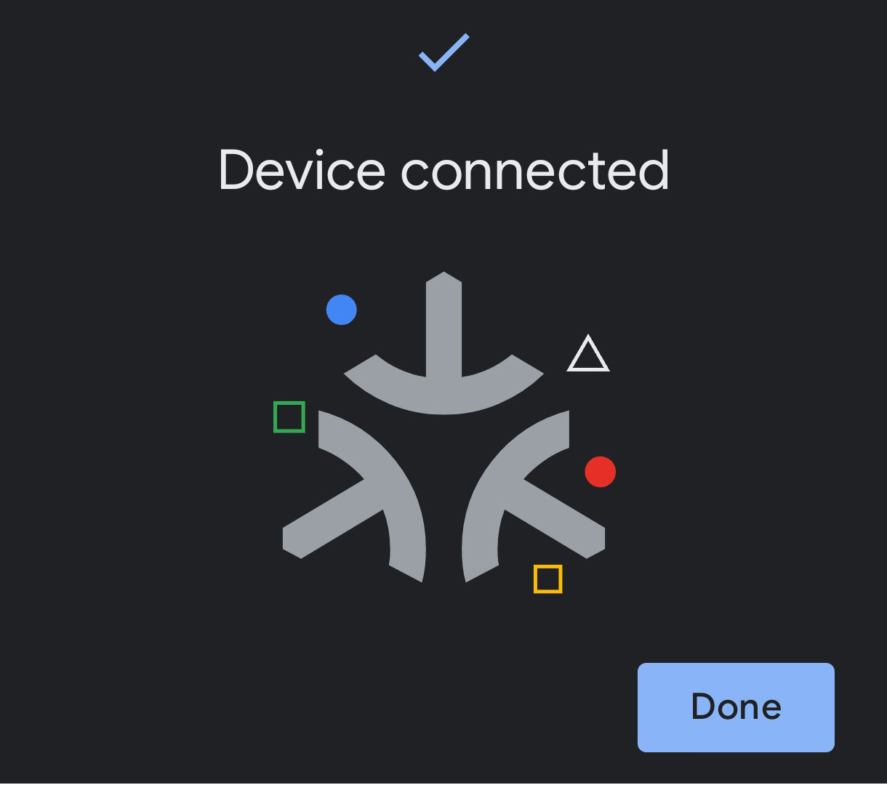
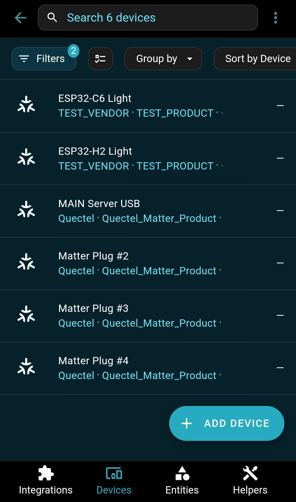

# Home Assistant Integration
https://docs.espressif.com/projects/esp-thread-br/en/latest/codelab/home_assistant.html  

  
  
  
  
  
  
  
  
  
  
  
  
  
  
  
  
  
  
  
  
  
  
  
  
  
  