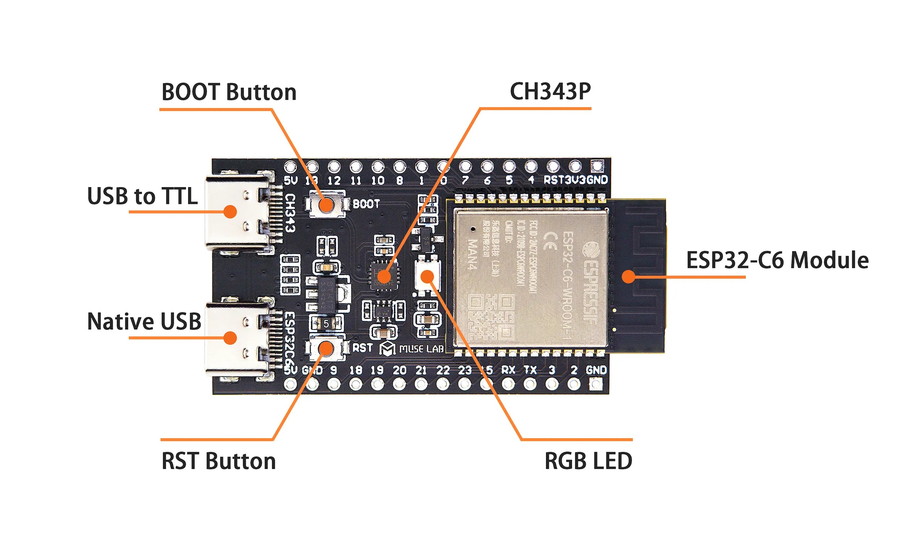

# How to setup and work with Matter Controller
[https://docs.espressif.com/projects/esp-matter/en/latest/esp32/developing.html#matter-controller](https://docs.espressif.com/projects/esp-matter/en/latest/esp32/developing.html#matter-controller)  
[https://github.com/espressif/esp-matter/tree/main/examples/controller](https://github.com/espressif/esp-matter/tree/main/examples/controller)  

# 1. Build

The sdkconfig file sdkconfig.defaults.otbr is provided to enable the OTBR feature on the controller.
~~~
cd ~/esp-matter/examples/controller
idf.py -D SDKCONFIG_DEFAULTS="sdkconfig.defaults.otbr" set-target esp32s3 build
idf.py -p /dev/ttyACM0 erase-flash flash monitor
~~~

# 2. Init and Start the Thread network

Connect the controller to Wi-Fi network with the device console  
*Syntax:* ***matter esp wifi connect {ssid} {password}***
~~~
matter esp wifi connect MIKE_WIFI_24 MIKE_WIFI_PSWD
~~~

Initializing a new Thread network dataset and commit it as the active one
~~~
matter esp ot_cli dataset init new
matter esp ot_cli dataset commit active
~~~

Getting the operational dataset TLV-encoded string. The {dataset_tlvs} will be printed.
~~~
matter esp ot_cli dataset active -x
~~~
> 0e08000000000001000000030000144a0300001435060004001fffe002080a9f6e962bfaf9880708fdded0b37370c3f60510b7078e7ab3c4c3624b10968aa9338f2e030f4f70656e5468726561642d613537300102a5700410f88938966f178b3876174a63b8639a220c0402a0f7f8

Starting the Thread network
~~~
matter esp ot_cli ifconfig up
matter esp ot_cli thread start
~~~
Check Thread Border Router state
~~~
matter esp ot_cli state
~~~
> leader

# 3. Pair and Control

Pairing the Thread end-device  
*Syntax:* ***matter esp controller pairing code-thread {node_id} {dataset_tlvs} {payload}***  
- {node_id} : randomly chosen value  
- {dataset_tlvs} : dataset value from request "dataset active -x"  
- {payload} : matter QR code  
~~~
matter esp controller pairing code-thread 1234 0e08000000000001000000030000144a0300001435060004001fffe002080a9f6e962bfaf9880708fdded0b37370c3f60510b7078e7ab3c4c3624b10968aa9338f2e030f4f70656e5468726561642d613537300102a5700410f88938966f178b3876174a63b8639a220c0402a0f7f8 34970112332
~~~
If the command fails:
> E (5440899) chip[CTL]: Discovery timed out  
> E (5440899) chip[BLE]: BleConnectionDelegate::CancelConnection is not implemented.  
> E (5440899) chip[-]: Error CHIP:0x0000002D at src/controller/SetUpCodePairer.cpp:687  

If the command is successfully executed:
> I (7784199) chip[CTL]: Successfully finished commissioning step 'ReadCommissioningInfo'  
> I (7784299) chip[CTL]: Successfully finished commissioning step 'ArmFailSafe'  
> I (7784399) chip[CTL]: Successfully finished commissioning step 'ConfigRegulatory'  
> I (7784399) chip[CTL]: Successfully finished commissioning step 'ConfigureTCAcknowledgments'  
> I (7784699) chip[CTL]: Successfully finished commissioning step 'SendPAICertificateRequest'  
> I (7784999) chip[CTL]: Successfully finished commissioning step 'SendDACCertificateRequest'  
> I (7785299) chip[CTL]: Successfully finished commissioning step 'SendAttestationRequest'  
> I (7786649) chip[CTL]: Successfully finished commissioning step 'AttestationVerification'  
> I (7786649) chip[CTL]: Successfully validated 'Attestation Information' command received from the device  
> I (7786649) chip[CTL]: Successfully finished commissioning step 'AttestationRevocationCheck'  
> I (7786899) chip[CTL]: Successfully finished commissioning step 'SendOpCertSigningRequest'  
> I (7787229) chip[CTL]: Successfully finished commissioning step 'ValidateCSR'  
> I (7787739) chip[CTL]: Successfully finished commissioning step 'GenerateNOCChain'  
> I (7787999) chip[CTL]: Successfully finished commissioning step 'SendTrustedRootCert'  
> I (7788349) chip[CTL]: Successfully finished commissioning step 'SendNOC'  
> I (7788449) chip[CTL]: Successfully finished commissioning step 'ThreadNetworkSetup'  
> I (7788549) chip[CTL]: Successfully finished commissioning step 'FailsafeBeforeThreadEnable'  
> I (7790099) chip[CTL]: Successfully finished commissioning step 'ThreadNetworkEnable'  
> I (7790099) chip[CTL]: Successfully finished commissioning step 'kEvictPreviousCaseSessions'  
> I (7795379) chip[CTL]: Successfully finished commissioning step 'kFindOperationalForStayActive'  
> I (7795389) chip[CTL]: Successfully finished commissioning step 'ICDSendStayActive'  
> I (7795389) chip[CTL]: Successfully finished commissioning step 'kFindOperationalForCommissioningComplete'  
> I (7795519) chip[CTL]: Successfully finished commissioning step 'SendComplete'  
> I (7795519) chip[CTL]: Successfully finished commissioning step 'Cleanup'  
> I (7795529) chip[CTL]: Commissioning complete for node ID 0x00000000000004D2: **success**  
> I (7795529) pairing_command: Commissioning **success** with node 66291657CE65E808-4D2  

*Note: Be sure to check the {dataset_tlvs} value before attempting to pair the Thread Border Router with end devices by sending the following command:*
~~~
matter esp ot_cli dataset active -x
~~~
> 0e08000000000001000000030000144a0300001435060004001fffe002080a9f6e962bfaf9880708fdded0b37370c3f60510b7078e7ab3c4c3624b10968aa9338f2e030f4f70656e5468726561642d613537300102a5700410f88938966f178b3876174a63b8639a220c0402a0f7f8

Control the Thread end-device on the device console (On/Off cluster Toggle command)
*Syntax:* ***matter esp controller invoke-cmd {node_id} {endpoint_id} {cluster_id} {command_id} {command_data>}***  
- {node_id} : NodeId chosen for the end device during pairing
- {endpoint_id} : EndPointId (1 for this example)
- {cluster_id} : ClusterId (6 for OnOff cluster)
- {command_id} : CommandId (2 for Toggle command)
  
Send the command "Turn Off" (command_id = 0)
~~~
matter esp controller invoke-cmd 1234 1 6 0
~~~
If the command fails:
> I (6214639) chip[DIS]: Resolving 66291657CE65E808:00000000000004D2 ...  
> I (6214639) chip[DIS]: Lookup started for 66291657CE65E808-00000000000004D2  
> E (6259639) chip[DIS]: OperationalSessionSetup[1:00000000000004D2]: operational discovery failed: 32  

If the command is successfully executed:
> I (8633409) chip[DIS]: Found an existing secure session to [1:00000000000004D2]!  
> I (8633499) chip[DMG]: Received Command Response Status for Endpoint=1 Cluster=0x0000_0006 Command=0x0000_0002 Status=0x0  
> I (8633509) cluster_command: Send command success  
  
Send the command "Turn On" (command_id = 1)
~~~
matter esp controller invoke-cmd 1234 1 6 1
~~~
Send the command "Toggle" (command_id = 2)
~~~
matter esp controller invoke-cmd 1234 1 6 2
~~~
  
Read OnOff state  
*Syntax:* ***matter esp controller read-attr {node_id} {endpoint_ids} {cluster_ids} {attr_ids}***
- {node_id} : NodeId chosen for the end device during pairing
- {endpoint_ids} : EndPointId (1 for this example)
- {cluster_ids} : ClusterId (6 for OnOff cluster)
- {attr_ids} : AttributeId (0 for OnOff attribute)
~~~
matter esp controller read-attr 1234 1 6 0
~~~
If the command is successfully executed:
> I (4102064) chip[TOO]: *Endpoint:* **1** *Cluster:* **0x0000_0006** *Attribute* **0x0000_0000** DataVersion: 1171748968  
> I (4102064) chip[TOO]:   *OnOff:* **TRUE**  
> I (4102064) read_command: read done  
  
Unpair end device using its {node_id}:
~~~  
matter esp controller pairing unpair 1234  
~~~
> I (20907279) chip[DMG]: Received Command Response Data, Endpoint=0 Cluster=0x0000_003E Command=0x0000_0008  
> I (20907279) chip[CTL]: Remove Current Fabric succeeded.  
> I (20907279) pairing_command: Succeeded to remove fabric for remote node 0x4d2  

# Thread End Device (ESP32-C6):
[Example: ~/esp-matter/examples/light](https://github.com/espressif/esp-matter/tree/main/examples/light)  
This example is implemented using the ESP32-C6 development board.  

~~~
matter esp ot_cli factoryreset
matter onboardingcodes none
~~~
> QRCode:            MT:Y.K90-Q000KA0648G00  
> QRCodeUrl:         https://project-chip.github.io/connectedhomeip/qrcode.html?data=MT%3AY.K90-Q000KA0648G00  
> ManualPairingCode: 34970112332  

Check End Device state
~~~
matter esp ot_cli state
~~~
> router

Pressed BOOT button (LED on the board set to OFF):
> I (454109) app_driver: Toggle button pressed  
> I (454109) esp_matter_attribute: R : Endpoint 0x0001's Cluster 0x00000006's Attribute 0x00000000 is 1  
> I (454109) esp_matter_attribute: W : Endpoint 0x0001's Cluster 0x00000006's Attribute 0x00000000 is 0  
> I (454109) led_driver_ws2812: led set r:0, g:0, b:0  
