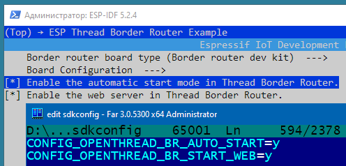

URL: [https://github.com/mozolin/matter-thread](https://github.com/mozolin/matter-thread)  
# How to setup and work with OpenThread Border Router
[How_to_setup_and_work_with_OpenThread_Border_Router.pdf](How_to_setup_and_work_with_OpenThread_Border_Router.pdf)  

[https://docs.espressif.com/projects/esp-thread-br/en/latest/dev-guide/build_and_run.html](https://docs.espressif.com/projects/esp-thread-br/en/latest/dev-guide/build_and_run.html)  
[https://openthread.io/guides/border-router/espressif-esp32](https://openthread.io/guides/border-router/espressif-esp32)  
[https://openthread.io/codelabs/esp-openthread-hardware](https://openthread.io/codelabs/esp-openthread-hardware)  
 
  
Note: Only the USB2 port on the ESP Thread Border Router Board needs to be connected to the host.

~~~
D:
cd /Espressif/esp-idf
./export.bat
cd ..
git clone --recursive https://github.com/espressif/esp-thread-br.git
~~~

Build the esp-idf/examples/openthread/ot_rcp example. The firmware doesn't need to be explicitly flashed to a device. It will be included in the Border Router firmware and flashed to the ESP32-H2 chip upon first boot (or the RCP firmware changed).
~~~
cd /Espressif/esp-idf/examples/openthread/ot_rcp
idf.py set-target esp32h2
idf.py build
cd /Espressif/esp-thread-br\examples\basic_thread_border_router
idf.py set-target esp32s3
idf.py menuconfig
~~~

 

 

~~~
idf.py -p COM3 build flash monitor
~~~

Now we can form a Thread network using the OpenThread command line on ESP Thread Border Router Board (BR Commissioner):
~~~
dataset init new
~~~
Done

~~~
dataset
~~~
Active Timestamp: 1  
Channel: 21  
Channel Mask: 0x07fff800  
Ext PAN ID: 151975d11bea97b5  
Mesh Local Prefix: fd6a:b54b:d6a3:b05a::/64  
Network Key: 731ab6a60a64a0a0b14b259b86b2be01  
Network Name: OpenThread-1444  
PAN ID: 0x1444  
PSKc: 54e7f18d2575014da94db09df29c5df0  
Security Policy: 672 onrc 0  
Done  
  
Commit this dataset as the active one:
~~~
dataset commit active
~~~
Done  
  
Bring up the IPv6 interface:
~~~
ifconfig up
~~~
I (59329) OPENTHREAD: Platform UDP bound to port 49153  
Done  
I (59329) OT_STATE: netif up  
  
Start Thread protocol operation:
~~~
thread start
~~~
I(61709) OPENTHREAD:[N] Mle-----------: Role disabled -> detached  
Done  
I(62469) OPENTHREAD:[N] Mle-----------: Attach attempt 1, AnyPartition reattaching with Active Dataset  
I(69079) OPENTHREAD:[N] RouterTable---: Allocate router id 11  
I(69079) OPENTHREAD:[N] Mle-----------: RLOC16 fffe -> 2c00  
I(69089) OPENTHREAD:[N] Mle-----------: Role detached -> leader  
I(69089) OPENTHREAD:[N] Mle-----------: Partition ID 0x28b518c6  
I (69099) OPENTHREAD: Platform UDP bound to port 49154  
  
After a moment, check the device state. It should be the Leader.
~~~
state
~~~
leader  
Done  
