# Working with ESP-MATTER in Windows Subsystem for Linux (WSL)

The dataset for this [OpenThread Border Router](https://openthread.io/codelabs/esp-openthread-hardware#2) looks like  
The same information can be found in an original [manual](https://docs.espressif.com/projects/esp-thread-br/en/latest/dev-guide/build_and_run.html#configure-esp-thread-border-router) from Espressif.
~~~
dataset active -x
~~~
> 0e080000000000010000000300001a4a0300001635060004001fffe002083dd5846a27dd139f0708fdec29c2f04b4b23051045005945ef9dbed88082d208673dad0f030f4f70656e5468726561642d3562393101025b9104109855950ef75071da53e996c50694576a0c0402a0f7f8

The length of the dataset string id 222 chars.  
It surely works with an example of [End Device](https://openthread.io/codelabs/esp-openthread-hardware#4) from the same manual.  
~~~
dataset set active 0e080000000000010000000300001a4a0300001635060004001fffe002083dd5846a27dd139f0708fdec29c2f04b4b23051045005945ef9dbed88082d208673dad0f030f4f70656e5468726561642d3562393101025b9104109855950ef75071da53e996c50694576a0c0402a0f7f8
~~~
> I(27097) OPENTHREAD:[N] Mle-----------: RLOC16 9800 -> fffe  
> I(27317) OPENTHREAD:[N] Mle-----------: Attach attempt 1, AnyPartition reattaching with Active Dataset  
> I(28197) OPENTHREAD:[N] Mle-----------: RLOC16 fffe -> 5401  
> I(28197) OPENTHREAD:[N] Mle-----------: Role detached -> child  
> I(28227) OT_STATE: Set dns server address: FD8A:FD34:7273:2::808:808  
> I(83637) OPENTHREAD:[N] Mle-----------: RLOC16 5401 -> 9800  
> I(83637) OPENTHREAD:[N] Mle-----------: Role child -> router  
> I(83637) OPENTHREAD:[N] Mle-----------: Partition ID 0x6b2a7b8e  
~~~
state
~~~
> router

When we parse this dataset using [tlv-parser.py](D/utils/tlv-parser) we can get the following info:  
> t:  0 (CHANNEL), l: 3, v: 0x00001a  
> t:  2 (EXTPANID), l: 8, v: 0x3dd5846a27dd139f  
> t:  3 (NETWORKNAME), l: 15, v: b'OpenThread-5b91'  
> t:  4 (PSKC), l: 16, v: 0x9855950ef75071da53e996c50694576a  
> t:  5 (NETWORKKEY), l: 16, v: 0x45005945ef9dbed88082d208673dad0f  
> t:  7 (MESHLOCALPREFIX), l: 8, v: 0xfdec29c2f04b4b23  
> t: 12 (SECURITYPOLICY), l: 4, v: 0x02a0f7f8  
> t: 14 (ACTIVETIMESTAMP), l: 8, v: 0x0000000000010000  
> t: 53 (CHANNELMASK), l: 6, v: 0x0004001fffe0  
> ***t: 74 (APPLE_TAG_UNKNOWN), l: 3, v: 0x000016***  

But it does not work with an example of [End Device](https://github.com/espressif/esp-matter/tree/main/examples/light)
~~~
matter esp ot_cli dataset set active 0e080000000000010000000300001a4a0300001635060004001fffe002083dd5846a27dd139f0708fdec29c2f04b4b23051045005945ef9dbed88082d208673dad0f030f4f70656e5468726561642d3562393101025b9104109855950ef75071da53e996c50694576a0c0402a0f7f8

TMP> matter esp ot_cli factoryreset
TMP> matter esp ot_cli dataset set active 0e080000000000010000000300001a4a0300001635060004001fffe002083dd5846a27dd139f0708fdec29c2f04b4b23051045005945ef9dbed88082d208673dad0f030f4f70656e5468726561642d3562393101025b9104109855950ef75071da53e996c50694576a0c0402a0f7f8
~~~
> Error 7: InvalidArgs

This example needs having the dataset length 12 chars shorter, the length of the dataset string must be 210 chars.
~~~
matter esp ot_cli dataset set active 0e080000000000010000000300001a4a0300001635060004001fffe002083dd5846a27dd139f0708fdec29c2f04b4b23051045005945ef9dbed88082d208673dad0f030f4f70656e5468726561642d3562393101025b9104109855950ef75071da53e996c50694576a
~~~
> I(6396760) OPENTHREAD:[I] Settings------: Saved ActiveDataset
> I(6396760) OPENTHREAD:[I] DatasetManager: Active dataset set
> I(6396760) OPENTHREAD:[I] Notifier------: StateChanged (0x100fc110) [MLAddr KeySeqCntr Channel PanId NetName ExtPanId NetworkKey PSKc ActDset]
> I(6396770) OPENTHREAD:[I] AnnounceSender: StartingChannel:26

This run unsuccessful, but without any errors.  
So, we pair the End Device using the Thread Router network key.  
Get the network key from the Border Router:
~~~
networkkey
~~~
> 45005945ef9dbed88082d208673dad0f

Set this network key to the End Device, commit this dataset as the active one, bring up the IPv6 interface, start Thread protocol operation and check the state of the End Device:
~~~
matter esp ot_cli dataset networkkey 45005945ef9dbed88082d208673dad0f
matter esp ot_cli dataset commit active
matter esp ot_cli ifconfig up
matter esp ot_cli thread start
matter esp ot_cli state
~~~
> child

The same length of dataset string (210) is provided by an another example of [OpenThread Border Router](https://openthread.io/codelabs/openthread-border-router#1)
~~~
sudo ot-ctl dataset active -x
~~~
> 0e080000000000010000000300001235060004001fffe002083d3818dc1c8db63f0708fda85ce9df1e662005101d81689e4c0a32f3b4aa112994d29692030f4f70656e5468726561642d35326532010252e204103f23f6b8875d4b05541eeb4f9718d2f40c0302a0ff
> Done
~~~
dataset set active 0e080000000000010000000300001235060004001fffe002083d3818dc1c8db63f0708fda85ce9df1e662005101d81689e4c0a32f3b4aa112994d29692030f4f70656e5468726561642d35326532010252e204103f23f6b8875d4b05541eeb4f9718d2f40c0302a0ff
~~~
> Done

When we parse this dataset using [tlv-parser.py](D/utils/tlv-parser) we can get the following info:  
> t:  0 (CHANNEL), l: 3, v: 0x000012  
> t:  1 (PANID), l: 2, v: 0x52e2  
> t:  2 (EXTPANID), l: 8, v: 0x3d3818dc1c8db63f  
> t:  3 (NETWORKNAME), l: 15, v: b'OpenThread-52e2'  
> t:  4 (PSKC), l: 16, v: 0x3f23f6b8875d4b05541eeb4f9718d2f4  
> t:  5 (NETWORKKEY), l: 16, v: 0x1d81689e4c0a32f3b4aa112994d29692  
> t:  7 (MESHLOCALPREFIX), l: 8, v: 0xfda85ce9df1e6620  
> t: 12 (SECURITYPOLICY), l: 3, v: 0x02a0ff  
> t: 14 (ACTIVETIMESTAMP), l: 8, v: 0x0000000000010000  
> t: 53 (CHANNELMASK), l: 6, v: 0x0004001fffe0  

As we can see, there is no tag named "APPLE_TAG_UNKNOWN" in this example!
This tag can also be found after parsing the Home Assistant dataset in its Thread integration. According to the comments inside the "tlv-parser.py" script code, this tag can be "seen in a dataset imported through iOS companion app"...  

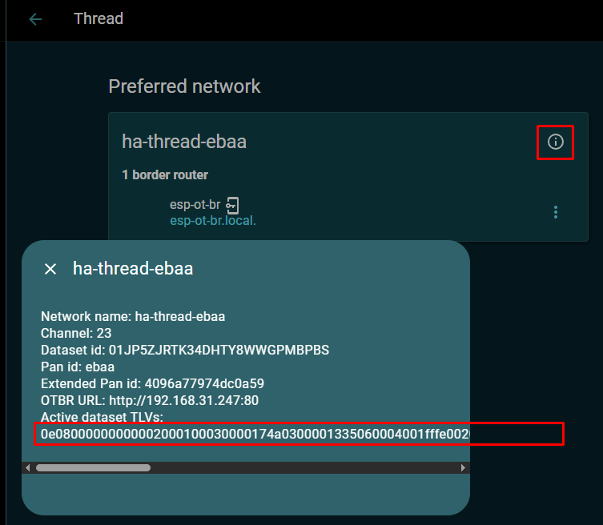

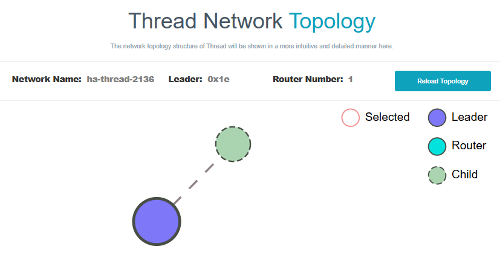
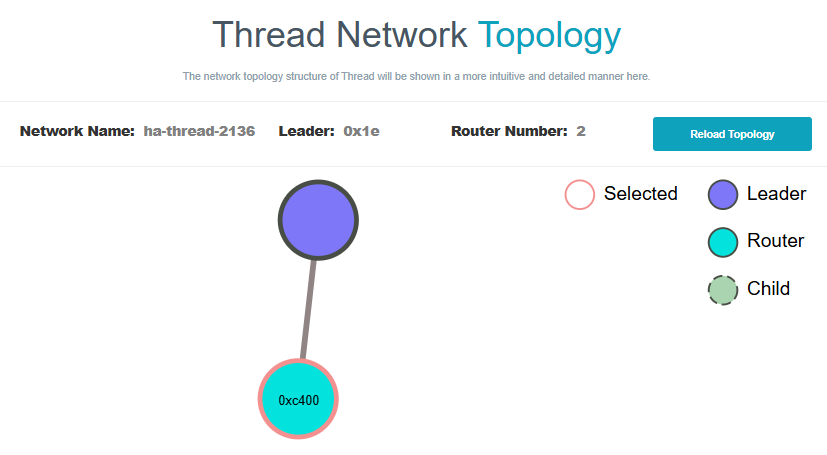

# [Working with the CHIP Tool](https://github.com/project-chip/connectedhomeip/blob/master/docs/development_controllers/chip-tool/chip_tool_guide.md#installation)
Another branch: https://project-chip.github.io/connectedhomeip-doc/development_controllers/chip-tool/chip_tool_guide.html#installation  
Examples: https://docs.silabs.com/matter/2.2.2/matter-wifi-getting-started-example/chip-tool-wifi
Examples: https://docs.espressif.com/projects/esp-matter/en/latest/esp32c6/developing.html#test-setup-chip-tool
# [Working with the CHIP Tool in WSL2](https://docs.silabs.com/matter/2.2.2/matter-wifi-getting-started-example/chip-tool-wifi)
ChipTool not working properly due to missing BLE adapter in WSL
~~~
chip-tool pairing code-thread 1 hex:0e080000000000010000000300001a4a0300001635060004001fffe002083dd5846a27dd139f0708fdec29c2f04b4b23051045005945ef9dbed88082d208673dad0f030f4f70656e5468726561642d3562393101025b9104109855950ef75071da53e996c50694576a0c0402a0f7f8 34970112332
~~~
> [DL] Disabling CHIPoBLE service due to error: BLE adapter unavailable
> [CTL] Commissioning discovery over BLE failed: BLE adapter unavailable

# OT Commissioner CLI
[OpenThread Commissioner](https://openthread.io/guides/commissioner/build) not working in WSL
Its commands can be found [here](https://github.com/openthread/ot-commissioner/blob/main/src/app/cli/README.md).
https://openthread.io/guides/border-router/external-commissioning/cli

# OTBR Commissioner CLI:
~~~
commissioner help
~~~
> announce
> energy
> id
> joiner
> mgmtget
> mgmtset
> panid
> provisioningurl
> sessionid
> start
> state
> stop

End Device:
~~~
eui64
~~~
> 404ccafffe58101c

??? OTBR:
~~~
commissioner joiner enable meshcop 404ccafffe58101c
commissioner joiner enableall meshcop J01NU5
commissioner joiner enablea meshcop J01NU5
~~~
> Error 7: InvalidArgs

# Thread Border Router
Github: https://github.com/espressif/esp-matter/tree/main/examples/thread_border_router  
  
OpenThread Radio Co-Processor (RCP):  
~~~
cd ~/esp-idf/examples/openthread/ot_rcp
idf.py set-target esp32h2 build
~~~
Thread Border Router:
~~~
cd ~/esp-matter/examples/thread_border_router
idf.py set-target esp32s3 build
idf.py -p {port} erase-flash flash
~~~
  
  

# Matter ESP32 Thread Border Router Example
Github: https://github.com/project-chip/connectedhomeip/tree/master/examples/thread-br-app/esp32  

OpenThread Radio Co-Processor (RCP):  
~~~
cd ~/esp-idf/examples/openthread/ot_rcp
idf.py set-target esp32h2
idf.py build
~~~
Thread Border Router:
~~~
cd ~/esp-matter/connectedhomeip/connectedhomeip/examples/thread-br-app/esp32
idf.py set-target esp32s3
idf.py build
idf.py -p {port} erase-flash flash monitor
~~~

# OpenThread Border Router Example
Github: https://github.com/espressif/esp-idf/tree/master/examples/openthread/ot_br  
  
The example could also run on a single SoC which supports both Wi-Fi and Thread (e.g., ESP32-C6), but since there is only one RF path in ESP32-C6, which means Wi-Fi and Thread can't receive simultaneously, it has a significant impact on performance.
~~~
idf.py menuconfig
~~~
Component config > ESP System Settings > Channel for console output > USB Serial/JTAG Controller

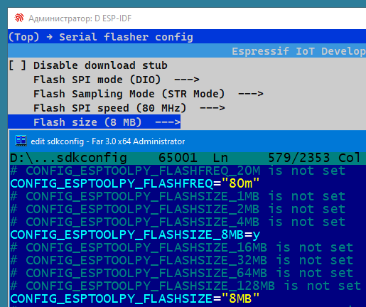

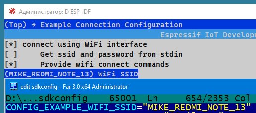

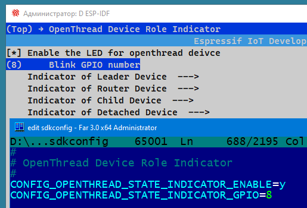

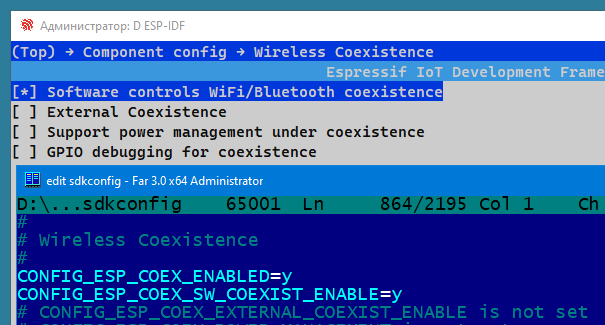

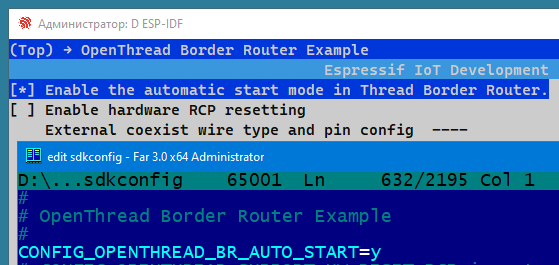

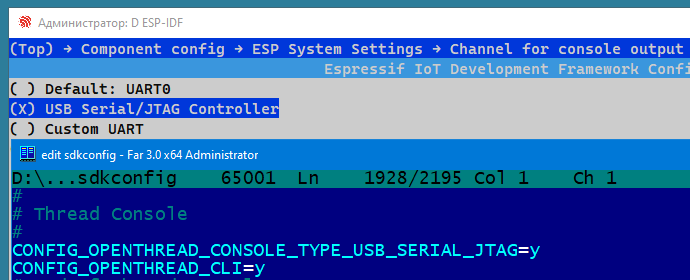

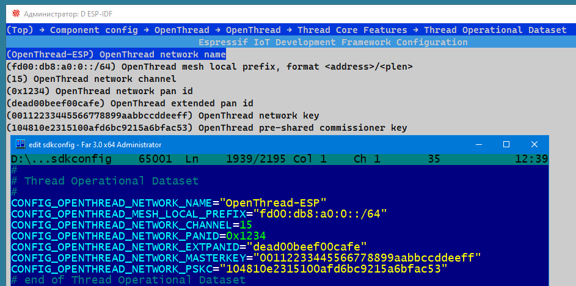

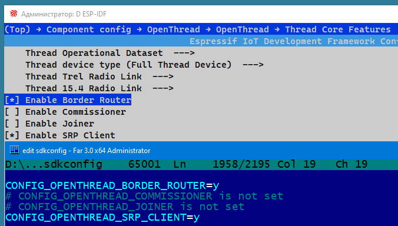

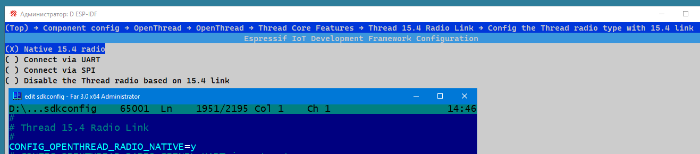

~~~
idf.py -p COM3 build flash monitor
~~~
> I (499) ot_ext_cli: Start example_connect  
> I (499) example_connect: Connecting to MIKE_REDMI_NOTE_13...  
> ...  
> I (17219) esp_netif_handlers: example_netif_sta ip: **192.168.31.218**, mask: 255.255.255.0, gw: 192.168.31.193  
> I (17219) example_connect: Got IPv4 event: Interface "example_netif_sta" address: 192.168.31.218  
> I (17379) example_connect: Got IPv6 event: Interface "example_netif_sta" address: fe80:0000:0000:0000:424c:caff:fe58:101c, type: ESP_IP6_ADDR_IS_LINK_LOCAL  
...  
> I(17389) OPENTHREAD:[N] Mle-----------: Role disabled -> detached  
...  
> I(51099) OPENTHREAD:[N] Mle-----------: Role detached -> leader  
  
OpenThread command line interface (CLI):
~~~
state
~~~
> leader
~~~
wifi state
~~~
> connected
~~~
dataset active -x
~~~
> 0e080000000000010000000300000f4a0300001135060004001fffe00208dead00beef00cafe0708fd000db800a00000051000112233445566778899aabbccddeeff030e4f70656e5468726561642d455350010212340410104810e2315100afd6bc9215a6bfac530c0402a0f7f8

# Simulating a Thread network with OpenThread
https://openthread.io/codelabs/openthread-simulation-posix/index.html#1  
  
Build a leader node:
~~~
git clone --recursive https://github.com/openthread/openthread.git
cd openthread
./script/bootstrap
./script/cmake-build simulation
./script/cmake-build posix -DOT_DAEMON=ON
./build/simulation/examples/apps/cli/ot-cli-ftd 1
~~~
OpenThread CLI - Leader:
~~~
dataset init new
dataset
~~~
> Network Key: e4344ca17d1dca2a33f064992f31f786  
> PAN ID: 0xc169  
~~~
dataset commit active
ifconfig up
thread start
state
~~~
> leader

Build a child node:
~~~
./build/simulation/examples/apps/cli/ot-cli-ftd 2
~~~
OpenThread CLI - Child:
~~~
dataset networkkey e4344ca17d1dca2a33f064992f31f786
dataset panid 0xc169
dataset commit active
ifconfig up
thread start
state
~~~
> child
~~~
state
~~~
> router

OpenThread CLI - Leader:
~~~
router table
~~~
> | ID | RLOC16 | Next Hop | Path Cost | LQI In | LQI Out | Age | Extended MAC     |  
> +----+--------+----------+-----------+--------+---------+-----+------------------+  
> | 20 | 0x5000 |       63 |         0 |      0 |       0 |   0 | 96da92ea13534f3b |  
> | 22 | 0x5800 |       63 |         0 |      3 |       3 |  23 | 5a4eb647eb6bc66c |  
  
