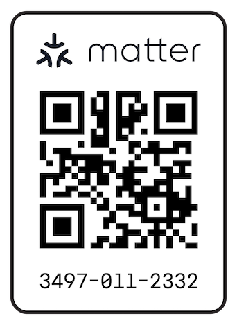

# Testing Matter/Thread apps

- [Windows links to launch Powershell terminals](C)

- [Windows Powershell scripts and BAT files](D)

- [Some DOCX and PDF documents](docs)

- [Examples](examples)

- [Installation guides](install)

- [Some tools](tools)

- [Example tree for shared drive in WSL](U)

Test QR code for Matter end devices:  
  
  
### ESP Test Tools and Guidelines
- https://docs.espressif.com/projects/esp-test-tools/en/latest/esp32/index.html  
- https://docs.espressif.com/projects/esp-matter/en/latest/esp32/developing.html#commissioning-and-control  
