[**How to setup and work with OpenThread Border Router**](OPENTHREAD.md)  
# How to setup and work with ESP-IDF and ESP-Matter
[How_to_setup_and_work_with_ESP-IDF_and_ESP-Matter.pdf](docs/How_to_setup_and_work_with_ESP-IDF_and_ESP-Matter.pdf)  

Windows Powershell (with Administrator rights):
~~~
systeminfo
~~~
OS Name: Microsoft Windows 10 Pro  
OS Version: 10.0.19045 N/A Build 19045  
**Works successfully in this version of Windows!**  
  
OS Name: Microsoft Windows 10 Enterprise  
OS Version: 10.0.19045 N/A Build 19045  
**Works without sharing COM-ports in this version of Windows!**  

# 1. How to install Ubuntu on Windows with WSL
Recommended Ubuntu 22.04…  
[https://learn.microsoft.com/en-us/windows/wsl/install](https://learn.microsoft.com/en-us/windows/wsl/install)  
Check Ubuntu version:
~~~
lsb_release -a
~~~
> No LSB modules are available.  
> Distributor ID: Ubuntu  
> Description: Ubuntu 22.04.5 LTS  
> Release: 22.04  
> Codename: jammy  
~~~
hostnamectl
~~~
>  Static hostname: matter  
>        Icon name: computer  
>       Machine ID: 4434801db3c544fcb87aed78381cf1dc  
>          Boot ID: 1f90601ca4914976b9ee4a2b17b71687  
> Operating System: Ubuntu 22.04.5 LTS  
>           Kernel: Linux 5.15.0-1075-raspi  
>     Architecture: arm64  
~~~
cat /etc/*ease
~~~
> DISTRIB_ID=Ubuntu  
> DISTRIB_RELEASE=22.04  
> DISTRIB_CODENAME=jammy  
> DISTRIB_DESCRIPTION="Ubuntu 22.04.5 LTS"  
> PRETTY_NAME="Ubuntu 22.04.5 LTS"  
> NAME="Ubuntu"  
> VERSION_ID="22.04"  
> VERSION="22.04.5 LTS (Jammy Jellyfish)"  
> VERSION_CODENAME=jammy  
> ID=ubuntu  
> ID_LIKE=debian  
> HOME_URL="https://www.ubuntu.com/"  
> SUPPORT_URL="https://help.ubuntu.com/"  
> BUG_REPORT_URL="https://bugs.launchpad.net/ubuntu/"  
> PRIVACY_POLICY_URL="https://www.ubuntu.com/legal/terms-and-policies/privacy-policy"  
> UBUNTU_CODENAME=jammy  
  
If asked to add a new user, just do it, but after that we should switch to root.
Windows Powershell:
~~~
ubuntu config --default-user root       #-- default instance
ubuntu2204 config --default-user root   #-- another instance
~~~

# 2. Ubuntu on Windows App Store
[https://apps.microsoft.com/search?query=ubuntu&hl=en-us&gl=US](https://apps.microsoft.com/search?query=ubuntu&hl=en-us&gl=US)  
Map network resource \\\\wsl.localhost\Ubuntu or \\\\wsl\$\Ubuntu on disk U (for instance). So, the project examples can be found in U:\root\esp-matter\examples folder. If we are using another WSL instance, then the path should be something like \\\\wsl\$\Ubuntu-22.04
 
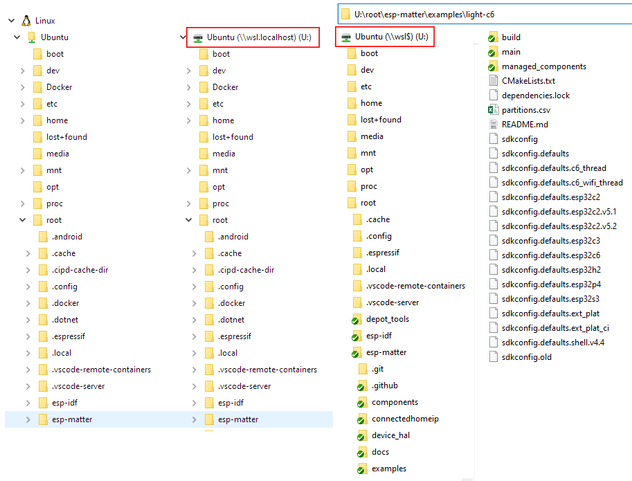
# 3. ESP-IDF Prerequisites (Ubuntu only)
[https://docs.espressif.com/projects/esp-idf/en/latest/esp32/get-started/linux-macos-setup.html](https://docs.espressif.com/projects/esp-idf/en/latest/esp32/get-started/linux-macos-setup.html)  
[https://wiki.seeedstudio.com/xiao_idf/](https://wiki.seeedstudio.com/xiao_idf/)
~~~
sudo apt update
sudo apt upgrade
sudo apt-get install git wget flex bison gperf python3 python3-pip python3-venv cmake ninja-build ccache libffi-dev libssl-dev dfu-util libusb-1.0-0
~~~

# 4. ESP-IDF Setup (Windows and Ubuntu)
[https://docs.espressif.com/projects/esp-matter/en/latest/esp32/developing.html](https://docs.espressif.com/projects/esp-matter/en/latest/esp32/developing.html)  
Windows Powershell (with Administrator rights):
~~~
D:
cd /
mkdir Espressif
cd Espressif
~~~
Both, Windows and Ubuntu (esp-idf v5.2.4 is recommended):
~~~
git clone --recursive https://github.com/espressif/esp-idf.git
cd esp-idf
git checkout v5.2.4
git submodule update --init --recursive
./install.sh
source ./export.sh
#./install.bat          #-- Windows instance
#./export.bat           #-- Windows instance
~~~
To /root/.bashrc add (Ubuntu only):
~~~
#-- Alias for setting up the ESP-IDF environment
alias get_idf='. ~/esp-idf/export.sh'
~~~
Than run:
~~~
source ~/.bashrc
~~~
Now it is possible to run get_idf to set up or refresh the esp-idf environment in any terminal session.

# 5. Matter Prerequisites (Ubuntu only)
[https://github.com/project-chip/connectedhomeip/blob/master/docs/guides/BUILDING.md#prerequisites](https://github.com/project-chip/connectedhomeip/blob/master/docs/guides/BUILDING.md#prerequisites)  
[https://wiki.seeedstudio.com/xiao_esp32_matter_env/](https://wiki.seeedstudio.com/xiao_esp32_matter_env/)

~~~
sudo apt-get install git gcc g++ pkg-config libssl-dev libdbus-1-dev libglib2.0-dev libavahi-client-dev ninja-build python3-venv python3-dev python3-pip unzip libgirepository1.0-dev libcairo2-dev libreadline-dev default-jre
~~~

# 6. ESP Matter Setup (Ubuntu only)
[https://docs.espressif.com/projects/esp-matter/en/latest/esp32/developing.html#esp-matter-setup](https://docs.espressif.com/projects/esp-matter/en/latest/esp32/developing.html#esp-matter-setup)  
[https://wiki.seeedstudio.com/xiao_esp32_matter_env/](https://wiki.seeedstudio.com/xiao_esp32_matter_env/)
~~~
cd esp-idf
source ./export.sh
cd ..

git clone --depth 1 https://github.com/espressif/esp-matter.git
cd esp-matter
git submodule update --init --depth 1
cd ./connectedhomeip/connectedhomeip
./scripts/checkout_submodules.py --platform esp32 linux --shallow
cd ../..
./install.sh
cd ..

cd esp-idf; source ./export.sh; cd ..
cd esp-matter; source ./export.sh; cd ..

export IDF_CCACHE_ENABLE=1
~~~
*During the installation of Esp-Matter ("./install.sh"), compilation may stop due to errors. In case of errors such as:*  
> ...pw: command not found  
> ...pop_var_context: hed of shell_variables not a function context"  
> ...nonja: build stopped: subcommand failed"  
> ...etc...  

*try running the following commands:*
~~~
cd ~/esp-matter/connectedhomeip/connectedhomeip
git clean -Xdf
source ./scripts/bootstrap.sh
~~~

To /root/.bashrc add:
~~~
#-- Alias for setting up the ESP-Matter environment
alias get_matter='. ~/esp-matter/export.sh'

#-- Enable ccache to speed up compilation
alias set_cache='export IDF_CCACHE_ENABLE=1'
~~~
Than run:
~~~
source ~/.bashrc
~~~
Now it is possible to run get_matter and set_cache to set up or refresh the esp-matter environment in any terminal session.  
  
Note:  
"A complete installation of Ubuntu, ESP-IDF and ESP-Matter takes up about 20 GB of disk space on drive C."

# 7. Install Visual Studio Code
[https://code.visualstudio.com/](https://code.visualstudio.com/)

# 8. Install Remote WSL extension in Visual Studio Code
[https://docs.espressif.com/projects/vscode-esp-idf-extension/en/latest/additionalfeatures/wsl.html#install-remote-wsl-extension-in-visual-studio-code](https://docs.espressif.com/projects/vscode-esp-idf-extension/en/latest/additionalfeatures/wsl.html#install-remote-wsl-extension-in-visual-studio-code)

# 9. Install usbipd-win
[https://github.com/dorssel/usbipd-win/releases](https://github.com/dorssel/usbipd-win/releases)  
[https://docs.espressif.com/projects/vscode-esp-idf-extension/en/latest/additionalfeatures/wsl.html#usbipd-win-in-wsl](https://docs.espressif.com/projects/vscode-esp-idf-extension/en/latest/additionalfeatures/wsl.html#usbipd-win-in-wsl)  
Windows Powershell:
~~~
usbipd list
usbipd list –u
usbipd bind --busid 1-1
usbipd attach --wsl --busid 1-1
~~~

 
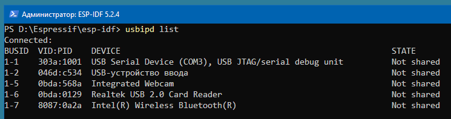

 
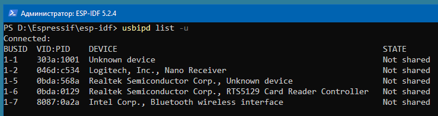

 
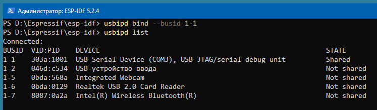

 
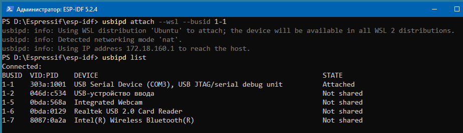

Ubuntu:
~~~
dmesg | tail
lsusb
~~~

 
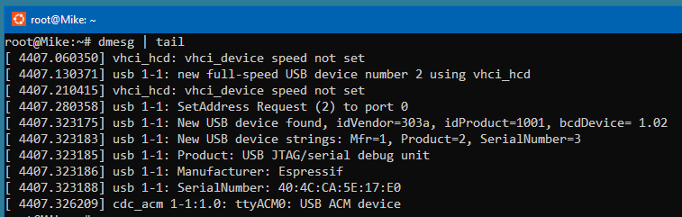

 
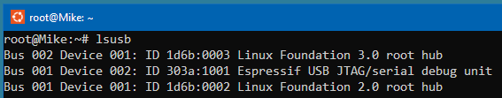

 
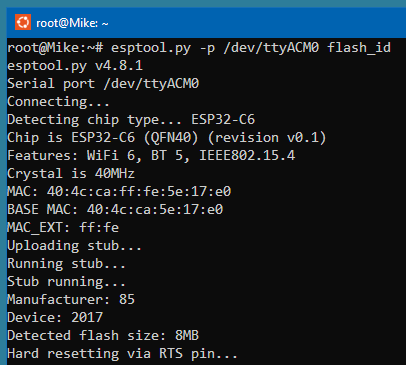

There may be issues with shared access to COM ports in Windows 10 Enterprise. Therefore, it will not be possible to use Ubuntu ports for flashing and monitoring the firmware. In this case, we should make a build in VSCode using a remote WSL or in Ubuntu, and then use a shared drive (U). Here are a couple of examples of BAT files for flashing and monitoring: [idf_build_c6.cmd](D/Espressif/idf_build_c6.cmd) and [idf_build_h2.cmd](D/Espressif/idf_build_h2.cmd)

 
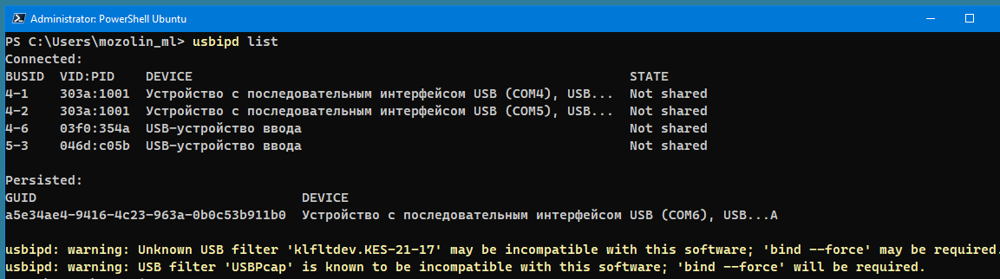

 
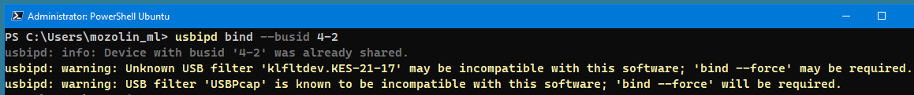

 
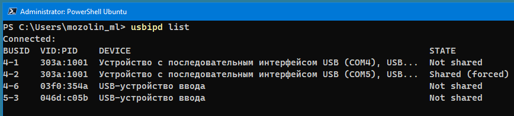

 
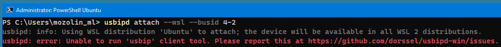

# 10. Make an example project (all the settings are made for ESP32-C6 development board, Ubuntu only)
- Make a copy of /root/esp-matter/examples/light folder to ../light-c6
- Open this folder in VSCode using a remote WSL or in Ubuntu
~~~
cd /root/esp-matter/examples/light-c6    #-- Navigate to the light example directory
rm -rf build/                            #-- Clean previous build files
idf.py set-target esp32c6                #-- Set the build target to ESP32-C6
idf.py menuconfig                        #-- Enter the configuration menu
~~~

CONFIG_OPENTHREAD_ENABLED=y  
CONFIG_ENABLE_WIFI_STATION=n  
CONFIG_USE_MINIMAL_MDNS=n  

 

 

 
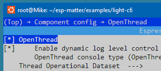

 
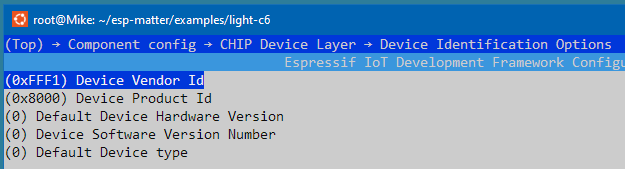

 

 

~~~
idf.py -p /tty/ACM0 build flash monitor  #-- Building, flashing and monitoring
~~~

**JOIN THE THREAD NETWORK VIA NETWORKKEY**  
OpenThread Border Router (see: [How to setup and work with OpenThread Border Router](OPENTHREAD.md))
~~~
dataset active -x
~~~
0e08000000000001000000030000154a0300001735060004001fffe00208def5e21b6165cc560708fde61aeab4004131051000112233445566778899aabbccddeeff030f4f70656e5468726561642d32326339010222c90410a5e0c5822c1e723956af6b1ee43f084e0c0402a0f7f8  
Done

~~~
networkkey
~~~
00112233445566778899aabbccddeeff  
Done

Thread End Device:
~~~
matter esp ot_cli dataset set active 0e08000000000001000000030000154a0300001735060004001fffe00208def5e21b6165cc560708fde61aeab4004131051000112233445566778899aabbccddeeff030f4f70656e5468726561642d32326339010222c90410a5e0c5822c1e723956af6b1ee43f084e0c0402a0f7f8
~~~
> Error 7: InvalidArgs  

Why is that? There is a difference between the results of the datasets:  
Here:  
> matter esp ot_cli dataset set active 0e08000000000001000000030000154a0300001735060004001fffe00208def5e21b6165cc560708fde61aeab4004131051000112233445566778899aabbccddeeff030f4f70656e5468726561642d32326339010222c90410a5e0c5822c1e723956af6b1ee43f084e0c0402a0f7f8  

[Example "Join the OTBR network"](https://openthread.io/codelabs/openthread-border-router):  
> matter esp ot_cli dataset set active 0e080000000000010000000300001235060004001fffe002083d3818dc1c8db63f0708fda85ce9df1e662005101d81689e4c0a32f3b4aa112994d29692030f4f70656e5468726561642d35326532010252e204103f23f6b8875d4b05541eeb4f9718d2f40c0302a0ff  

The second one is 12 characters shorter!  
  
So, we pair the end device using the Thread Router network key.
~~~
matter esp ot_cli dataset networkkey 00112233445566778899aabbccddeeff
matter esp ot_cli dataset commit active
matter esp ot_cli ifconfig up
matter esp ot_cli thread start
matter esp ot_cli state
~~~

 
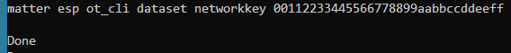

 
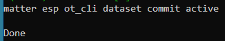

 

 

 

 

# 11. ??? Test Setup (CHIP Tool)
[https://docs.espressif.com/projects/esp-matter/en/latest/esp32c6/developing.html#test-setup-chip-tool](https://docs.espressif.com/projects/esp-matter/en/latest/esp32c6/developing.html#test-setup-chip-tool)

# 12. ??? Working with the CHIP Tool
[https://github.com/project-chip/connectedhomeip/blob/master/docs/development_controllers/chip-tool/chip_tool_guide.md](https://github.com/project-chip/connectedhomeip/blob/master/docs/development_controllers/chip-tool/chip_tool_guide.md)  
[https://project-chip.github.io/connectedhomeip-doc/development_controllers/chip-tool/chip_tool_guide.html](https://project-chip.github.io/connectedhomeip-doc/development_controllers/chip-tool/chip_tool_guide.html)  

# 13. Matter Shell Reference
[https://project-chip.github.io/connectedhomeip-doc/examples/chef/README_SHELL.html](https://project-chip.github.io/connectedhomeip-doc/examples/chef/README_SHELL.html)  
[https://docs.espressif.com/projects/esp-matter/en/latest/esp32/developing.html#device-console](https://docs.espressif.com/projects/esp-matter/en/latest/esp32/developing.html#device-console)
 
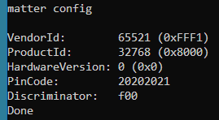

 
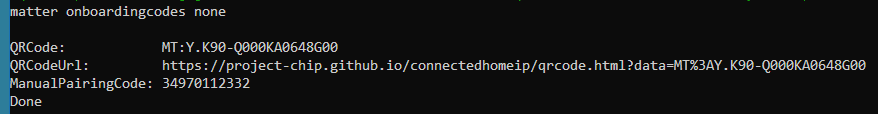

 
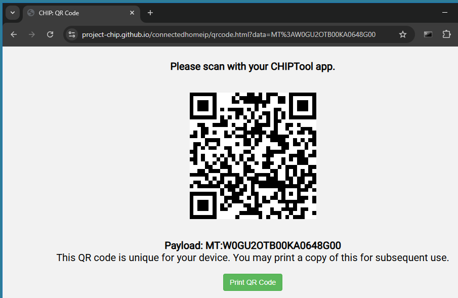

 
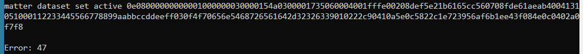

# 14. How to generate Matter Onboarding Codes (QR Code and Manual Pairing Code)
[https://docs.espressif.com/projects/esp-matter/en/latest/esp32/faq.html#a1-9-how-to-generate-matter-onboarding-codes-qr-code-and-manual-pairing-code](https://docs.espressif.com/projects/esp-matter/en/latest/esp32/faq.html#a1-9-how-to-generate-matter-onboarding-codes-qr-code-and-manual-pairing-code)
~~~
#-- Generate the QR Code
chip-tool payload generate-qrcode --discriminator 3131 --setup-pin-code 20201111 --vendor-id 0xFFF1 --product-id 0x8004 --version 0 --commissioning-mode 0 --rendezvous 2

#-- Generates the short manual pairing code (11-digit)
chip-tool payload generate-manualcode --discriminator 3131 --setup-pin-code 20201111 --version 0 --commissioning-mode 0

#-- To generate a long manual pairing code (21-digit) that includes both the vendor ID and product ID, --commissioning-mode parameter must be set to either 1 or 2, indicating a non-standard commissioning flow
chip-tool payload generate-manualcode --discriminator 3131 --setup-pin-code 20201111 --vendor-id 0xFFF1 --product-id 0x8004 --version 0 --commissioning-mode 1
~~~
 
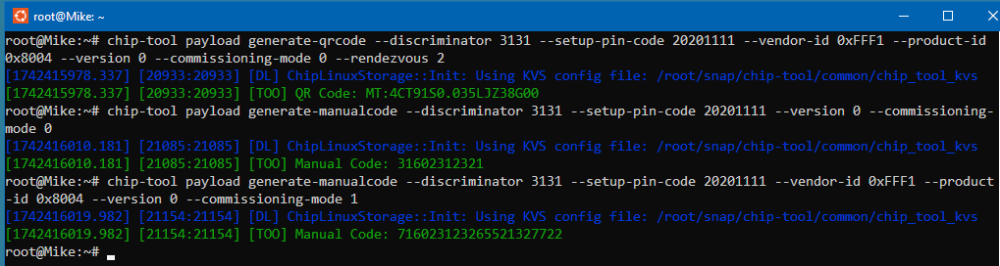
