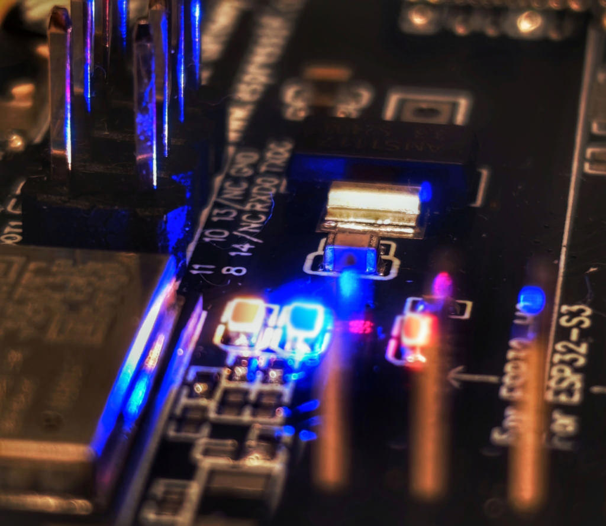
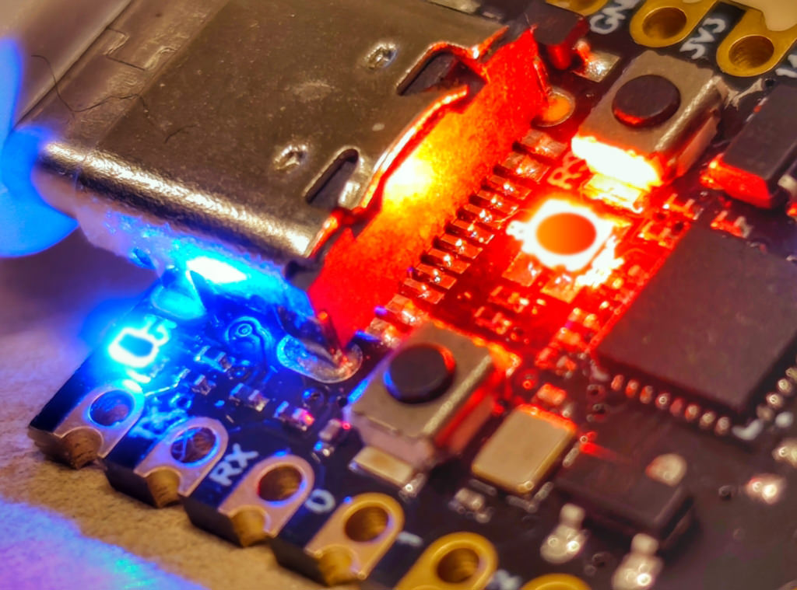

# How to prepare for Compilation and Building

### 1. ESP-IDF
The driver "driver_led_indicator" must be C-code: drivers/driver_led_indicator.c  
The CMakeLists.txt file should contain the following lines: 
~~~
idf_component_register(
  SRCS "app_main.c" "drivers/driver_led_indicator.c"
  INCLUDE_DIRS "." "./drivers"
)
~~~
This depends on the espressif/led_indicator library version 1.1.1, and the source files are located in the /drivers folder.  
idf_component.yml:
~~~
dependencies:
  espressif/led_indicator:
    version: "^1.1.1"
~~~
The source code for the example can be found [here](rcp/)  
  
  
### 2. ESP-MATTER
The driver "driver_led_indicator" must be CPP-code: drivers/driver_led_indicator.cpp  
The CMakeLists.txt file should contain the following lines: 
~~~
idf_component_register(
	SRC_DIRS "." "./drivers"
  PRIV_INCLUDE_DIRS "." "./drivers" "${ESP_MATTER_PATH}/examples/common/utils"
)
~~~
This depends on the espressif/led_indicator library version 1.1.1, and the source files are located in the /drivers folder.  
idf_component.yml:
~~~
dependencies:
  espressif/cmake_utilities:
    version: "^1"
    rules: # will add "optional_component" only when all if clauses are True
      - if: "idf_version >=5.0"
      - if: "target in [esp32c2]"
  espressif/led_indicator:
    version: "^1.1.1"
  esp_bsp_devkit:
    version: "^3"
~~~
The source code for the example can be found [here](h2_tiny/)  
  
  
### 3. Common part
Files **driver_led_indicator.cpp** and **driver_led_indicator.c** are absolutely identical, the only difference is in their extension!
The header files **driver_led_indicator.h** and **led_config.h** are the same for both types of code.  
  
Add to app_main.c or app_main.cpp:
~~~
#include "led_config.h"
#if USE_DRIVER_LED_INDICATOR
  #include "driver_led_indicator.h"
  led_indicator_handle_t led_handle;
#endif
~~~
Add to the function **void app_main(void)** (C-code) or **extern "C" void app_main()** (CPP-code):
~~~
  #if USE_DRIVER_LED_INDICATOR
    //-- at least one LED must not be an RGB LED
    #if USE_ORDINARY_LED
      //--> UART RX/TX Blinking Simulator
      #if LED_MODE == 1
        #if DEBUG_MODE
          ESP_LOGW(TAG_H2, "~~~ BLINK: 1. Simple version with random intervals");
        #endif
        xTaskCreate(random_blink_task, "uart_sim", 4096, NULL, 1, NULL);
      #endif
    
      #if LED_MODE == 2
        #if DEBUG_MODE
          ESP_LOGW(TAG_H2, "~~~ BLINK: 2. Realistic version with UART patterns");
        #endif
        xTaskCreate(simulate_uart_activity, "uart_pattern", 4096, NULL, 1, NULL);
      #endif
    
      #if LED_MODE == 3
        #if DEBUG_MODE
           ESP_LOGW(TAG_H2, "~~~ BLINK: 3. Version with different activity modes");
         #endif
         xTaskCreate(uart_simulation_task, "uart_sim", 4096, NULL, 1, NULL);
      #endif
      //<-- UART RX/TX Blinking Simulator
    #endif //-- USE_ORDINARY_LED
  
    //-- at least one LED must be an RGB LED
    #if USE_RGB_LED
      //--> RGB LED indicator
      led_handle = configure_indicator();
      while(1) {
        //ESP_LOGW(TAG_H2, "~~~ BLINK RGB: BLINK_ONCE_RED");
        get_led_indicator_blink_idx(BLINK_ONCE_RED, 60, 0);
        vTaskDelay(pdMS_TO_TICKS(1000));
      }
      //<-- RGB LED indicator
    #endif //-- USE_RGB_LED
  #endif //-- USE_DRIVER_LED_INDICATOR
~~~

### 4. Examples
ESP OTBR & Zigbee GW (RCP ESP32-H2):  
- GPIO_NUM_22 //-- ordinary LED: yellow (old)/green (new)  
- GPIO_NUM_25 //-- ordinary LED: blue  
~~~
#define ESP32_GPIO_LED_1         GPIO_NUM_22
#define ESP32_RGB_LED_1          false

#define ESP32_GPIO_LED_2         GPIO_NUM_25
#define ESP32_RGB_LED_2          false
~~~
  
ESP32-H2 SuperMini:  
- GPIO_NUM_8  //-- RGB LED  
- GPIO_NUM_13 //-- ordinary LED: blue  
~~~
#define ESP32_GPIO_LED_1         GPIO_NUM_8
#define ESP32_RGB_LED_1          true

#define ESP32_GPIO_LED_2         GPIO_NUM_13
#define ESP32_RGB_LED_2          false
~~~
