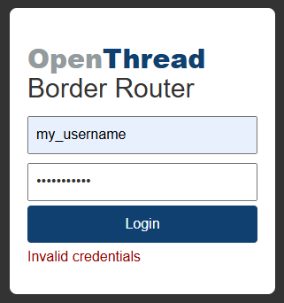

# ESP OTBR Example Optimization
Based on [ESP-THREAD-BR Release v1.2](https://github.com/espressif/esp-thread-br/releases/tag/v1.2)  
  
*Content:*  
**1) Web Page**  
**2) Configuration parameters**  
**3) mDNS: instance name and hostname**  
  
*Links:*  
- [Crypt Utility](crypt/)  
- [Minify Utility](minify/)  
- [Optimized Code](optimized/)  
  

## 1) Web Page

Considering that the ESP32-S3 chip on the ESP OTBR board can have 8MB or 16MB of flash memory, we can optimize the web page code inside the OTBR.  
Moreover, we can set custom values for mDNS instance name and mDNS hostname.  
  
In any case, this is worth checking if the flash memory capacity is really more than 4MB:  
~~~
esptool -p COM3 flash_id
~~~
> Detecting chip type... ESP32-S3  
> Chip is ESP32-S3 (QFN56) (revision v0.1)  
> Features: WiFi, BLE, Embedded PSRAM 2MB (AP_3v3)  
> Crystal is 40MHz  
> Manufacturer: c8  
> Device: 4018  
> Detected flash size: **16MB**  
> Flash type set in eFuse: quad (4 data lines)  
> Flash voltage set by eFuse to 3.3V  
  
  
### Change partition table
/examples/basic_thread_border_router/partitions.csv:  
Increase web_storage from *100K* to **640K** or more...
~~~
nvs,        data, nvs,      , 0x6000,
otadata,    data, ota,      , 0x2000,
phy_init,   data, phy,      , 0x1000,
ota_0,      app,  ota_0,    , 1600K,
ota_1,      app,  ota_1,    , 1600K,
web_storage,data, spiffs,   , 640K,
rcp_fw,     data, spiffs,   , 640K,
~~~

### Change flash value in configuration
/examples/basic_thread_border_router/sdkconfig.defaults:  
Change *ESPTOOLPY_FLASHSIZE_4MB* to **ESPTOOLPY_FLASHSIZE_8MB** or **ESPTOOLPY_FLASHSIZE_16MB**
>  
> CONFIG_ESPTOOLPY_FLASHSIZE_8MB=y  
>  
  
Or  
  
>  
> CONFIG_ESPTOOLPY_FLASHSIZE_16MB=y  
>  
  
The original HTML includes 3 links:
~~~
<link href="https://cdn.jsdelivr.net/npm/bootstrap@3.3.7/dist/css/bootstrap.min.css" rel="stylesheet">

~~~

### Save external scripts locally
1) /components/esp_ot_br_server/frontend/static/static.min.css  
Download *https://cdn.jsdelivr.net/npm/bootstrap@3.3.7/dist/css/bootstrap.min.css* and put its code into the **static.min.css** file.

2) /components/esp_ot_br_server/frontend/static/static.min.js  
Download *https://code.jquery.com/jquery-1.10.2.min.js* and *https://d3js.org/d3.v3.min.js* and put their code into the **static.min.js** file.

Add a few lines to the */components/esp_ot_br_server/src/esp_br_web.c*:
~~~
...
    //-- added external css
    } else if (strcmp(info.file_name, "/static/static.min.css") == 0) {
        return style_css_get_handler(req, info.file_path);
    //-- added external js
    } else if (strcmp(info.file_name, "/static/static.min.js") == 0) {
        return script_js_get_handler(req, info.file_path);
...
~~~
It might be correct to change WEB_TAG from "obtr_web" to "otbr_web" (OpenThread Border Router) there:
~~~
#define WEB_TAG "otbr_web"
~~~

### Minify code
We can also minify *index.html* (to **index.min.html**), *restful.js* (to **restful.min.js**) and *style.css* (to **style.min.css**) using the [*minify*](minify/) PHP-script:
  
Add new lines to the *esp_br_web.c* file:
~~~
...
    //-- added minified html
    } else if (strcmp(info.file_name, "/index.min.html") == 0) {
        return index_html_get_handler(req, info.file_path);
    //-- added minified css
    } else if (strcmp(info.file_name, "/static/style.min.css") == 0) {
        return style_css_get_handler(req, info.file_path);
    //-- added minified js
    } else if (strcmp(info.file_name, "/static/restful.min.js") == 0) {
        return script_js_get_handler(req, info.file_path);
...
~~~
Hide old lines in file *esp_br_web.c*:
~~~
...
/*
    } else if (strcmp(info.file_name, "/static/style.css") == 0) {
        return style_css_get_handler(req, info.file_path);
    } else if (strcmp(info.file_name, "/static/restful.js") == 0) {
        return script_js_get_handler(req, info.file_path);
*/
...
~~~
~~~
---------------------------------------------
| File name         |    Source |  Minified |
---------------------------------------------
| index.min.html    |     25001 |     15730 |
| restful.min.js    |     31752 |     15018 |
| style.min.css     |     31153 |     23728 |
---------------------------------------------
~~~
*P.S. To run minify for JS correctly, it's necessary to make edits to the **restful.js** file code - to put the missing semicolons at the end of the expressions.*  

### Password protected web page
The original HTML ([crypt](crypt/)) includes 2 links:
~~~

~~~

1) Download *https://cdnjs.cloudflare.com/ajax/libs/crypto-js/4.0.0/core.min.js* and *https://cdnjs.cloudflare.com/ajax/libs/crypto-js/3.1.9-1/md5.min.js* and put their code into the **static.min.js** file.
2) Add code from the [crypt](crypt/) folder: html code to *index.html*, css code to *static/style.css* and js code to *restful.js*.  
3) Using the following commands we will get the MD5 sequence for the login and password,
~~~
const username = 'my_username';
const password = 'my_password';
const crypt_usr = CryptoJS.MD5(username).toString();
const crypt_pwd = CryptoJS.MD5(password).toString();
console.log('username:', username, ', MD5 username:', crypt_usr, 'password:', password, ', MD5 password: ', crypt_pwd);
~~~
>  
> username: my_username, MD5 username: 70410b7ffa7b5fb23e87cfaa9c5fc258, password: my_password, MD5 password: a865a7e0ddbf35fa6f6a232e0893bea4  
>  
  
replace the value of the MD5_USERNAME and MD5_PASSWORD variables in the JS code: 
~~~
const MD5_USERNAME = '70410b7ffa7b5fb23e87cfaa9c5fc258';
const MD5_PASSWORD = 'a865a7e0ddbf35fa6f6a232e0893bea4';
~~~
Now when opening a web page we will have to log in with the saved username and password. If there is an error filling out the authorization form, the message "Invalid credentials" will be displayed.  
  
  
  

### Final stage
After that we need to compile and flash the firmware to get the latest version!  
  
When the web server starts, we will see something like this:  
~~~ 
I (10386) otbr_web: <=======================server start========================>  
I (10386) otbr_web: http://10.122.251.157:80/index.html  
I (10386) otbr_web: <===========================================================>  
~~~ 
or, in my version of the code (*esp_br_web.c*) :)  
~~~
ESP_LOGW(WEB_TAG, "### Server start ##########################");
ESP_LOGW(WEB_TAG, "#");
ESP_LOGW(WEB_TAG, "#   http://%s:%d/index.html", s_server.ip, s_server.port);
ESP_LOGW(WEB_TAG, "#");
ESP_LOGW(WEB_TAG, "###########################################");
~~~
it looks like:
~~~ 
W (4565) otbr_web: ### Server start ##########################
W (4565) otbr_web: #
W (4565) otbr_web: #   http://10.122.251.157:80/index.html
W (4565) otbr_web: #
W (4565) otbr_web: ###########################################
~~~ 
So, we can run this URL, http://10.122.251.157:80/index.html or its minified version http://10.122.251.157:80/index.min.html 

## 2) Configuration parameters
/examples/basic_thread_border_router/sdkconfig.defaults:  
Add to the beginning of the file:  
>  
> CONFIG_MIKE_MDNS_HOSTNAME="ESP OTBR Mike Board N5"  
> CONFIG_OPENTHREAD_BR_AUTO_START=y  
> CONFIG_OPENTHREAD_BR_START_WEB=y  
>  
  
***See "3) mDNS: custom instance name and hostname" section for descriptions of the "CONFIG_MIKE_MDNS_HOSTNAME" parameter!***  
    
Add to the "Ethernet" section:  
> CONFIG_EXAMPLE_CONNECT_ETHERNET=y  
> CONFIG_EXAMPLE_ETHERNET_EMAC_TASK_STACK_SIZE=2048  
> CONFIG_EXAMPLE_USE_SPI_ETHERNET=y  
  
Add "Wi-Fi" section:  
> \#  
> \# Wi-Fi  
> \#   
> CONFIG_EXAMPLE_CONNECT_WIFI=y  
> CONFIG_EXAMPLE_PROVIDE_WIFI_CONSOLE_CMD=y  
> CONFIG_EXAMPLE_WIFI_SSID="MIKE_OFFICE"  
> CONFIG_EXAMPLE_WIFI_PASSWORD="mike_secret_password"  
> CONFIG_EXAMPLE_WIFI_CONN_MAX_RETRY=1000000  
> \# end of Wi-Fi  
  
<!--  
It is necessary to use **only one of two** configurations for settings: either "Ethernet" or "Wi-Fi". For example, if it is assumed that OTBR will work via Ethernet, all parameters of the "Wi-Fi" section **should be hidden**!  
-->

## 3) mDNS: custom instance name and hostname
The "CONFIG_MIKE_MDNS_HOSTNAME" parameter specifies custom values for the mDNS instance name and mDNS hostname.  
  
Example: the value of this parameter "ESP OTBR Mike Board N5" will be displayed in the flow network as:  
- Instance name: display name (ESP OTBR Mike Board N5)  
- Host name: technical name (esp-otbr-mike-board-n5.local)  
 
Adding the "CONFIG_MIKE_MDNS_HOSTNAME" parameter will affect edits in several places of the application:  
- adding the *main/Kconfig.projbuild* file with the necessary settings for "idf.py menuconfig"  
- adding the *main/mdns_utils.c* file, containing a function for correctly converting the parameter value to Hostname  
- adding the *main/mdns_utils.h* file, containing a declaration of the function from *main/mdns_utils.c*  
- adding code to the *main/CMakeLists.txt* file to include *main/mdns_utils.c* in the compilation process  
~~~
idf_component_register(SRCS "esp_ot_br.c" "mdns_utils.c"
~~~
- adding code to the *main/esp_ot_br.c* file to condition the use of this parameter  
~~~
...
#ifdef CONFIG_MIKE_MDNS_HOSTNAME
  #include "mdns_utils.h"
#endif
...
    #ifdef CONFIG_MIKE_MDNS_HOSTNAME
      char hostname[256];
      //-- convert instance name to correct hostname
      hostname_optimized(CONFIG_MIKE_MDNS_HOSTNAME, hostname);
      ESP_ERROR_CHECK(mdns_hostname_set(hostname));
      ESP_ERROR_CHECK(mdns_instance_name_set(CONFIG_MIKE_MDNS_HOSTNAME));
    #else
      //-- default values
      ESP_ERROR_CHECK(mdns_hostname_set("esp-ot-br"));
    #endif
...
~~~
  
  