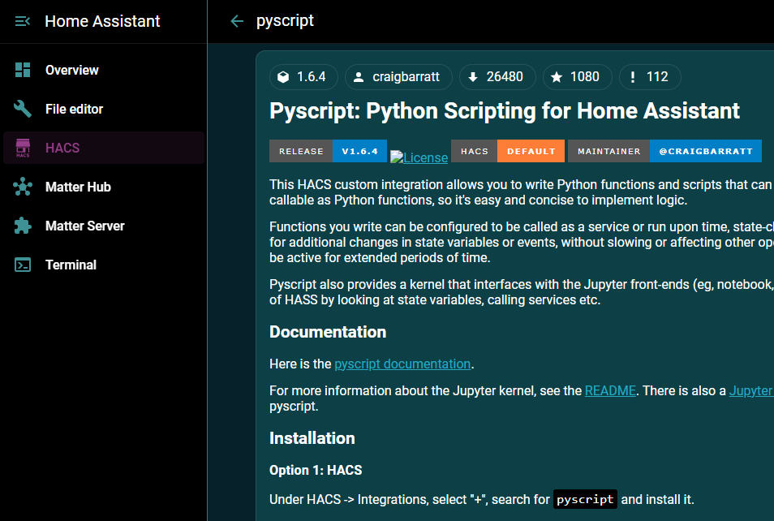
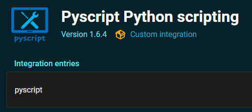

# HA: Get Matter/Thread entities list

## 1. PyScript
Installation as an integration from HACS:  
  
  
  
  
## 2. matter_devices.py
Creates sensor "sensor.orphaned_matter_devices" to get entities without entity_id:  
[matter_devices.py](_confs_/pyscript/matter_devices.py)  

## 3. automation.reload_matter_devices
Reloads sensor "sensor.orphaned_matter_devices" every minute:  
[automation.reload_matter_devices](_confs_/config/entities/automations/matter.yaml)  

## 4. sensor.matter_devices
Gets all Matter entities list:  
[sensor.matter_devices](_confs_/config/entities/sensors/matter.yaml)  
