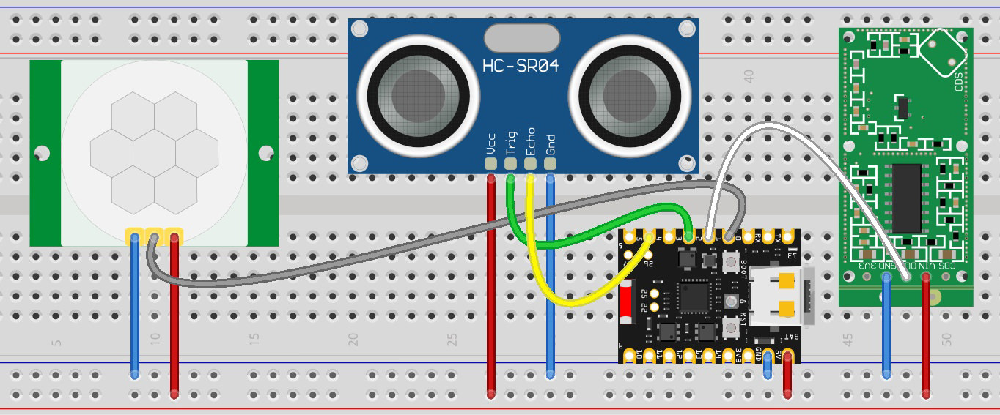
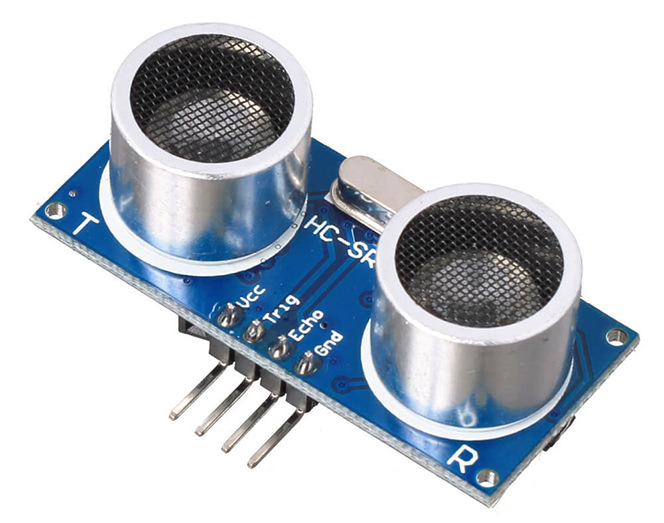
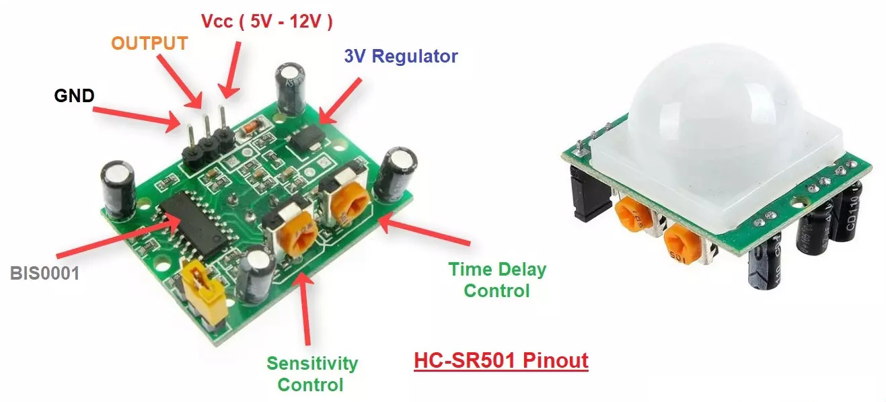
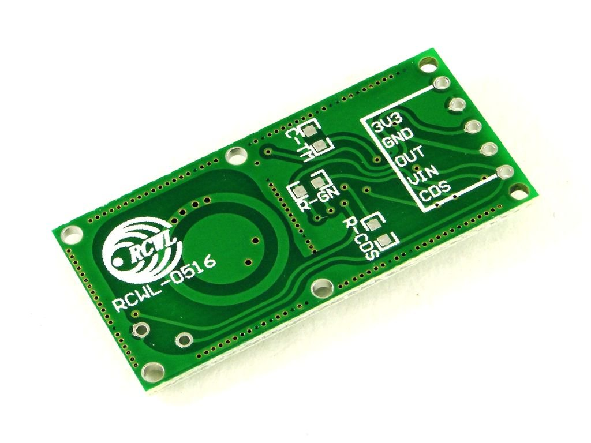

# Sensors on ESP-32-H2

### GPIO Configuration
~~~
#define CONFIG_HCSR501_PIR_GPIO          1
#define CONFIG_RCWL0516_MICROWAVE_GPIO   2
#define CONFIG_HCSR04_TRIG_GPIO          3
#define CONFIG_HCSR04_ECHO_GPIO          5
~~~

### Circuit
  

### ESP32-H2 SuperMini
  
  
### HC-SR04: Ultrasonic Distance Sensor
  
  
### HC-SR501: Passive Infrared (PIR) Motion Sensor
  
  
### RCWL-0516: Microwave Doppler Radar Motion Sensor
  
  
### KY-038: Sound Detection Sensor
  
  