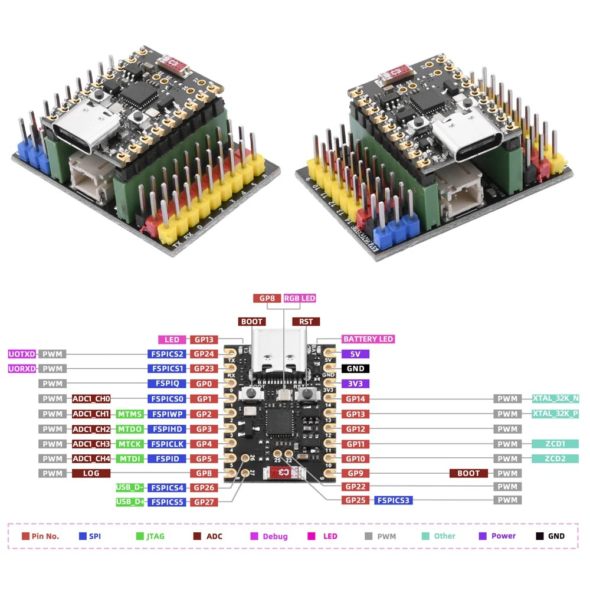

# Mike's On/Off example

This example demonstrates the creation of a Multiple On-Off Plugin Unit, where multiple endpoints are mapped to GPIO pins.  
Adapted for SuperMini ESP32-H2:  
  

## Plugin Manager Configuration
To update the existing CONFIG_GPIO_PLUG values, set their value in sdkconfig.defaults.esp32h2.

The following table defines the available GPIO pin numbers for the ESP32-H2 device.
~~~
------------------
| IO Func | GPIO |
|---------|-------
| Reset   |   9  |
|         |      |
| Plug 1  |   0  |
| Plug 2  |   1  |
| Plug 3  |   2  |
| Plug 4  |   3  |
| Plug 5  |   4  |
| Plug 6  |   5  |
| Plug 7  |   8  | RGB LED
| Plug 8  |  10  |
| Plug 9  |  11  |
| Plug 10 |  12  |
| Plug 11 |  13  | User LED
| Plug 12 |  14  |
| Plug 13 |  22  |
| Plug 14 |  25  |
| Plug 15 |  26  |
| Plug 16 |  27  |
------------------
~~~
See the [docs](https://docs.espressif.com/projects/esp-matter/en/latest/esp32/developing.html) for more information about building and flashing the firmware.

## 1. Additional Environment Setup

No additional setup is required.

## 2. Post Commissioning Setup

No additional setup is required.
