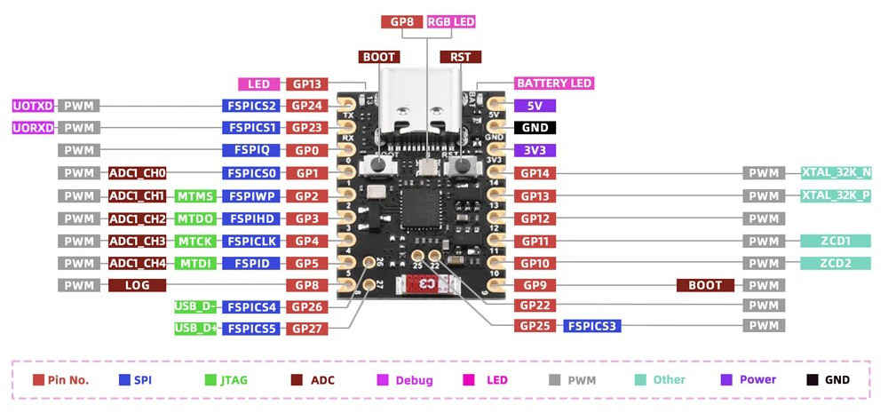

# Mike's On/Off example

This example demonstrates how to control 8 relays on 8 GPIOs of an ESP32-H2 device via Matter over Thread, using Espressif's SDK for Matter.  
For this purpose, I use the Home Assistant add-on "Matter Server" and the "Matter" service.  
  
Adapted for SuperMini ESP32-H2:  
  

## Project Configuration
To update the existing *CONFIG_GPIO_PLUG* values, set their value in **sdkconfig.defaults.esp32h2**.

The following table defines the available GPIO pin numbers for the ESP32-H2 device.
~~~
------------------
| IO Func | GPIO |
|---------|-------
| Reset   |   9  |
|         |      |
| Plug 1  |   0  |
| Plug 2  |   1  |
| Plug 3  |   2  |
| Plug 4  |   3  |
| Plug 5  |   4  |
| Plug 6  |   5  |
| Plug 7  |   8  | RGB LED
| Plug 8  |  10  |
| Plug 9  |  11  |
| Plug 10 |  12  |
| Plug 11 |  13  | User LED
| Plug 12 |  14  |
| Plug 13 |  22  |
| Plug 14 |  25  |
| Plug 15 |  26  |
| Plug 16 |  27  |
------------------
~~~
  
### Set the target to the ESP32-H2 device
~~~
idf.py set-target esp32h2
~~~

See the [docs](https://docs.espressif.com/projects/esp-matter/en/latest/esp32/developing.html) for more information about building and flashing the firmware.  
  
### Reset Button settings
- GPIO = **9**
- Time to reboot = **3** seconds
- Time to factory reset = **10** seconds

~~~
app_priv.h:

/********************
 *                  *
 *   RESET BUTTON   *
 *                  *
 ********************/
#include "esp_matter_core.h"
#define REBOOT_BUTTON_GPIO 9
//-- Hold for 3 seconds to reboot
#define REBOOT_HOLD_TIME_MS 3000
//-- Hold for 10 seconds to factory reset
#define FACTORY_RESET_HOLD_TIME_MS 10000
extern void reboot_button_task(void *pvParameter);
~~~
