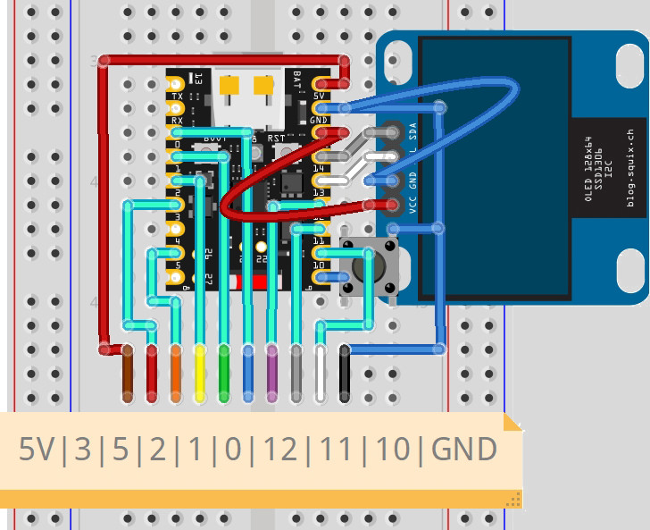

# Mike's On/Off example

**Example: Multiple ESP-Matter forks with on/off, latching and mutual exclusion (only one can be on at a time) using ESP-IDF 5.4 and Supermini ESP32-H2 board.**  
  
This example demonstrates how to control 8 relays on 8 GPIOs of an ESP32-H2 device via Matter over Thread, using Espressif's SDK for Matter.  
For this purpose, we use the Home Assistant add-on "Matter Server" and the "Matter" service.  
  
Adapted for SuperMini ESP32-H2:  
  

## Project Configuration
The following table defines the available GPIO pin numbers for the ESP32-H2 device.
~~~
------------------
| IO Func | GPIO |
|---------|-------
| Reset   |   9  |
|         |      |
| Plug 1  |   0  |
| Plug 2  |   1  |
| Plug 3  |   2  |
| Plug 4  |   3  |
| Plug 5  |   4  |
| Plug 6  |   5  |
| Plug 7  |   8  | RGB LED
| Plug 8  |  10  |
| Plug 9  |  11  |
| Plug 10 |  12  |
| Plug 11 |  13  | User LED
| Plug 12 |  14  |
| Plug 13 |  22  |
| Plug 14 |  25  |
| Plug 15 |  26  |
| Plug 16 |  27  |
------------------
~~~
  
### Set the target to the ESP32-H2 device
~~~
idf.py set-target esp32h2
~~~

See the [docs](https://docs.espressif.com/projects/esp-matter/en/latest/esp32/developing.html) for more information about building and flashing the firmware.  
  
### Reboot Button settings
- GPIO = **9**
- Time to reboot = **3** seconds
- Time to factory reset = **10** seconds

~~~
app_priv.h:

#define REBOOT_BUTTON_GPIO 9
//-- Hold for 3 seconds to reboot
#define REBOOT_HOLD_TIME_MS 3000
//-- Hold for 10 seconds to factory reset
#define FACTORY_RESET_HOLD_TIME_MS 10000
~~~

  
  
The back side of this board  
  
  
According to this circuit, the GPIO table will be as follows:  
~~~
------------------
| IO Func | GPIO |
|---------|-------
| Reset   |   9  |
|         |      |
| Plug 1  |   3  |
| Plug 2  |   5  |
| Plug 3  |   2  |
| Plug 4  |   1  |
| Plug 5  |   0  |
| Plug 6  |  12  |
| Plug 7  |  11  |
| Plug 8  |  10  |
------------------
~~~
  
## Testing using OpenThread Border Router + ChipTool

### Get active dataset (OTBR CLI)
~~~
dataset active -x
~~~
> 0e080000000000010000000300001a4a0300001635060004001fffe002083dd5846a27dd139f0708fdec29c2f04b4b23051045005945ef9dbed88082d208673dad0f030f4f70656e5468726561642d3562393101025b9104109855950ef75071da53e996c50694576a0c0402a0f7f8

### End device factory reset
~~~
matter esp factoryreset
~~~

### Pairing (Ubuntu)
*Syntax:* ***chip-tool pairing code-thread {node_id} hex:{Dataset} {ManualPairingCode}***  
- {node_id} : NodeId chosen for the end device during pairing  
- {Dataset} : from "dataset active -x"  
- {ManualPairingCode} : from "matter onboardingcodes none"  
~~~
chip-tool pairing code-thread 1 hex:0e080000000000010000000300001a4a0300001635060004001fffe002083dd5846a27dd139f0708fdec29c2f04b4b23051045005945ef9dbed88082d208673dad0f030f4f70656e5468726561642d3562393101025b9104109855950ef75071da53e996c50694576a0c0402a0f7f8 34970112332
~~~

### View list of routers (OTBR CLI)
~~~
> router table                     #-- OTBR CLI
> matter esp ot_cli router table   #-- End device CLI

| ID | RLOC16 | Next Hop | Path Cost | LQ In | LQ Out | Age | Extended MAC     | Link |
+----+--------+----------+-----------+-------+--------+-----+------------------+------+
| 44 | 0xb000 |       63 |         0 |     3 |      3 |  10 | 76556b3a72973249 |    1 |
| 53 | 0xd400 |       63 |         0 |     0 |      0 |   0 | 12744708b7b878a9 |    0 |
~~~

### Send toggle command (Ubuntu)
*Syntax:* ***chip-tool {cluster_id} {command_id} {node_id} {endpoint_id}***  
- {cluster_id} : ClusterId ("onoff" for this example)  
- {command_id} : CommandId ("toggle" for this example)  
- {node_id} : NodeId chosen for the end device during pairing  
- {endpoint_id} : EndPointId (1 for this example)  
~~~
chip-tool onoff toggle 1 1
~~~

### Send toggle command (ESP32-H2 CLI)
*Syntax:* ***matter esp attribute set {endpoint_id} {cluster_id} {attribute_id} {value}***  
- {endpoint_id} : EndPointId (1 for this example)  
- {cluster_id} : ClusterId ("0x6" for this example - OnOff)  
- {attribute_id} : AttributeId ("0x0" for this example - OnOff)  
- {value} : Value ("1" for this example - On)  
~~~
matter esp attribute set 0x1 0x6 0x0 1
~~~

### Read state (ESP32-H2 CLI)
*Syntax:* ***matter esp attribute get {endpoint_id} {cluster_id} {attribute_id}***  
- {endpoint_id} : EndPointId (1 for this example)  
- {cluster_id} : ClusterId ("0x6" for this example - OnOff)  
- {attribute_id} : AttributeId ("0x0" for this example - OnOff)  
~~~
matter esp attribute get 0x1 0x6 0x0
~~~
> I esp_matter_attribute: R : Endpoint 0x0001's Cluster 0x00000006's Attribute 0x00000000 is 0
