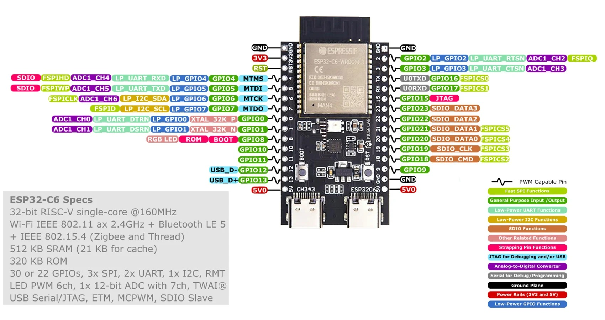
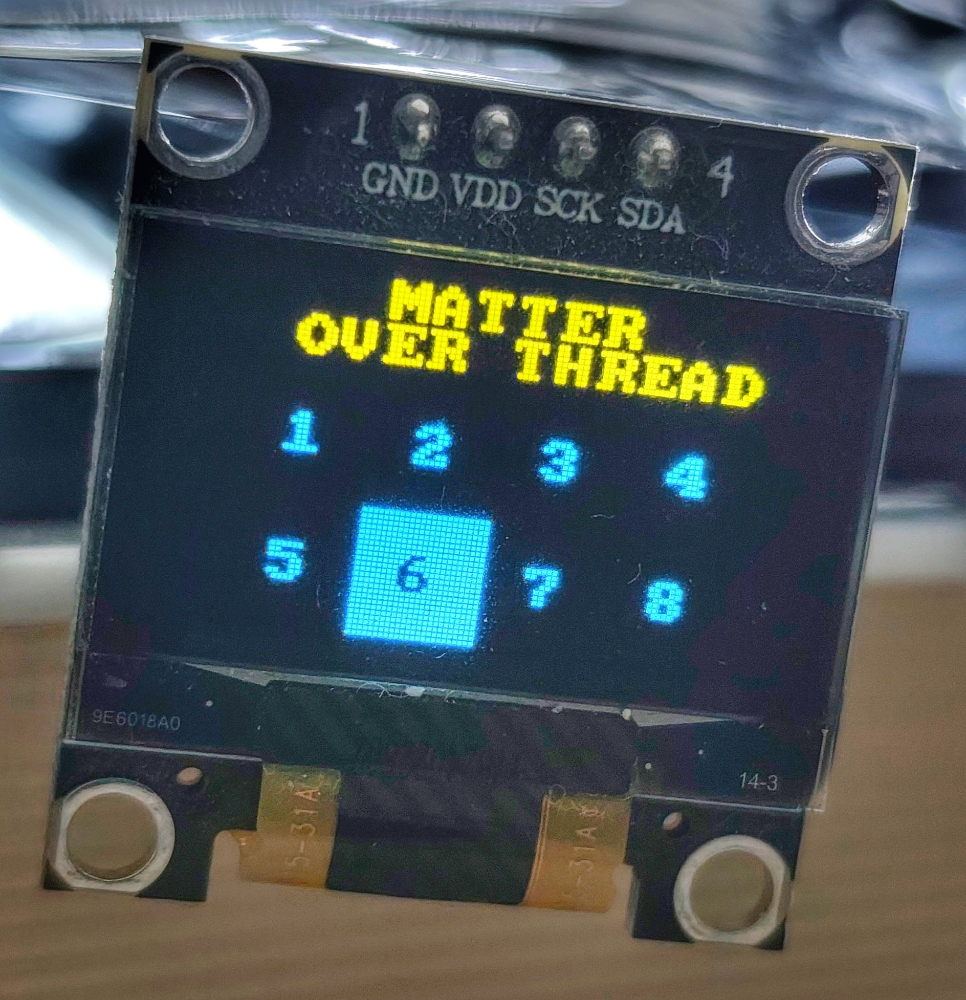

# Mike's On/Off example

**Example: Multiple ESP-Matter forks with on/off, latching and mutual exclusion (only one can be on at a time) using ESP-IDF 5.4 and NanoESP32-C6 board.**  
  
This example demonstrates how to control 8 relays on 8 GPIOs of an ESP32-C6 device via Matter over Thread, using Espressif's SDK for Matter.  
For this purpose, we use the Home Assistant add-on "Matter Server" and the "Matter" service.  
  
Adapted for NanoESP32-C6:  
  
  
  
  