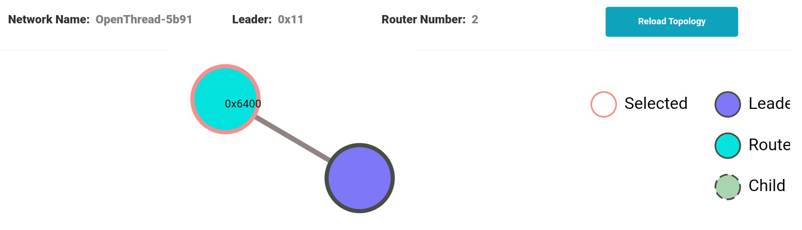

# Example: OpenThread Border Router + End Device + ChipTool
~/esp-thread-br/examples/basic_thread_border_router : OpenThread Border Router  
~/esp-matter/examples/light-c6 : End Device  
  

## End Device
~~~
matter esp factoryreset
matter esp ot_cli state
~~~
disabled
~~~
matter onboardingcodes none
~~~
> QRCode:            MT:Y.K90-Q000KA0648G00  
> QRCodeUrl:         https://project-chip.github.io/connectedhomeip/qrcode.html?data=MT%3AY.K90-Q000KA0648G00  
> ManualPairingCode: 34970112332  

## OpenThread Border Router
~~~
dataset active -x
~~~
> 0e080000000000010000000300001a4a0300001635060004001fffe002083dd5846a27dd139f0708fdec29c2f04b4b23051045005945ef9dbed88082d208673dad0f030f4f70656e5468726561642d3562393101025b9104109855950ef75071da53e996c50694576a0c0402a0f7f8

We use ManualPairingCode and Dataset values to make a request with chip-tool  
*Syntax:* ***chip-tool pairing code-thread {node_id} hex:{Dataset} {ManualPairingCode}***  
- {node_id} : NodeId chosen for the end device during pairing  
- {Dataset} : from "dataset active -x"  
- {ManualPairingCode} : from "matter onboardingcodes none"  

~~~
chip-tool pairing code-thread 1 hex:0e080000000000010000000300001a4a0300001635060004001fffe002083dd5846a27dd139f0708fdec29c2f04b4b23051045005945ef9dbed88082d208673dad0f030f4f70656e5468726561642d3562393101025b9104109855950ef75071da53e996c50694576a0c0402a0f7f8 34970112332
~~~

## End Device
~~~
> matter esp ot_cli state
~~~
> router
~~~
matter esp ot_cli router table
~~~
  
> | ID | RLOC16 | Next Hop | Path Cost | LQ In | LQ Out | Age | Extended MAC     | Link |  
> +----+--------+----------+-----------+-------+--------+-----+------------------+------+  
> | 17 | 0x4400 |       63 |         0 |     3 |      3 |  10 | 7a64fd2b41e75415 |    1 |  
> | 25 | 0x6400 |       63 |         0 |     0 |      0 |   0 | 0000000000000000 |    0 |  
  
  
  

## OpenThread Border Router
Now we can toggle RGB-LED on the ESP32-C6 development board
*Syntax:* ***chip-tool {cluster_id} {command_id} {node_id} {endpoint_id}***  
- {cluster_id} : ClusterId ("onoff" for this example)
- {command_id} : CommandId ("toggle" for this example)
- {node_id} : NodeId chosen for the end device during pairing  
- {endpoint_id} : EndPointId (1 for this example)  
~~~
chip-tool onoff toggle 1 1
~~~
> Command: onoff toggle 1 1  
> Sending command to node 0x1  
> Sending cluster (0x00000006) command (0x00000002) on endpoint 1  
> Received Command Response Status for Endpoint=1 Cluster=0x0000_0006 Command=0x0000_0002 Status=0x0  
  
EndpointId = 0x1 (1 for this example)  
ClusterId = 0x6 (6 for OnOff cluster)  
CommandId = 0x2 (2 for Toggle command)  
Status = 0x00 (0 = SUCCESS)  
  
  
