[**How to setup and work with ESP-IDF and ESP-Matter**](https://github.com/mozolin/matter-thread)  
# How to setup and work with OpenThread Border Router
[How_to_setup_and_work_with_OpenThread_Border_Router.pdf](docs/How_to_setup_and_work_with_OpenThread_Border_Router.pdf)  

[https://docs.espressif.com/projects/esp-thread-br/en/latest/dev-guide/build_and_run.html](https://docs.espressif.com/projects/esp-thread-br/en/latest/dev-guide/build_and_run.html)  
[https://openthread.io/guides/border-router/espressif-esp32](https://openthread.io/guides/border-router/espressif-esp32)  
[https://openthread.io/codelabs/esp-openthread-hardware](https://openthread.io/codelabs/esp-openthread-hardware)  
 
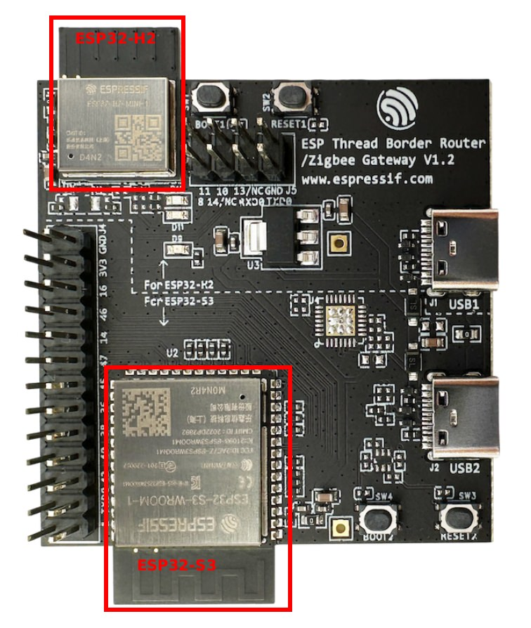  
Note: Only the USB2 port on the ESP Thread Border Router Board needs to be connected to the host.

~~~
D:
cd ~/esp-idf
./export.bat
cd ..
git clone --recursive https://github.com/espressif/esp-thread-br.git
~~~

Build the esp-idf/examples/openthread/ot_rcp example. The firmware doesn't need to be explicitly flashed to a device. It will be included in the Border Router firmware and flashed to the ESP32-H2 chip upon first boot (or the RCP firmware changed).
~~~
cd ~/esp-idf/examples/openthread/ot_rcp
idf.py set-target esp32h2
idf.py build
cd ~/esp-thread-br/examples/basic_thread_border_router
idf.py set-target esp32s3
idf.py menuconfig
~~~

**1) Using Wi-Fi:**  
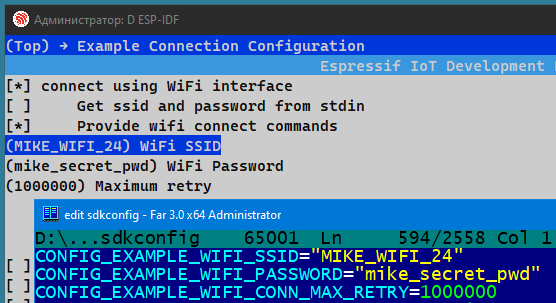

**2) Using Ethernet (with Sub-Ethernet board):**  
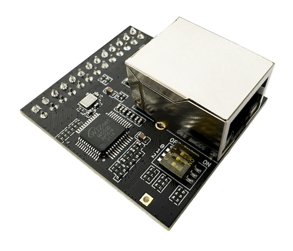  
  
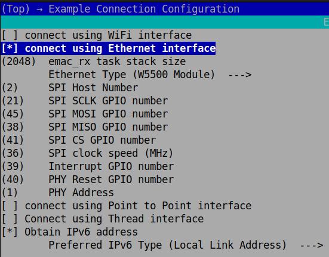  
  
**Common settings:**  
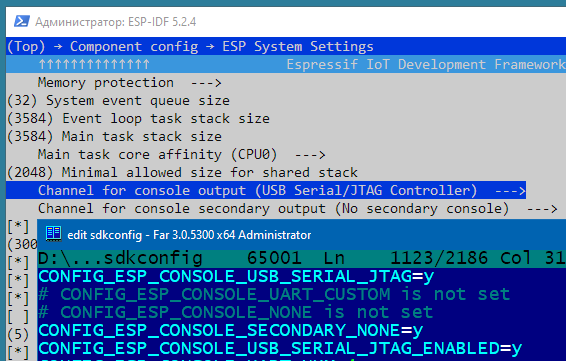  
 
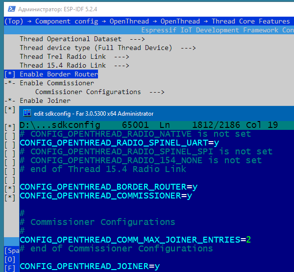  

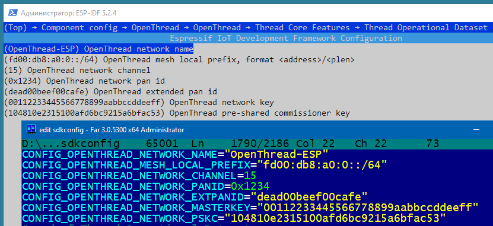  

~~~
idf.py -p COM3 build flash monitor
~~~

If ethernet connection failed:  
>   
> E (6252) w5500.mac: W5500 version mismatched, expected 0x04, got 0x0hx  
> E (6252) w5500.mac: emac_w5500_init(826): verify chip ID failed  
> E (6252) esp_eth: esp_eth_driver_install(228): init mac failed  
> ESP_ERROR_CHECK failed: esp_err_t 0x10a (ESP_ERR_INVALID_VERSION) at 0x4202126a  
> ===========================
> E (6144) dm9051.mac: dm9051_verify_id(307): wrong Vendor ID  
> E (6144) dm9051.mac: emac_dm9051_init(798): verify chip ID failed  
> E (6144) esp_eth: esp_eth_driver_install(228): init mac failed  
> ESP_ERROR_CHECK failed: esp_err_t 0x10a (ESP_ERR_INVALID_VERSION) at 0x42021266  
> ===========================
> E (6150) opencores.emac: CONFIG_ETH_USE_OPENETH should only be used when running in QEMU.  
> E (6150) opencores.emac: When running the app on the ESP32, use CONFIG_ETH_USE_ESP32_EMAC instead.  
> abort() was called at PC 0x42022542 on core 1    
>   
  
try to change...  
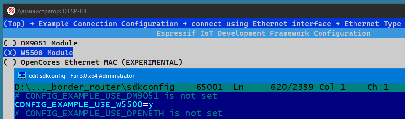  
  
Now we can form a Thread network using the OpenThread command line on ESP Thread Border Router Board (BR Commissioner):
~~~
dataset init new
~~~
Done

~~~
dataset
~~~
Active Timestamp: 1  
Channel: 21  
Channel Mask: 0x07fff800  
Ext PAN ID: 151975d11bea97b5  
Mesh Local Prefix: fd6a:b54b:d6a3:b05a::/64  
Network Key: 731ab6a60a64a0a0b14b259b86b2be01  
Network Name: OpenThread-1444  
PAN ID: 0x1444  
PSKc: 54e7f18d2575014da94db09df29c5df0  
Security Policy: 672 onrc 0  
Done  
  
Commit this dataset as the active one:
~~~
dataset commit active
~~~
Done  
  
Bring up the IPv6 interface:
~~~
ifconfig up
~~~
I (59329) OPENTHREAD: Platform UDP bound to port 49153  
Done  
I (59329) OT_STATE: netif up  
  
Start Thread protocol operation:
~~~
thread start
~~~
I(61709) OPENTHREAD:[N] Mle-----------: Role disabled -> detached  
Done  
I(62469) OPENTHREAD:[N] Mle-----------: Attach attempt 1, AnyPartition reattaching with Active Dataset  
I(69079) OPENTHREAD:[N] RouterTable---: Allocate router id 11  
I(69079) OPENTHREAD:[N] Mle-----------: RLOC16 fffe -> 2c00  
I(69089) OPENTHREAD:[N] Mle-----------: Role detached -> leader  
I(69089) OPENTHREAD:[N] Mle-----------: Partition ID 0x28b518c6  
I (69099) OPENTHREAD: Platform UDP bound to port 49154  
  
After a moment, check the device state. It should be the Leader.
~~~
state
~~~
leader  
Done  

# Example: OpenThread Border Router + End Device + ChipTool
~/esp-thread-br/examples/basic_thread_border_router : OpenThread Border Router  
  
## End Device
~~~
matter esp factoryreset
matter esp ot_cli state
~~~
disabled
~~~
matter onboardingcodes none
~~~
> QRCode:            MT:Y.K90-Q000KA0648G00  
> QRCodeUrl:         https://project-chip.github.io/connectedhomeip/qrcode.html?data=MT%3AY.K90-Q000KA0648G00  
> ManualPairingCode: 34970112332  

## OpenThread Border Router
~~~
dataset active -x
~~~
> 0e080000000000010000000300001a4a0300001635060004001fffe002083dd5846a27dd139f0708fdec29c2f04b4b23051045005945ef9dbed88082d208673dad0f030f4f70656e5468726561642d3562393101025b9104109855950ef75071da53e996c50694576a0c0402a0f7f8

We use ManualPairingCode and Dataset values to make a request with chip-tool  
*Syntax:* ***chip-tool pairing code-thread {node_id} hex:{Dataset} {ManualPairingCode}***  
- {node_id} : NodeId chosen for the end device during pairing  
- {Dataset} : from "dataset active -x"  
- {ManualPairingCode} : from "matter onboardingcodes none"  

~~~
chip-tool pairing code-thread 1 hex:0e080000000000010000000300001a4a0300001635060004001fffe002083dd5846a27dd139f0708fdec29c2f04b4b23051045005945ef9dbed88082d208673dad0f030f4f70656e5468726561642d3562393101025b9104109855950ef75071da53e996c50694576a0c0402a0f7f8 34970112332
~~~

## End Device
~~~
> matter esp ot_cli state
~~~
> router
~~~
matter esp ot_cli router table
~~~
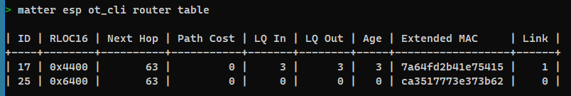  
> | ID | RLOC16 | Next Hop | Path Cost | LQ In | LQ Out | Age | Extended MAC     | Link |  
> +----+--------+----------+-----------+-------+--------+-----+------------------+------+  
> | 17 | 0x4400 |       63 |         0 |     3 |      3 |  10 | 7a64fd2b41e75415 |    1 |  
> | 25 | 0x6400 |       63 |         0 |     0 |      0 |   0 | 0000000000000000 |    0 |  
  
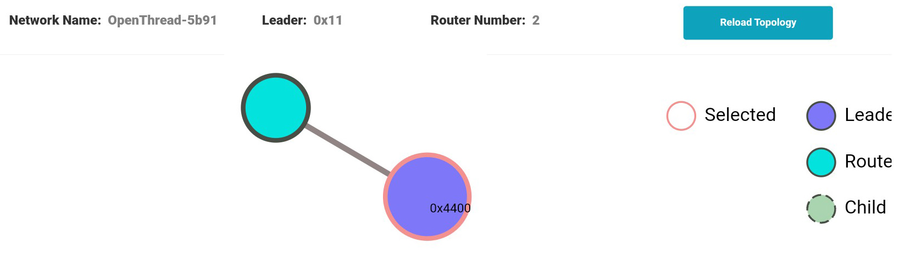  
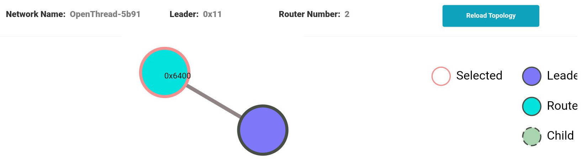  

## ChipTool
Now we can toggle RGB-LED on the ESP32-C6 development board  
*Syntax:* ***chip-tool {cluster_id} {command_id} {node_id} {endpoint_id}***  
- {cluster_id} : ClusterId ("onoff" for this example)  
- {command_id} : CommandId ("toggle" for this example)  
- {node_id} : NodeId chosen for the end device during pairing  
- {endpoint_id} : EndPointId (1 for this example)  
~~~
chip-tool onoff toggle 1 1
~~~
> Command: onoff toggle 1 1  
> Sending command to node 0x1  
> Sending cluster (0x00000006) command (0x00000002) on endpoint 1  
> Received Command Response Status for Endpoint=1 Cluster=0x0000_0006 Command=0x0000_0002 Status=0x0  
  
EndpointId = 0x1 (1 for this example)  
ClusterId = 0x6 (6 for OnOff cluster)  
CommandId = 0x2 (2 for Toggle command)  
Status = 0x00 (0 = SUCCESS)  

## End Device  
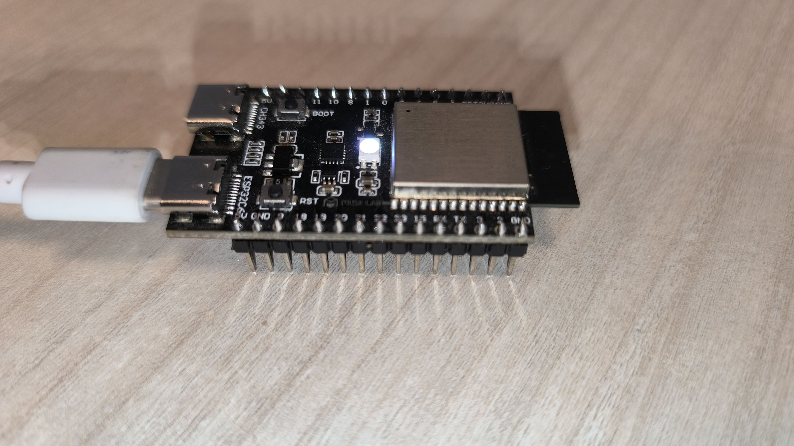  
