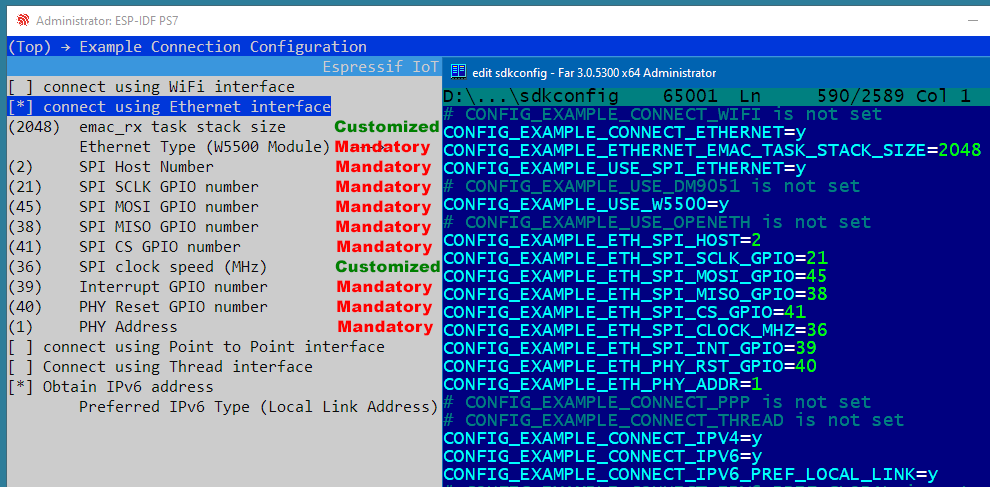
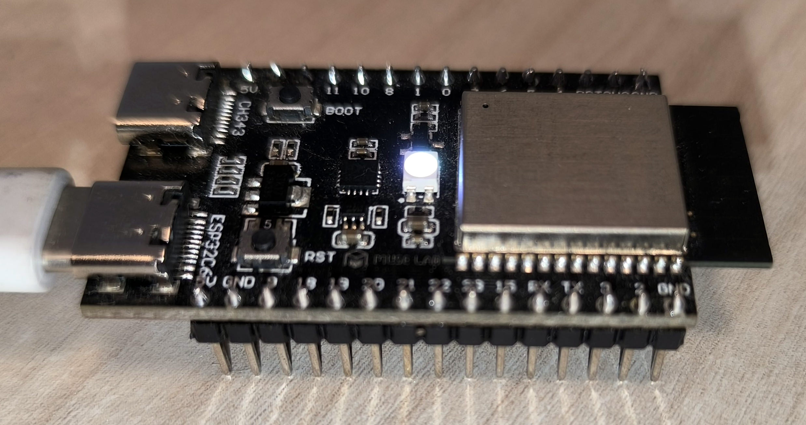

[**How to setup and work with ESP-IDF and ESP-Matter**](https://github.com/mozolin/matter-thread)  
# How to setup and work with OpenThread Border Router
[How_to_setup_and_work_with_OpenThread_Border_Router.pdf](docs/How_to_setup_and_work_with_OpenThread_Border_Router.pdf)  

[https://docs.espressif.com/projects/esp-thread-br/en/latest/dev-guide/build_and_run.html](https://docs.espressif.com/projects/esp-thread-br/en/latest/dev-guide/build_and_run.html)  
[https://openthread.io/guides/border-router/espressif-esp32](https://openthread.io/guides/border-router/espressif-esp32)  
[https://openthread.io/codelabs/esp-openthread-hardware](https://openthread.io/codelabs/esp-openthread-hardware)  
 
# 1) Hardware

  
Note: Only the USB2 port on the ESP Thread Border Router Board needs to be connected to the host.

# 2) Installation

~~~
D:
cd ~/esp-idf
./export.bat
cd ..
git clone --recursive https://github.com/espressif/esp-thread-br.git
~~~

Build the esp-idf/examples/openthread/ot_rcp example. The firmware doesn't need to be explicitly flashed to a device. It will be included in the Border Router firmware and flashed to the ESP32-H2 chip upon first boot (or the RCP firmware changed).
~~~
cd ~/esp-idf/examples/openthread/ot_rcp
idf.py set-target esp32h2
idf.py build
cd ~/esp-thread-br/examples/basic_thread_border_router
idf.py set-target esp32s3
idf.py menuconfig
~~~

**1) Using Wi-Fi:**  

**2) Using Ethernet (with Sub-Ethernet board):**  
  

[Ethernet based Thread Border Router](https://docs.espressif.com/projects/esp-thread-br/en/latest/dev-guide/build_and_run.html#ethernet-based-thread-border-router)  
  
  
  
**3) Common settings:**  
  
 
  

  

~~~
idf.py -p COM3 build flash monitor
~~~

If the ethernet connection fails, the parameters in the *"Example connection configuration"* section (see above *"2) Using Ethernet..."*) are most likely incorrect.  
  
> E (6252) w5500.mac: W5500 version mismatched, expected 0x04, got 0x0hx  
> E (6252) w5500.mac: emac_w5500_init(826): verify chip ID failed  
> E (6252) esp_eth: esp_eth_driver_install(228): init mac failed  
> ESP_ERROR_CHECK failed: esp_err_t 0x10a (ESP_ERR_INVALID_VERSION) at 0x4202126a  
  
# 3) Form a Thread network

Now we can form a Thread network using the OpenThread command line on ESP Thread Border Router Board (BR Commissioner):
~~~
dataset init new
~~~
Done

~~~
dataset
~~~
Active Timestamp: 1  
Channel: 21  
Channel Mask: 0x07fff800  
Ext PAN ID: 151975d11bea97b5  
Mesh Local Prefix: fd6a:b54b:d6a3:b05a::/64  
Network Key: 731ab6a60a64a0a0b14b259b86b2be01  
Network Name: OpenThread-1444  
PAN ID: 0x1444  
PSKc: 54e7f18d2575014da94db09df29c5df0  
Security Policy: 672 onrc 0  
Done  
  
Commit this dataset as the active one:
~~~
dataset commit active
~~~
Done  
  
Bring up the IPv6 interface:
~~~
ifconfig up
~~~
I (59329) OPENTHREAD: Platform UDP bound to port 49153  
Done  
I (59329) OT_STATE: netif up  
  
Start Thread protocol operation:
~~~
thread start
~~~
I(61709) OPENTHREAD:[N] Mle-----------: Role disabled -> detached  
Done  
I(62469) OPENTHREAD:[N] Mle-----------: Attach attempt 1, AnyPartition reattaching with Active Dataset  
I(69079) OPENTHREAD:[N] RouterTable---: Allocate router id 11  
I(69079) OPENTHREAD:[N] Mle-----------: RLOC16 fffe -> 2c00  
I(69089) OPENTHREAD:[N] Mle-----------: Role detached -> leader  
I(69089) OPENTHREAD:[N] Mle-----------: Partition ID 0x28b518c6  
I (69099) OPENTHREAD: Platform UDP bound to port 49154  
  
After a moment, check the device state. It should be the Leader.
~~~
state
~~~
leader  
Done  

# 4) Example: OpenThread Border Router + End Device + ChipTool
~/esp-thread-br/examples/basic_thread_border_router : OpenThread Border Router  
  
## End Device
~~~
matter esp factoryreset
matter esp ot_cli state
~~~
disabled
~~~
matter onboardingcodes none
~~~
> QRCode:            MT:Y.K90-Q000KA0648G00  
> QRCodeUrl:         https://project-chip.github.io/connectedhomeip/qrcode.html?data=MT%3AY.K90-Q000KA0648G00  
> ManualPairingCode: 34970112332  

## OpenThread Border Router
~~~
dataset active -x
~~~
> 0e080000000000010000000300001a4a0300001635060004001fffe002083dd5846a27dd139f0708fdec29c2f04b4b23051045005945ef9dbed88082d208673dad0f030f4f70656e5468726561642d3562393101025b9104109855950ef75071da53e996c50694576a0c0402a0f7f8

We use ManualPairingCode and Dataset values to make a request with chip-tool  
*Syntax:* ***chip-tool pairing code-thread {node_id} hex:{Dataset} {ManualPairingCode}***  
- {node_id} : NodeId chosen for the end device during pairing  
- {Dataset} : from "dataset active -x"  
- {ManualPairingCode} : from "matter onboardingcodes none"  

~~~
chip-tool pairing code-thread 1 hex:0e080000000000010000000300001a4a0300001635060004001fffe002083dd5846a27dd139f0708fdec29c2f04b4b23051045005945ef9dbed88082d208673dad0f030f4f70656e5468726561642d3562393101025b9104109855950ef75071da53e996c50694576a0c0402a0f7f8 34970112332
~~~

## End Device
~~~
> matter esp ot_cli state
~~~
> router
~~~
matter esp ot_cli router table
~~~
  
> | ID | RLOC16 | Next Hop | Path Cost | LQ In | LQ Out | Age | Extended MAC     | Link |  
> +----+--------+----------+-----------+-------+--------+-----+------------------+------+  
> | 17 | 0x4400 |       63 |         0 |     3 |      3 |  10 | 7a64fd2b41e75415 |    1 |  
> | 25 | 0x6400 |       63 |         0 |     0 |      0 |   0 | 0000000000000000 |    0 |  
  
  
  

## ChipTool
Now we can toggle RGB-LED on the ESP32-C6 development board  
*Syntax:* ***chip-tool {cluster_id} {command_id} {node_id} {endpoint_id}***  
- {cluster_id} : ClusterId ("onoff" for this example)  
- {command_id} : CommandId ("toggle" for this example)  
- {node_id} : NodeId chosen for the end device during pairing  
- {endpoint_id} : EndPointId (1 for this example)  
~~~
chip-tool onoff toggle 1 1
~~~
> Command: onoff toggle 1 1  
> Sending command to node 0x1  
> Sending cluster (0x00000006) command (0x00000002) on endpoint 1  
> Received Command Response Status for Endpoint=1 Cluster=0x0000_0006 Command=0x0000_0002 Status=0x0  
  
EndpointId = 0x1 (1 for this example)  
ClusterId = 0x6 (6 for OnOff cluster)  
CommandId = 0x2 (2 for Toggle command)  
Status = 0x00 (0 = SUCCESS)  

## End Device  
  

# 5) Example "basic_thread_border_router": flash firmware for 8MB and 16MB flash size

### - Partition table binary generated. Contents:
~~~
*******************************************************************************
# ESP-IDF Partition Table
# Name,      Type, SubType, Offset,   Size,  Flags
#--------------------------------------------------
nvs,         data, nvs,     0x9000,   24K,
otadata,     data, ota,     0xf000,   8K,
phy_init,    data, phy,     0x11000,  4K,
ota_0,       app,  ota_0,   0x20000,  1600K,
ota_1,       app,  ota_1,   0x1b0000, 1600K,
web_storage, data, spiffs,  0x340000, 640K,
rcp_fw,      data, spiffs,  0x3e0000, 640K,
*******************************************************************************
~~~

### - To flash, run:
~~~
python -m esptool --chip esp32s3 -b 460800 --before default_reset --after hard_reset write_flash --flash_mode dio --flash_size 16MB --flash_freq 80m
  0x000000 build\bootloader\bootloader.bin
  0x008000 build\partition_table\partition-table.bin
  0x00f000 build\ota_data_initial.bin
  0x020000 build\esp_ot_br.bin
  0x340000 build\web_storage.bin
  0x3e0000 build\rcp_fw.bin
~~~

Files size:
~~~
1451 K │ esp_ot_br.bin
  8192 │ ota_data_initial.bin
655360 │ rcp_fw.bin
655360 │ web_storage.bin
 20880 │ bootloader.bin 
  3072 │ partition-table.bin
~~~

~~~
Configuring flash size...
Flash will be erased from 0x00000000 to 0x00005fff...
Flash will be erased from 0x00020000 to 0x0018afff...
Flash will be erased from 0x00008000 to 0x00008fff...
Flash will be erased from 0x0000f000 to 0x00010fff...
Flash will be erased from 0x003e0000 to 0x0047ffff...
Flash will be erased from 0x00340000 to 0x003dffff...
~~~

### - Flashing process
**bootloader.bin**  
> Compressed 20880 bytes to 13278...  
> Wrote 20880 bytes (13278 compressed) at 0x00000000  
  
**esp_ot_br.bin (1600K)**  
> Compressed 1485968 bytes to 988504...  
> Wrote 1485968 bytes (988504 compressed) at 0x00020000  
  
**partition-table.bin**  
> Compressed 3072 bytes to 159...  
> Wrote 3072 bytes (159 compressed) at 0x00008000  
  
**ota_data_initial.bin (8K)**  
> Compressed 8192 bytes to 31...  
> Wrote 8192 bytes (31 compressed) at 0x0000f000  
  
**rcp_fw.bin (640K)**  
> Compressed 655360 bytes to 155948...  
> Wrote 655360 bytes (155948 compressed) at 0x003e0000  
  
**web_storage.bin (640K)**  
> Compressed 655360 bytes to 154806...  
> Wrote 655360 bytes (154806 compressed) at 0x00340000  
  

# 6) Example "basic_thread_border_router": flash firmware for 4MB flash size
We should remove one of the OTA blocks to save memory with the flash size limitation of 4MB, let it be ota_1...  
  
### - Partition table binary generated. Contents:
~~~
*******************************************************************************
# ESP-IDF Partition Table
# Name,      Type, SubType, Offset,   Size,  Flags
#--------------------------------------------------
nvs,         data, nvs,     0x9000,   24K,
otadata,     data, ota,     0xf000,   8K,
phy_init,    data, phy,     0x11000,  4K,
ota_0,       app,  ota_0,   0x20000,  1600K,
web_storage, data, spiffs,  0x1b0000, 640K,
rcp_fw,      data, spiffs,  0x250000, 640K,
*******************************************************************************
~~~

### - To flash, run:
~~~
python -m esptool --chip esp32s3 -b 460800 --before default_reset --after hard_reset write_flash --flash_mode dio --flash_size 4MB --flash_freq 80m
  0x000000 build\bootloader\bootloader.bin
  0x008000 build\partition_table\partition-table.bin
  0x00f000 build\ota_data_initial.bin
  0x020000 build\esp_ot_br.bin
  0x1b0000 build\web_storage.bin
  0x250000 build\rcp_fw.bin
~~~

### - Flashing process
**bootloader.bin**  
> Compressed 20880 bytes to 13277...  
> Wrote 20880 bytes (13277 compressed) at 0x00000000  

**esp_ot_br.bin (1600K)**  
> Compressed 1485984 bytes to 988526...  
> Wrote 1485984 bytes (988526 compressed) at 0x00020000  

**partition-table.bin**  
> Compressed 3072 bytes to 150...  
> Wrote 3072 bytes (150 compressed) at 0x00008000  

**ota_data_initial.bin (8K)**  
> Compressed 8192 bytes to 31...  
> Wrote 8192 bytes (31 compressed) at 0x0000f000  

**rcp_fw.bin (640K)**  
> Compressed 655360 bytes to 155948...  
> Wrote 655360 bytes (155948 compressed) at 0x00250000  

**web_storage.bin (640K)**  
> Compressed 655360 bytes to 154806...  
> Wrote 655360 bytes (154806 compressed) at 0x001b0000  
