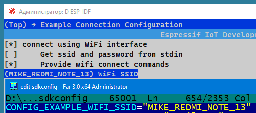
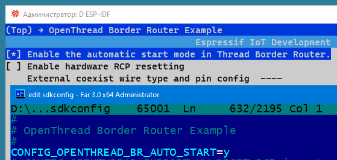
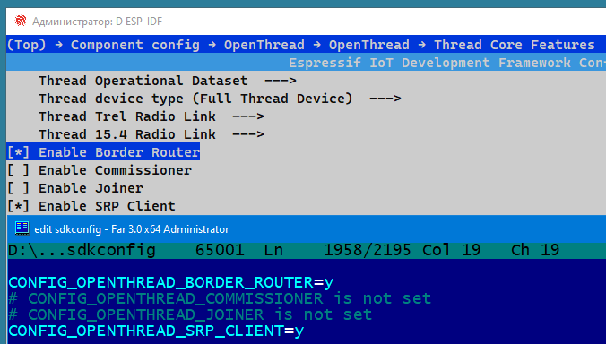
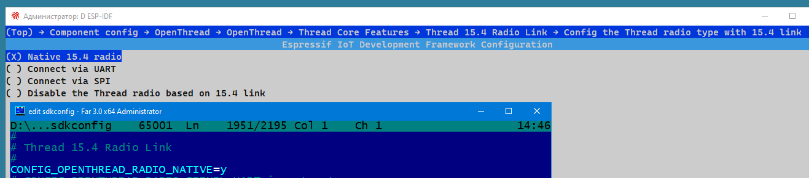

# OpenThread Border Router Example
Github: https://github.com/espressif/esp-idf/tree/master/examples/openthread/ot_br  
  
The example could also run on a single SoC which supports both Wi-Fi and Thread (e.g., ESP32-C6), but since there is only one RF path in ESP32-C6, which means Wi-Fi and Thread can't receive simultaneously, it has a significant impact on performance.  
This example is implemented using the ESP32-C6 development board.  

Blink GPIO number: 8  
  
Check ESP board configuration:
~~~
esptool -p {COM-PORT} flash_id
~~~
> esptool.py v4.8.1  
> Detecting chip type... ESP32-C6  
> Detected flash size: 8MB  
  
~~~
idf.py menuconfig
~~~

  

  
  
*Indicator of **Leader** Device: 40,0,0 (**red**)*  
*Indicator of **Router** Device: 0,0,40 (**blue**)*  
*Indicator of **Child** Device: 0,40,0 (**green**)*  
*Indicator of **Detached** Device: 20,20,20 (**white**)*  
  

  

  

  

  

  

~~~
idf.py -p COM3 build flash monitor
~~~
> I (499) ot_ext_cli: Start example_connect  
> I (499) example_connect: Connecting to MIKE_REDMI_NOTE_13...  
> ...  
> I (17219) esp_netif_handlers: example_netif_sta ip: **192.168.31.218**, mask: 255.255.255.0, gw: 192.168.31.193  
> I (17219) example_connect: Got IPv4 event: Interface "example_netif_sta" address: 192.168.31.218  
> I (17379) example_connect: Got IPv6 event: Interface "example_netif_sta" address: fe80:0000:0000:0000:424c:caff:fe58:101c, type: ESP_IP6_ADDR_IS_LINK_LOCAL  
...  
> I(17389) OPENTHREAD:[N] Mle-----------: Role disabled -> detached  
...  
> I(51099) OPENTHREAD:[N] Mle-----------: Role detached -> leader  
  
OpenThread command line interface (CLI):
~~~
state
~~~
> leader
~~~
wifi state
~~~
> connected
~~~
dataset active -x
~~~
> 0e080000000000010000000300000f4a0300001135060004001fffe00208dead00beef00cafe0708fd000db800a00000051000112233445566778899aabbccddeeff030e4f70656e5468726561642d455350010212340410104810e2315100afd6bc9215a6bfac530c0402a0f7f8
