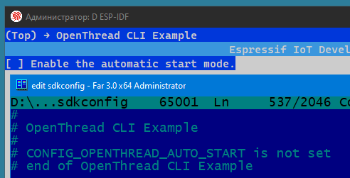
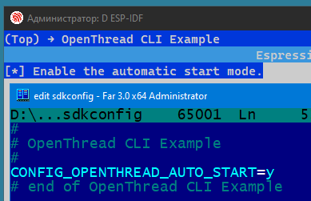
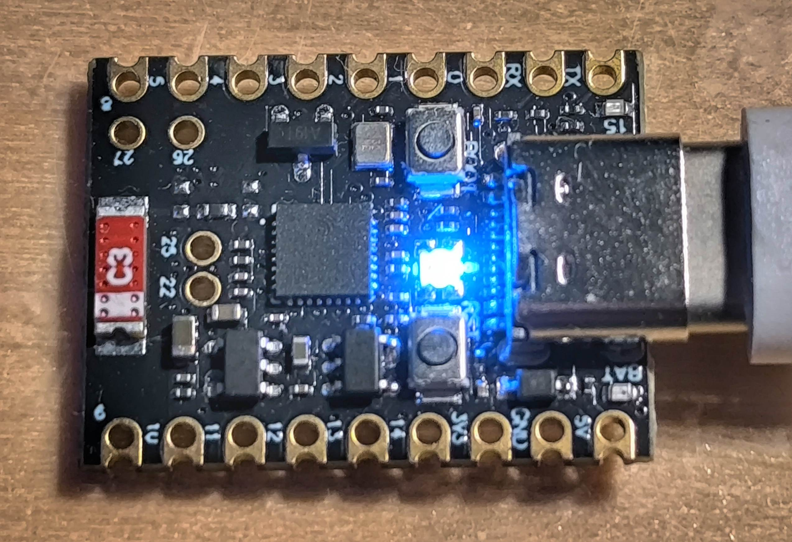

# Make an example project (all the settings are made for ESP32-H2 development board)

OpenThread Border Router (see: [How to setup and work with OpenThread Border Router](esp-basic_thread_border_router.md))
~~~
dataset active -x
~~~
> 0e08000000000001000000030000154a0300001735060004001fffe00208def5e21b6165cc560708fde61aeab4004131051000112233445566778899aabbccddeeff030f4f70656e5468726561642d32326339010222c90410a5e0c5822c1e723956af6b1ee43f084e0c0402a0f7f8  
> Done

~~~
networkkey
~~~
> 00112233445566778899aabbccddeeff  
> Done

Example: https://github.com/espressif/esp-idf/tree/master/examples/openthread/ot_cli  
Make a copy of ~/esp-idf/examples/openthread/ot_cli folder to ../ot_cli-h2  
Navigate to the ot_cli example directory, Clean previous build files, Set the build target to ESP32-H2 and Enter the configuration menu:  
~~~
cd ~/esp-idf/examples/openthread/ot_cli-h2
rm -rf build/
idf.py set-target esp32h2
idf.py menuconfig
~~~

  
  
  
  
  
*Indicator of **Leader** Device: 40,0,0 (**red**)*  
*Indicator of **Router** Device: 0,0,40 (**blue**)*  
*Indicator of **Child** Device: 0,40,0 (**green**)*  
*Indicator of **Detached** Device: 20,20,20 (**white**)*  

  
  

Building, flashing and monitoring  
~~~
idf.py -p COM3 build flash monitor
~~~

There are two modes of using this example:  
1) Automatic start mode = Disabled  
  
~~~
state
~~~
> disabled

2) Automatic start mode = Enabled  
  
~~~
state
~~~
The state will be changing: disabled -> detached -> leader.  

We can use **dataset** to join end device to Thread Network:
~~~
dataset set active 0e08000000000001000000030000154a0300001735060004001fffe00208def5e21b6165cc560708fde61aeab4004131051000112233445566778899aabbccddeeff030f4f70656e5468726561642d32326339010222c90410a5e0c5822c1e723956af6b1ee43f084e0c0402a0f7f8
~~~

Or, we can use **networkkey** to join end device to Thread Network:
~~~
dataset networkkey 00112233445566778899aabbccddeeff
~~~

Now, it can join the Thread network:
~~~
dataset commit active
ifconfig up
thread start
state
~~~
> child

After this, the role can become a *router* or remain a *child*.
~~~
state
~~~
> router

  
