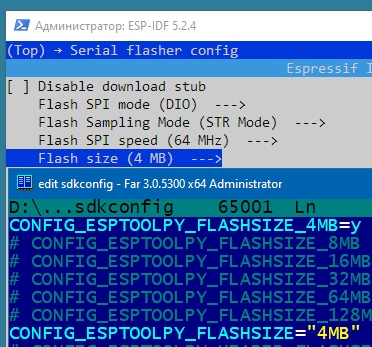
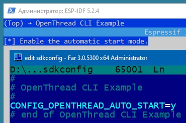
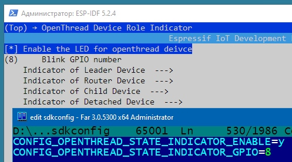
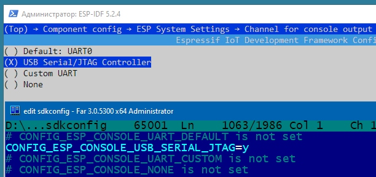

# Make an example project (all the settings are made for ESP32-H2 development board)

OpenThread Border Router (see: [How to setup and work with OpenThread Border Router](../OPENTHREAD.md))
~~~
dataset active -x
~~~
> 0e08000000000001000000030000154a0300001735060004001fffe00208def5e21b6165cc560708fde61aeab4004131051000112233445566778899aabbccddeeff030f4f70656e5468726561642d32326339010222c90410a5e0c5822c1e723956af6b1ee43f084e0c0402a0f7f8  
> Done

~~~
networkkey
~~~
> 00112233445566778899aabbccddeeff  
> Done

  
Make a copy of ~/esp-idf/examples/openthread/ot_cli folder to ../ot_cli-h2
~~~
cd ~/esp-idf/examples/openthread/ot_cli-h2   #-- Navigate to the ot_cli example directory
rm -rf build/                                #-- Clean previous build files
idf.py set-target esp32h2                    #-- Set the build target to ESP32-H2
idf.py menuconfig                            #-- Enter the configuration menu
~~~

  
  
  
  
  
  
  

Building, flashing and monitoring  
~~~
idf.py -p COM3 build flash monitor
~~~
If the end device role is *detached*,
> OPENTHREAD:[N] Mle-----------: Role disabled -> detached

there will be a problem joining it to the Thread Network using the border router dataset:
~~~
dataset set active 0e08000000000001000000030000154a0300001735060004001fffe00208def5e21b6165cc560708fde61aeab4004131051000112233445566778899aabbccddeeff030f4f70656e5468726561642d32326339010222c90410a5e0c5822c1e723956af6b1ee43f084e0c0402a0f7f8
~~~
> Error 7: InvalidArgs  

When the role becomes *leader*, we can use the border router dataset:
> OPENTHREAD:[N] Mle-----------: Role detached -> leader
~~~
dataset set active 0e08000000000001000000030000154a0300001735060004001fffe00208def5e21b6165cc560708fde61aeab4004131051000112233445566778899aabbccddeeff030f4f70656e5468726561642d32326339010222c90410a5e0c5822c1e723956af6b1ee43f084e0c0402a0f7f8
~~~
> Done  

Anyway, we can use **networkkey** to join end device to Thread Network:
~~~
dataset networkkey 00112233445566778899aabbccddeeff
dataset commit active
ifconfig up
thread start
state
~~~
> child

After this, the role can become a *router* or remain a *child*.
~~~
state
~~~
> router
