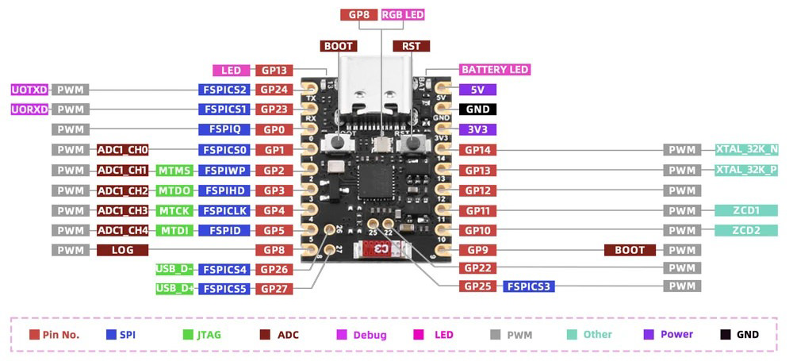

# 3. Thread End Device (ESP32-C6 development board, Ubuntu only):
Source code: [~/esp-matter/examples/light](https://github.com/espressif/esp-matter/tree/main/examples/light)  
This example is implemented using the Nano ESP32-C6 development board.  
  
This can also be implemented using the ESP32-H2 Super Mini development board.  
  
*We can see any events for these development boards in the terminal. For example, when clicking on the BOOT button:*  
> app_driver: Toggle button pressed  
> esp_matter_attribute: R : Endpoint 0x0001's Cluster 0x00000006's Attribute 0x00000000 is 1  
> esp_matter_attribute: W : Endpoint 0x0001's Cluster 0x00000006's Attribute 0x00000000 is 0  
> led_driver_ws2812: led set **r:0, g:0, b:0**  
> app_driver: Toggle button pressed  
> esp_matter_attribute: R : Endpoint 0x0001's Cluster 0x00000006's Attribute 0x00000000 is 0  
> esp_matter_attribute: W : Endpoint 0x0001's Cluster 0x00000006's Attribute 0x00000000 is 1  
> led_driver_ws2812: led set **r:63, g:51, b:40**  

According to this manual,  
https://docs.espressif.com/projects/esptool/en/latest/esp32c6/advanced-topics/boot-mode-selection.html  
we can use the BOOT button on both development boards to *toggle* (single click) and *factory reset* (long click/hold for 5 seconds). The same functionality is available on *GPIO9* shorted to GND.  
  
- Make a copy of /root/esp-matter/examples/light folder to ../light-c6 (or ../light-h2 for the ESP32-H2)
- Open this folder in VSCode using a remote WSL or in Ubuntu

Navigate to the light example directory, Clean previous build files, Set the build target to ESP32-C6 and Enter the configuration menu
~~~
cd /root/esp-matter/examples/light-c6
rm -rf build/
idf.py set-target esp32c6
#idf.py set-target esp32h2
idf.py menuconfig
~~~

  
  
  
  
  
  
  
  
  
  
  
  
Building, flashing and monitoring
~~~
idf.py -p /tty/ACM0 build flash monitor
~~~

## Join the Thread Network via NetworkKey or DataSet
**OpenThread Border Router** (see: [How to setup and work with OpenThread Border Router](esp-basic_thread_border_router.md))
~~~
dataset active -x
~~~
> 0e08000000000001000000030000154a0300001735060004001fffe00208def5e21b6165cc560708fde61aeab4004131051000112233445566778899aabbccddeeff030f4f70656e5468726561642d32326339010222c90410a5e0c5822c1e723956af6b1ee43f084e0c0402a0f7f8  
> Done

~~~
networkkey
~~~
> 00112233445566778899aabbccddeeff  
> Done

**Thread End Device**
~~~
matter esp ot_cli factoryreset
matter onboardingcodes none
~~~
> QRCode:            MT:Y.K90-Q000KA0648G00  
> QRCodeUrl:         https://project-chip.github.io/connectedhomeip/qrcode.html?data=MT%3AY.K90-Q000KA0648G00  
> ManualPairingCode: 34970112332  
~~~
matter config
~~~
> VendorId:        65521 (0xFFF1)  
> ProductId:       32768 (0x8000)  
> HardwareVersion: 1 (0x1)  
> PinCode:         020202021  
> Discriminator:   f00 (3840) 
    
There is a problem joining it to the Thread Network using the border router dataset:
~~~
matter esp ot_cli dataset set active 0e080000000000010000000300001a4a0300001635060004001fffe002083dd5846a27dd139f0708fdec29c2f04b4b23051045005945ef9dbed88082d208673dad0f030f4f70656e5468726561642d3562393101025b9104109855950ef75071da53e996c50694576a0c0402a0f7f8

TMP> matter esp ot_cli factoryreset
TMP> matter esp ot_cli dataset set active 0e080000000000010000000300001a4a0300001635060004001fffe002083dd5846a27dd139f0708fdec29c2f04b4b23051045005945ef9dbed88082d208673dad0f030f4f70656e5468726561642d3562393101025b9104109855950ef75071da53e996c50694576a0c0402a0f7f8
~~~
> Error 7: InvalidArgs  
  
The dataset string is 222 characters long.  
When we parse this dataset with [tlv-parser](D/utils/tlv-parser), we can get the following info:  
> t:  0 (CHANNEL), l: 3, v: 0x00001a  
> t:  2 (EXTPANID), l: 8, v: 0x3dd5846a27dd139f  
> t:  3 (NETWORKNAME), l: 15, v: b'OpenThread-5b91'  
> t:  4 (PSKC), l: 16, v: 0x9855950ef75071da53e996c50694576a  
> t:  5 (NETWORKKEY), l: 16, v: 0x45005945ef9dbed88082d208673dad0f  
> t:  7 (MESHLOCALPREFIX), l: 8, v: 0xfdec29c2f04b4b23  
> t: 12 (SECURITYPOLICY), l: 4, v: 0x02a0f7f8  
> t: 14 (ACTIVETIMESTAMP), l: 8, v: 0x0000000000010000  
> t: 53 (CHANNELMASK), l: 6, v: 0x0004001fffe0  
> ***t: 74 (APPLE_TAG_UNKNOWN), l: 3, v: 0x000016***  

Here we can see the companion app tag "74 (APPLE_TAG_UNKNOWN)". This tag can also be found after parsing the Home Assistant dataset in its Thread integration. According to the comments inside the "tlv-parser.py" script code, this tag can be "seen in a dataset imported through iOS/Android companion app"...  
  
  
If we run this parser script with the "use_app_tags=0" parameter (don't use companion app tags), we can get a new dataset:  
> 0e080000000000010000000300001a35060004001fffe002083dd5846a27dd139f0708fdec29c2f04b4b23051045005945ef9dbed88082d208673dad0f030f4f70656e5468726561642d3562393101025b9104109855950ef75071da53e996c50694576a0c0402a0f7f8

The new dataset string is 212 characters long, the tag "74 (APPLE_TAG_UNKNOWN)" has been removed.  

~~~
matter esp ot_cli dataset set active 0e080000000000010000000300001a35060004001fffe002083dd5846a27dd139f0708fdec29c2f04b4b23051045005945ef9dbed88082d208673dad0f030f4f70656e5468726561642d3562393101025b9104109855950ef75071da53e996c50694576a0c0402a0f7f8
~~~
> Done

This run was successful with a new dataset!  

Anyway, we can use networkkey to join the end device to the Thread Network:
~~~
matter esp ot_cli dataset networkkey 00112233445566778899aabbccddeeff
matter esp ot_cli dataset commit active
matter esp ot_cli ifconfig up
matter esp ot_cli thread start
~~~

Check End Device state
~~~
matter esp ot_cli state
~~~
Less possible state
> child

Most possible state
> router

  
  
  
  
  
  
  
  
  
  
  
  
Pressed BOOT button (LED on the board set to OFF):
> I (454109) app_driver: Toggle button pressed  
> I (454109) esp_matter_attribute: R : Endpoint 0x0001's Cluster 0x00000006's Attribute 0x00000000 is 1  
> I (454109) esp_matter_attribute: W : Endpoint 0x0001's Cluster 0x00000006's Attribute 0x00000000 is 0  
> I (454109) led_driver_ws2812: led set r:0, g:0, b:0  
  
Alternatively, we can join the end device by using ChipTool  
~~~
chip-tool pairing code-thread 1234 hex:0e080000000000010000000300001a4a0300001635060004001fffe002083dd5846a27dd139f0708fdec29c2f04b4b23051045005945ef9dbed88082d208673dad0f030f4f70656e5468726561642d3562393101025b9104109855950ef75071da53e996c50694576a0c0402a0f7f8 34970112332
~~~
Command: chip-tool pairing code-thread {node_id} hex:{Dataset} {ManualPairingCode}  
- {node_id} : NodeId chosen for the end device during pairing  
- {Dataset} : from "dataset active -x"  
- {ManualPairingCode} : from "matter onboardingcodes none"  
  
We can toggle LED on board using ChipTool command:  
~~~
chip-tool onoff toggle 1234 1
~~~
NodeId = *1234* (dec) = *0x4d2* (hex)  
> Command: onoff toggle 1 1  
> Sending command to node *0x4d2*  
> Sending cluster (0x00000006) command (0x00000002) on endpoint 1  
> Received Command Response Status for Endpoint=1 Cluster=0x0000_0006 Command=0x0000_0002 Status=0x0  

Set LED level to 10%
~~~
chip-tool levelcontrol move-to-level 10 0 0 0 1234 0x1
~~~

Matter specific command:  
1) Turn on LED  
2) Turn off LED  
~~~
matter esp attribute set 0x1 0x6 0x0 1
matter esp attribute set 0x1 0x6 0x0 0
~~~
