# 3. Thread End Device (ESP32-C6 development board, Ubuntu only):
Source code: [~/esp-matter/examples/light](https://github.com/espressif/esp-matter/tree/main/examples/light)  
This example is implemented using the ESP32-C6 development board.  
  
  
- Make a copy of /root/esp-matter/examples/light folder to ../light-c6
- Open this folder in VSCode using a remote WSL or in Ubuntu

Navigate to the light example directory, Clean previous build files, Set the build target to ESP32-C6 and Enter the configuration menu
~~~
cd /root/esp-matter/examples/light-c6
rm -rf build/
idf.py set-target esp32c6
idf.py menuconfig
~~~

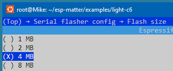  
  
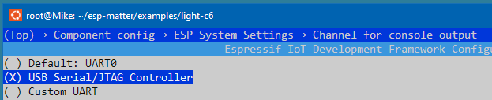  
  
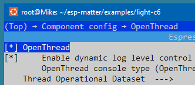  
  
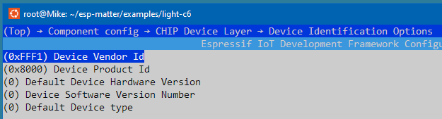  
  
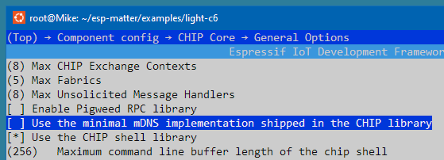  
  
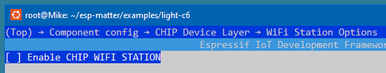  
  
Building, flashing and monitoring
~~~
idf.py -p /tty/ACM0 build flash monitor
~~~

## Join the Thread Network via NetworkKey or DataSet
**OpenThread Border Router** (see: [How to setup and work with OpenThread Border Router](../OPENTHREAD.md))
~~~
dataset active -x
~~~
> 0e08000000000001000000030000154a0300001735060004001fffe00208def5e21b6165cc560708fde61aeab4004131051000112233445566778899aabbccddeeff030f4f70656e5468726561642d32326339010222c90410a5e0c5822c1e723956af6b1ee43f084e0c0402a0f7f8  
> Done

~~~
networkkey
~~~
> 00112233445566778899aabbccddeeff  
> Done

**Thread End Device**
~~~
matter esp ot_cli factoryreset
matter onboardingcodes none
~~~
> QRCode:            MT:Y.K90-Q000KA0648G00  
> QRCodeUrl:         https://project-chip.github.io/connectedhomeip/qrcode.html?data=MT%3AY.K90-Q000KA0648G00  
> ManualPairingCode: 34970112332  
~~~
matter config
~~~
> VendorId:        65521 (0xFFF1)  
> ProductId:       32768 (0x8000)  
> HardwareVersion: 1 (0x1)  
> FabricId:  
> PinCode:         020202021  
> Discriminator:   f00 (3840) 
> DeviceId:  
    
If the end device role is *detached*,
> OPENTHREAD:[N] Mle-----------: Role disabled -> detached

there will be a problem joining it to the Thread Network using the border router **dataset**:
~~~
dataset set active 0e08000000000001000000030000154a0300001735060004001fffe00208def5e21b6165cc560708fde61aeab4004131051000112233445566778899aabbccddeeff030f4f70656e5468726561642d32326339010222c90410a5e0c5822c1e723956af6b1ee43f084e0c0402a0f7f8
~~~
> Error 7: InvalidArgs  

When the role becomes *leader*, we can use the border router **dataset**:
> OPENTHREAD:[N] Mle-----------: Role detached -> leader
~~~
dataset set active 0e08000000000001000000030000154a0300001735060004001fffe00208def5e21b6165cc560708fde61aeab4004131051000112233445566778899aabbccddeeff030f4f70656e5468726561642d32326339010222c90410a5e0c5822c1e723956af6b1ee43f084e0c0402a0f7f8
~~~
> Done  

Anyway, we can use **networkkey** to join end device to Thread Network:
~~~
matter esp ot_cli dataset networkkey 00112233445566778899aabbccddeeff
matter esp ot_cli dataset commit active
matter esp ot_cli ifconfig up
matter esp ot_cli thread start
~~~

Check End Device state
~~~
matter esp ot_cli state
~~~
Less possible state
> child

Most possible state
> router

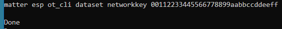  
  
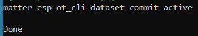  
  
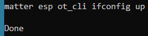  
  
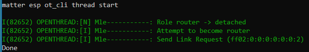  
  
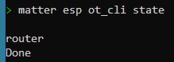  
  
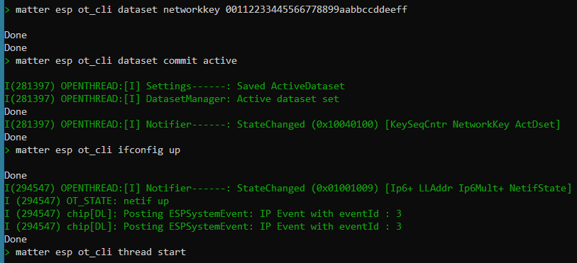  
  
Pressed BOOT button (LED on the board set to OFF):
> I (454109) app_driver: Toggle button pressed  
> I (454109) esp_matter_attribute: R : Endpoint 0x0001's Cluster 0x00000006's Attribute 0x00000000 is 1  
> I (454109) esp_matter_attribute: W : Endpoint 0x0001's Cluster 0x00000006's Attribute 0x00000000 is 0  
> I (454109) led_driver_ws2812: led set r:0, g:0, b:0  
  