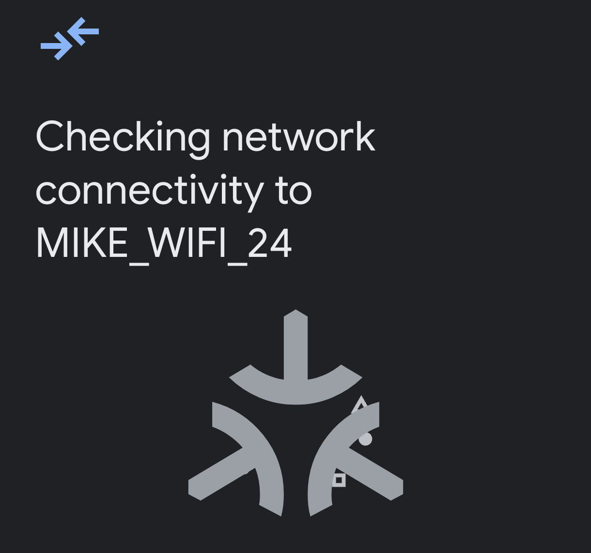

# ESP ZeroCode
[What’s New with ESP ZeroCode](https://developer.espressif.com/blog/whats-new-with-esp-zerocode/)  
[ESP ZeroCode](https://zerocode.espressif.com/)  

"ESP ZeroCode is the fastest way to launch matter-enabled products"  
  

## Trying to run an example with ESP ZeroCode (April 24, 2025)
- LED Strip
- ESP32-C6-WROOM-1
  
Downloaded project files: [esp-zerocode](esp-zerocode/XJBUMXDMVPVMNNHO9AQMEY/ESP%20ZeroCode_XJBUMXDMVPVMNNHO9AQMEY_test)  

**- Flash the firmware by using EspTool**
~~~
esptool.py -p {com-port} erase_flash
esptool.py -p {com-port} write_flash 0x0 common_binaries/all_products_merged.bin
esptool.py -p {com-port} write_flash 0xD000 devices/1/esp_secure_cert.bin 0x1F2000 devices/1/fctry.bin
~~~
> ***{com-port}*** is the COM-port (for example, */dev/ttyACM0* - for Ubuntu, *COM3* - for Windows)  
  
**- Flash the firmware  by using ESP Flash Download Tool (Windows)**  
  
  
  

We then tried to connect the end device to the Thread/Wi-Fi network...  
  
### 1. CHIP-TOOL
~~~
chip-tool pairing code-wifi 1234 {wifi-ssid} {wifi-psw} 32683111304

chip-tool pairing code-thread 1234 hex:0e0800... 32683111304
~~~
The same errors occurred for both commands...  

**Linux console**  
> [CTL] Verifying attestation  
> [CTL] Error on commissioning step 'AttestationVerification': 'src/controller/CHIPDeviceController.cpp:1283: CHIP Error 0x000000AC: Internal error'  
> [CTL] Failed verifying attestation information. Now checking DAC chain revoked status.  
> [CTL] Commissioning stage next step: 'AttestationVerification' -> 'AttestationRevocationCheck'  
> [CTL] Performing next commissioning step 'AttestationRevocationCheck' with completion status = 'src/controller/CHIPDeviceController.cpp:1283: CHIP Error 0x000000AC: Internal error'  
> [CTL] Verifying device's DAC chain revocation status  
> [CTL] Failed in verifying 'Attestation Information' command received from the device: err 101. Look at AttestationVerificationResult enum to understand the errors  
> [CTL] Error on commissioning step 'AttestationRevocationCheck': 'src/controller/CHIPDeviceController.cpp:1332: CHIP Error 0x000000AC: Internal error'  

**Device console**  
> E chip[SVR]: Failsafe timer expired  
> E chip[SVR]: Commissioning failed (attempt 1): 32  
> E chip[ZCL]: OpCreds: Got FailSafeTimerExpired  
> E chip[ZCL]: OpCreds: Proceeding to FailSafeCleanup on fail-safe expiry!  

### 2. HOME ASSISTANT
The pairing process stopped at step
  

### 3. YANDEX HUB
The pairing process was interrupted at step  
  
