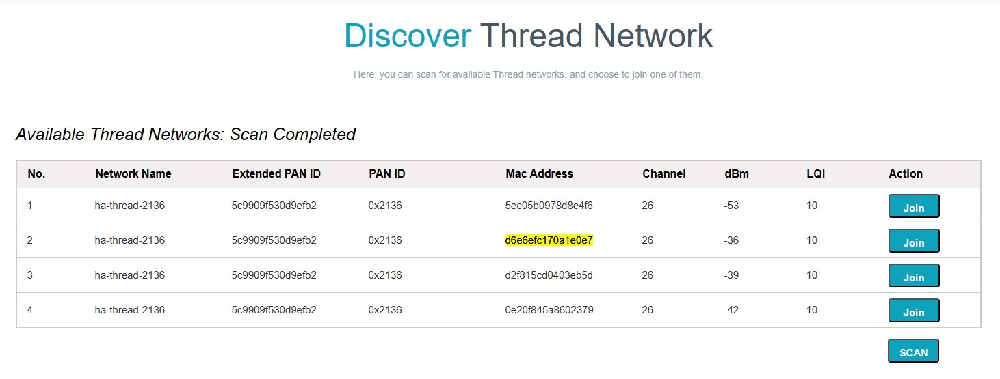
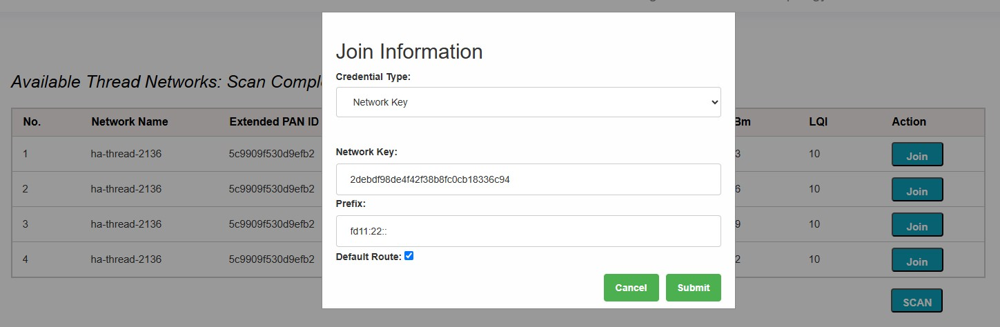
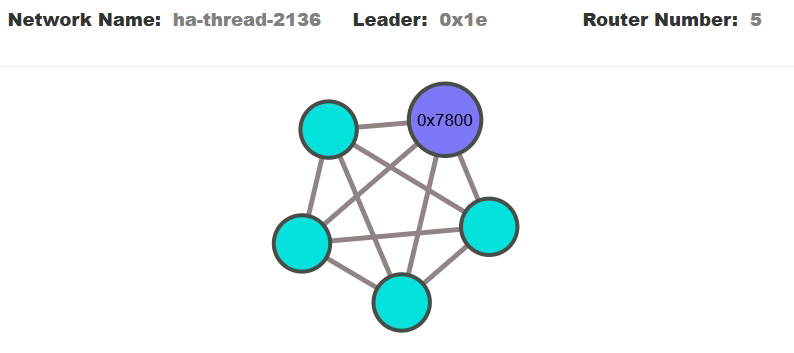
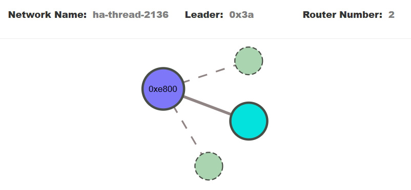
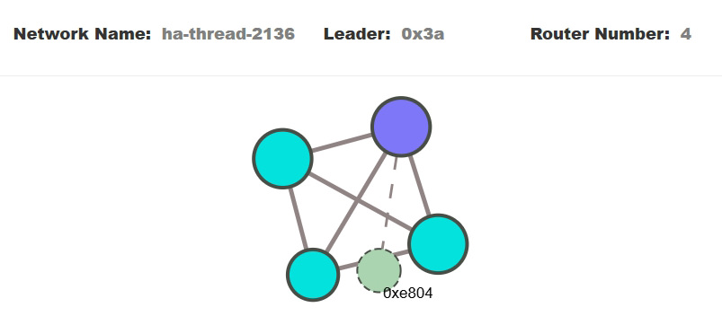

# Forming a Thread network on two Thread Border Routers

This example uses two ESP OTBR boards, two ESP32-H2 and one ESP32-C6 development boards.  
  
Get the networkkey from OTBR #1  
~~~
networkkey
~~~
>2debdf98de4f42f38b8fc0cb18336c94

All end devices (ESP boards with IEEE 802.15.4 modules) have joined the first formed BR network.  
Example: ~/esp-matter/examples/light-c6 (one ESP32-C6 chip used)  
(original folder *light* was copied to *light-c6*)  
~~~
matter esp ot_cli dataset networkkey 2debdf98de4f42f38b8fc0cb18336c94
matter esp ot_cli dataset commit active
matter esp ot_cli ifconfig up
matter esp ot_cli thread start
matter esp ot_cli state
~~~
Example: ~/esp-idf/examples/openthread/ot_cli-h2 (two ESP32-H2 chips used)  
(original folder *ot_cli* was copied to *ot_cli-h2*)  
~~~
dataset networkkey 2debdf98de4f42f38b8fc0cb18336c94
dataset commit active
ifconfig up
thread start
state
~~~

OTBR #1 has RLOC16 = 0x7800, OTBR #2 has RLOC16 = 0xe800  
~~~
matter esp ot_cli router table

| ID | RLOC16 | Next Hop | Path Cost | LQ In | LQ Out | Age | Extended MAC     | Link |  
+----+--------+----------+-----------+-------+--------+-----+------------------+------+  
| 13 | 0x3400 |       30 |         1 |     3 |      3 |   5 | 5ec05b0978d8e4f6 |    1 |  
| 20 | 0x5000 |       63 |         0 |     0 |      0 |   0 | 0e20f845a8602379 |    0 |  
| 26 | 0x6800 |       13 |         1 |     3 |      3 |   6 | d2f815cd0403eb5d |    1 |  
| 30 | 0x7800 |       13 |         1 |     3 |      3 |   6 | d6e6efc170a1e0e7 |    1 |  
| 58 | 0xe800 |       30 |         1 |     3 |      3 |  26 | ca5ea5c17ffad900 |    1 |  
~~~

Using ESPRESSIF-OpenThread Web-GUI, the second OTBR was joined to the first by clicking the "Join" button for the row with MAC address = d6e6efc170a1e0e7 (MAC address of the first ORBR)  
  

The value of the "Network Key" field has been replaced with the value of the network key of the first OTBR (2debdf98de4f42f38b8fc0cb18336c94)  
  

The network topology became as follows:  
  

The first OTBR was disconnected, the second one became the leader:  
  

Since all ESP boards used in this example have IEEE 802.15.4 modules, each of them can be either a child or a router:  
  

Then the first OTBR was reconnected, it first became a child with a new RLOC16 = 0xe804,  
  
  
then a leader again with its previous RLOC16 = 0x7800  
  
  