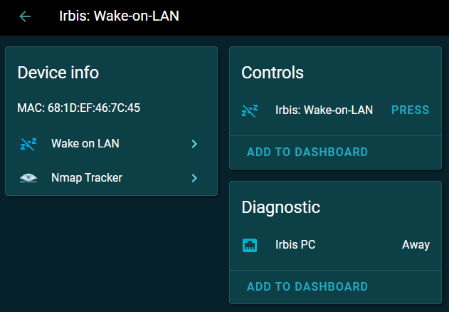

# 1. Install Home Assistant

- On [Raspberry Pi 4b+](HA-Ubuntu22Desktop_RP4.md)  
- On [PC](HA-Ubuntu22Desktop_PC.md)  
- [Some settings](HA-Settings.md)  
- [Create a Home Assistant configuration using an office network with Wi-Fi router](HA-Office_1.md)
- [Create a Home Assistant configuration using an office network without Wi-Fi router](HA-Office_2.md)

# 2. Install PHP 7.4 (fpm) and Apache2
### a) Update the system
~~~
sudo apt update
sudo apt upgrade
~~~
### b) Install Apache2
~~~
sudo apt install apache2
~~~
### c) Add the PHP 7.4 repository
~~~
sudo apt install software-properties-common
sudo add-apt-repository ppa:ondrej/php
sudo apt update
~~~
### d) Install PHP 7.4 and required modules
~~~
sudo apt install php7.4 php7.4-cli php7.4-common php7.4-fpm
~~~
### e) Install additional PHP modules
~~~
sudo apt install php7.4-mysql php7.4-xml php7.4-json php7.4-curl php7.4-mbstring php7.4-zip php7.4-gd php7.4-bcmath

# Check PHP version
php -v
~~~
### f) Configuring Apache to Work with PHP
~~~
# Enabling Required Apache Modules
sudo a2enmod rewrite
sudo a2enmod proxy_fcgi setenvif
sudo a2enconf php7.4-fpm

# Restarting Apache
sudo systemctl reload apache2
~~~
### g) Configuring the Virtual Host
Create a configuration file:
~~~
sudo nano /etc/apache2/sites-available/your-site.conf
~~~
Add the following content:
~~~
<VirtualHost *:80>
  ServerName your-domain.com
  ServerAlias www.your-domain.com
  DocumentRoot /var/www/html

  <Directory /var/www/html>
    Options Indexes FollowSymLinks
    AllowOverride All
    Require all granted
  </Directory>

  # PHP Handler
  <FilesMatch \.php$>
    SetHandler "proxy:unix:/var/run/php/php7.4-fpm.sock|fcgi://localhost"
  </FilesMatch>

  ErrorLog ${APACHE_LOG_DIR}/error.log
  CustomLog ${APACHE_LOG_DIR}/access.log combined
</VirtualHost>
~~~
Activate the site:
~~~
sudo a2ensite your-site.conf
sudo systemctl reload apache2
~~~
### h) Testing PHP
Create a test file:
~~~
sudo nano /var/www/html/info.php
~~~
Add the following content:
~~~
<?php
phpinfo();
?>
~~~
Open in a browser: http://your-server-ip/info.php
### i) Basic Management Commands
Apache:
~~~
sudo systemctl start apache2
sudo systemctl stop apache2
sudo systemctl restart apache2
sudo systemctl status apache2
~~~
PHP-FPM:
~~~
sudo systemctl start php7.4-fpm
sudo systemctl stop php7.4-fpm
sudo systemctl restart php7.4-fpm
sudo systemctl status php7.4-fpm
~~~
### j) Security Configuration
Configuring php.ini:
~~~
sudo nano /etc/php/7.4/fpm/php.ini
~~~
Recommended Settings:
~~~
expose_php = Off
display_errors = Off
log_errors = On
upload_max_filesize = 16M
post_max_size = 16M
max_execution_time = 30
short_tags=On
~~~
### k) Configure Permissions
~~~
sudo chown -R www-data:www-data /var/www/html
sudo chmod -R 755 /var/www/html
~~~
### l) Check Configuration
~~~
# Check Apache Syntax
sudo apache2ctl configtest

# Check PHP Syntax
php -l /path/to/your/file.php
~~~
### m) Apache2 restart script
apache-restart.sh
~~~
#!/bin/bash
sudo systemctl restart apache2.service
sudo systemctl restart php7.4-fpm
~~~
### n) Choose PHP instance
~~~
sudo update-alternatives --config php

There are 2 choices for the alternative php (providing /usr/bin/php).
  Selection    Path                   Priority   Status
-------------------------------------------------------------
  0            /usr/bin/php.default   100        manual mode
* 1            /usr/bin/php7.4        74         auto mode
  2            /usr/bin/php8.1        81         manual mode
Press <enter> to keep the current choice[*], or type selection number:
~~~  
After completing these steps, we will have a fully configured PHP 7.4 + Apache2 environment on Ubuntu.
### o) Example
Testing a link like: http://localhost/pages/test/title/hi_Mike/id/234  
  
.htaccess:
~~~
DirectoryIndex index.php

#AuthType Basic
#AuthName "My Webserver Authentification"
#AuthUserFile /share/htdocs/.htpasswd
#Require valid-user

RewriteEngine On

# Basic settings
Options -Indexes
RewriteBase /

# Rule for /page/index/id/123
RewriteRule ^([^/]+)/index/id/([0-9]+)/?$ $1/index.php?id=$2 [L,QSA]

# Rule for /page/view/id/123
RewriteRule ^([^/]+)/view/id/([0-9]+)/?$ $1/view.php?id=$2 [L,QSA]

# Universal rule for any parameters
# /controller/action/param/value -> /controller/action.php?param=value
RewriteRule ^([^/]+)/([^/]+)/([^/]+)/([^/]+)/?$ $1/$2.php?$3=$4 [L,QSA]

# Rule for multiple parameters
# /controller/action/param1/value1/param2/value2 -> /controller/action.php?param1=value1&param2=value2
RewriteRule ^([^/]+)/([^/]+)/([^/]+)/([^/]+)/([^/]+)/([^/]+)/?$ $1/$2.php?$3=$4&$5=$6 [L,QSA]

# Additional rule for SEF
RewriteRule ^([^/]+)/([^/]+)/([^/]+)/([^/]+)/([^/]+)/([^/]+)/([^/]+)/([^/]+)/?$ $1/$2.php?$3=$4&$5=$6&$7=$8 [L,QSA]

# If it's necessary to save the trailing slash
#RewriteCond %{REQUEST_FILENAME} !-f
#RewriteCond %{REQUEST_FILENAME} !-d
#RewriteRule ^(.*)/$ /$1 [L,R=301]

#---   FINAL   -------------------------
RewriteCond %{REQUEST_URI} !^/(index\.php|images|robots\.txt|public) [NC]
RewriteCond %{REQUEST_URI} !\.(cssіjsіjpgіgifіpng)$
RewriteCond %{REQUEST_FILENAME} !-f
RewriteCond %{REQUEST_FILENAME} !-d
RewriteRule ^(.*)$ /index.php?$1 [L,QSA]
~~~
/pages/test.php:
~~~
<?
$qs = $_SERVER['QUERY_STRING'];
parse_str($qs, $output);

if(!empty($output)) {
  $id = addslashes($output['id']);
  $title = addslashes($output['title']);
  echo "{\"id\":{$id},\"title\":\"{$title}\"}";
}
~~~
>  
> {"id":234,"title":"hi_Mike"}  
>  
  

# 3. Install NetTools
NetTools includes some useful network applications suck as *arp, dnsdomainname, domainname, hostname, ifconfig, nameif, netstat, nisdomainname, plipconfig, rarp, route, slattach, ypdomainname*
~~~
sudo apt install net-tools
~~~

# 4. Install HardInfo
HardInfo is an application that contains information about a computer system
~~~
sudo apt install hardinfo
~~~
  
  
  
# 5. Install Portainer
DO NOT INSTALL PORTAINER! THERE WILL BE PROBLEMS WITH SUPERVISED HOME ASSISTANT!  

# 6. Install Avahi utilities
~~~
sudo apt-get install -y avahi-daemon avahi-utils
sudo service avahi-daemon
~~~
> Usage: /etc/init.d/avahi-daemon {start|stop|restart|force-reload|reload|status}  

# 7. Install ESP-IDF
~~~
sudo apt-get install git wget flex bison gperf python3 python3-pip python3-venv cmake ninja-build ccache libffi-dev libssl-dev dfu-util libusb-1.0-0

git clone -b v5.4.1 --recursive https://github.com/espressif/esp-idf.git
cd esp-idf
./install.sh
source ./export.sh
~~~

# 8. Install ESP-MATTER
~~~
sudo apt-get install git gcc g++ pkg-config libssl-dev libdbus-1-dev libglib2.0-dev libavahi-client-dev ninja-build python3-venv python3-dev python3-pip unzip libgirepository1.0-dev libcairo2-dev libreadline-dev default-jre
sudo apt-get install libsdl2-dev
sudo apt-get install mc
sudo apt-get install pi-bluetooth avahi-utils

cd esp-idf
source ./export.sh
cd ..

git clone --recursive https://github.com/espressif/esp-matter.git
cd esp-matter
./install.sh
cd ..
~~~

If bugs occured:
~~~
cd ~/esp-matter/connectedhomeip/connectedhomeip
git clean -Xdf
source ./scripts/bootstrap.sh
~~~

If a fatal error occurs (e.g. "no response from https://git.gitlab.arm.com/"), try setting DNS to "8.8.8.8" and "8.8.4.4".  
  
.bashrc:
~~~
#-- Alias for setting up the ESP-IDF environment
alias get_idf='. ~/esp-idf/export.sh'

#-- Alias for setting up the ESP-Matter environment
alias get_matter='. ~/esp-matter/export.sh'

#-- Alias for setting up the ConnectedHomeIP environment
alias get_chip='cd ~/esp-matter/connectedhomeip/connectedhomeip;. scripts/activate.sh'

#-- Enable ccache to speed up compilation (green color output)
green=$'\033[92m'
reset=$'\033[0m'
alias set_cache='echo $green; echo -e "Enable Ccache to speed up IDF compilation!\n"; echo $reset; export IDF_CCACHE_ENABLE=1'

#-- Alias for setting up all necessary environments
alias set_env='set savePath=$PWD; get_idf; get_matter; get_chip; set_cache; cd $savePath'
~~~
Launch ESP environment:
~~~
set_env
~~~

# 9. Install ESP Thread BR
~~~
git clone --recursive https://github.com/espressif/esp-thread-br.git
~~~

# 10. Install ChipTool
This tool is used to commission and control Matter End devices
~~~
sudo apt update
sudo apt install snapd
sudo snap install chip-tool
~~~
Otherwise, we can use an application like "NXP Matter Tools" which is based on ChipTool commands  
  
  

# 11. Install Samba
See [here](samba.md)

# 12. Install SSH
~~~
sudo apt install ssh

sudo ufw allow 22/tcp

sudo service sshd restart
~~~
Install SSHPASS (no password required to log in):
~~~
sudo apt-get install sshpass
~~~
Check the settings
~~~
ssh pi@192.168.31.77 -p 22

sshpass -p raspberry sudo ssh pi@192.168.31.77 -p 22
~~~

# 13. Install Wake-on-LAN
~~~
sudo apt install ethtool
ifconfig
~~~
> **enp1s0**: flags=4163<UP,BROADCAST,RUNNING,MULTICAST>  mtu 1500  
>         inet 192.168.31.198  netmask 255.255.255.0  broadcast 192.168.31.255  
>         inet6 fe80::6986:d3e8:5cb6:9780  prefixlen 64  scopeid 0x20<link>  
>         ether **68:1d:ef:46:7c:45**  txqueuelen 1000  (Ethernet)  
  
~~~
sudo ethtool enp1s0 | grep "Wake-on"
~~~
> Supports Wake-on: pumbg  
> Wake-on: d (disabled)  
  
~~~
sudo ethtool --change enp1s0 wol g
sudo ethtool enp1s0 | grep "Wake-on"
~~~
> Supports Wake-on: pumbg  
> Wake-on: **g** (Wake on MagicPacket)  
  
~~~
nmcli con show
~~~
> NAME               UUID                                  TYPE      DEVICE  
> **Supervisor enp1s0**  be397120-9171-304c-817e-e084eb50825b  ethernet  enp1s0  
> Supervisor wlp2s0  ef23d080-c905-405a-98b3-1e85de873c84  wifi      wlp2s0  
  
~~~
sudo nmcli c modify "Supervisor enp1s0" 802-3-ethernet.wake-on-lan magic
nmcli c show "Supervisor enp1s0" | grep 802-3-eth
~~~
> 802-3-ethernet.wake-on-lan:             magic  
  
Wake up by sending a magic packet to the MAC ***68:1d:ef:46:7c:45***  
  

We can also use apps to send a magic packet:
  
  
  
  
  
# 14. Remote shutdown Ubuntu (Windows, Linux)
Create a file shutdown.txt:  
~~~
shutdown -h now
~~~
Run a Windows script:  
~~~
putty.exe -m shutdown.txt -ssh -P {port} -l {user} -pw {password} {ipaddress}
~~~
- *{port}* : SSH port
- *{user}* : user login
- *{password}* : user password
- *{ipaddress}* : server IP address

The shutdown command may be as follows (password required):
~~~
ssh {user}@{ipaddress} -p {port} poweroff
~~~

Or as follows (no password required to log in):
~~~
sshpass -p raspberry sudo ssh pi@192.168.31.77 -p 22 poweroff

sshpass -p raspberry sudo ssh pi@192.168.31.77 -p 22 shutdown -h now
~~~
- *raspberry* : user password
- *pi* : user login
- *192.168.31.77* : server IP address
- *22* : SSH port

# 15. Remote shutdown Ubuntu (Home Assistant)
We would like to access the Ubuntu computer with IP=192.168.31.198 and shut it down as user "mike" using Home Assistant SSH terminal.
1) SSH terminal protection mode = Off  
2) Enter to docker bash  
~~~
docker exec -it homeassistant bash
~~~
3) Generate SSH key  
~~~
ssh-keygen -t rsa
~~~
- save in /**root**/.ssh/id_rsa
- no passphrase!

4) Copy SSH Keys to server  
~~~
ssh-copy-id -i /root/.ssh/id_rsa mike@192.168.31.198
~~~
5) shell_commands.yaml (send command to remote computer via SSH)
~~~
irbis_shutdown: ssh -i /root/.ssh/id_rsa mike@192.168.31.198 sudo shutdown -h now
~~~
6) scripts.yaml (run command as a service)
~~~
irbis_shutdown:
  sequence:
    - service: shell_command.irbis_shutdown
~~~
7) customizations.yaml (add a suitable name and icon)
~~~
script.irbis_shutdown:
  friendly_name: 'Irbis: Shutdown (.198)'
  icon: mdi:ethernet
~~~
8) lovelace.yaml (display script link)
~~~
entity_id: script.irbis_shutdown
~~~
  
  

# 16. Set port access
### This means: the port used for flashing ESP32 controllers.
We should add our user account to the "dialout" group since group members already have "rw" permissions:
~~~
sudo usermod -aG dialout $USER
~~~
This needs to be done for each user we want to grant access to.  
  
Or we should set permissions for all users when the device is detected.  
~~~
sudo chmod a+rw /dev/ttyACM0
~~~

# 17. Ubuntu: what we need to install
- [Can be found here](ubuntu_what_we_need_to_install.md)  
