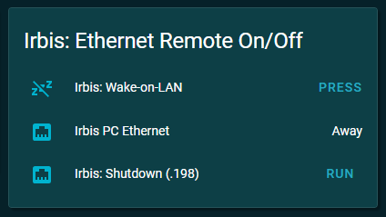

# 1. Install Home Assistant

- On [Raspberry Pi 4b+](HA-Ubuntu22Desktop_RP4.md)  
- On [PC](HA-Ubuntu22Desktop_PC.md)  
- [Some settings](HA-Settings.md)  

# 2. Install PHP + Apache2
~~~
sudo apt install php libapache2-mod-php
sudo apt install php-cli
sudo apt install php-cgi
sudo apt install php-mysql
sudo apt install php-{extension-name}
~~~
Restart Apache2 service
~~~
sudo systemctl restart apache2.service
~~~
Check PHP version
~~~
php -v
~~~
> PHP 8.1.2-1ubuntu2.21 (cli) (built: Mar 24 2025 19:04:23) (NTS)  
> Copyright (c) The PHP Group  
> Zend Engine v4.1.2, Copyright (c) Zend Technologies with Zend OPcache v8.1.2-1ubuntu2.21, Copyright (c), by Zend Technologies  

Choose PHP instance
~~~
sudo update-alternatives --config php

There are 2 choices for the alternative php (providing /usr/bin/php).
  Selection    Path                  Priority   Status
------------------------------------------------------------
  0            /usr/bin/php.default   100       auto mode
  1            /usr/bin/php.default   100       manual mode
* 2            /usr/bin/php8.1        81        manual mode
Press <enter> to keep the current choice[*], or type selection number:
~~~  
Configuration file can be found here: */etc/php/8.1/apache2/php.ini*

# 3. Install NetTools
NetTools includes some useful network applications suck as *arp, dnsdomainname, domainname, hostname, ifconfig, nameif, netstat, nisdomainname, plipconfig, rarp, route, slattach, ypdomainname*
~~~
sudo apt install net-tools
~~~

# 4. Install HardInfo
HardInfo is an application that contains information about a computer system
~~~
sudo apt install hardinfo
~~~
  
  
  
# 5. Install Portainer
DO NOT INSTALL PORTAINER! THERE WILL BE PROBLEMS WITH SUPERVISED HOME ASSISTANT!  

# 6. Install Avahi utilities
~~~
sudo apt-get install -y avahi-daemon avahi-utils
sudo service avahi-daemon
~~~
> Usage: /etc/init.d/avahi-daemon {start|stop|restart|force-reload|reload|status}  

# 7. Install ESP-IDF
~~~
sudo apt-get install git wget flex bison gperf python3 python3-pip python3-venv cmake ninja-build ccache libffi-dev libssl-dev dfu-util libusb-1.0-0

git clone -b v5.4.1 --recursive https://github.com/espressif/esp-idf.git
cd esp-idf
./install.sh
source ./export.sh
~~~

# 8. Install ESP-MATTER
~~~
sudo apt-get install git gcc g++ pkg-config libssl-dev libdbus-1-dev libglib2.0-dev libavahi-client-dev ninja-build python3-venv python3-dev python3-pip unzip libgirepository1.0-dev libcairo2-dev libreadline-dev default-jre
sudo apt-get install libsdl2-dev
sudo apt-get install mc
sudo apt-get install pi-bluetooth avahi-utils

cd esp-idf
source ./export.sh
cd ..

git clone --recursive https://github.com/espressif/esp-matter.git
cd esp-matter
./install.sh
cd ..
~~~
If bugs occured:
~~~
cd ~/esp-matter/connectedhomeip/connectedhomeip
git clean -Xdf
source ./scripts/bootstrap.sh
~~~

.bashrc:
~~~
#-- Alias for setting up the ESP-IDF environment
alias get_idf='. ~/esp-idf/export.sh'

#-- Alias for setting up the ESP-Matter environment
alias get_matter='. ~/esp-matter/export.sh'

#-- Alias for setting up the ConnectedHomeIP environment
alias get_chip='cd ~/esp-matter/connectedhomeip/connectedhomeip;. scripts/activate.sh'

#-- Enable ccache to speed up compilation (green color output)
green=$'\033[92m'
reset=$'\033[0m'
alias set_cache='echo $green; echo -e "Enable Ccache to speed up IDF compilation!\n"; echo $reset; export IDF_CCACHE_ENABLE=1'

#-- Alias for setting up all necessary environments
alias set_env='set savePath=$PWD; get_idf; get_matter; get_chip; set_cache; cd $savePath'
~~~
Launch ESP environment:
~~~
set_env
~~~

# 9. Install ESP Thread BR
~~~
git clone --recursive https://github.com/espressif/esp-thread-br.git
~~~

# 10. Install ChipTool
This tool is used to commission and control Matter End devices
~~~
sudo apt update
sudo apt install snapd
sudo snap install chip-tool
~~~
Otherwise, we can use an application like "NXP Matter Tools" which is based on ChipTool commands  
  
  

# 11. Install Samba
See [here](samba.md)

# 12. Install SSH
~~~
sudo apt install ssh

sudo ufw allow 22/tcp

sudo service sshd restart
~~~
Install SSHPASS (no password required to log in):
~~~
sudo apt-get install sshpass
~~~
Check the settings
~~~
ssh pi@192.168.31.77 -p 22

sshpass -p raspberry sudo ssh pi@192.168.31.77 -p 22
~~~

# 13. Install Wake-on-LAN
~~~
sudo apt install ethtool
ifconfig
~~~
> **enp1s0**: flags=4163<UP,BROADCAST,RUNNING,MULTICAST>  mtu 1500  
>         inet 192.168.31.198  netmask 255.255.255.0  broadcast 192.168.31.255  
>         inet6 fe80::6986:d3e8:5cb6:9780  prefixlen 64  scopeid 0x20<link>  
>         ether **68:1d:ef:46:7c:45**  txqueuelen 1000  (Ethernet)  
  
~~~
sudo ethtool enp1s0 | grep "Wake-on"
~~~
> Supports Wake-on: pumbg  
> Wake-on: d (disabled)  
  
~~~
sudo ethtool --change enp1s0 wol g
sudo ethtool enp1s0 | grep "Wake-on"
~~~
> Supports Wake-on: pumbg  
> Wake-on: **g** (Wake on MagicPacket)  
  
~~~
nmcli con show
~~~
> NAME               UUID                                  TYPE      DEVICE  
> **Supervisor enp1s0**  be397120-9171-304c-817e-e084eb50825b  ethernet  enp1s0  
> Supervisor wlp2s0  ef23d080-c905-405a-98b3-1e85de873c84  wifi      wlp2s0  
  
~~~
sudo nmcli c modify "Supervisor enp1s0" 802-3-ethernet.wake-on-lan magic
nmcli c show "Supervisor enp1s0" | grep 802-3-eth
~~~
> 802-3-ethernet.wake-on-lan:             magic  
  
Wake up by sending a magic packet to the MAC ***68:1d:ef:46:7c:45***  
  

We can also use apps to send a magic packet:
  
  
  
  
  
# 14. Remote shutdown Ubuntu (Windows, Linux)
Create a file shutdown.txt:  
~~~
shutdown -h now
~~~
Run a Windows script:  
~~~
putty.exe -m shutdown.txt -ssh -P {port} -l {user} -pw {password} {ipaddress}
~~~
- *{port}* : SSH port
- *{user}* : user login
- *{password}* : user password
- *{ipaddress}* : server IP address

The shutdown command may be as follows (password required):
~~~
ssh {user}@{ipaddress} -p {port} poweroff
~~~

Or as follows (no password required to log in):
~~~
sshpass -p raspberry sudo ssh pi@192.168.31.77 -p 22 poweroff

sshpass -p raspberry sudo ssh pi@192.168.31.77 -p 22 shutdown -h now
~~~
- *raspberry* : user password
- *pi* : user login
- *192.168.31.77* : server IP address
- *22* : SSH port

# 15. Remote shutdown Ubuntu (Home Assistant)
We would like to access the Ubuntu computer with IP=192.168.31.198 and shut it down as user "mike" using Home Assistant SSH terminal.
1) SSH terminal protection mode = Off  
2) Enter to docker bash  
~~~
docker exec -it homeassistant bash
~~~
3) Generate SSH key  
~~~
ssh-keygen -t rsa
~~~
- save in /**root**/.ssh/id_rsa
- no passphrase!

4) Copy SSH Keys to server  
~~~
ssh-copy-id -i /root/.ssh/id_rsa mike@192.168.31.198
~~~
5) shell_commands.yaml (send command to remote computer via SSH)
~~~
irbis_shutdown: ssh -i /root/.ssh/id_rsa mike@192.168.31.198 sudo shutdown -h now
~~~
6) scripts.yaml (run command as a service)
~~~
irbis_shutdown:
  sequence:
    - service: shell_command.irbis_shutdown
~~~
7) customizations.yaml (add a suitable name and icon)
~~~
script.irbis_shutdown:
  friendly_name: 'Irbis: Shutdown (.198)'
  icon: mdi:ethernet
~~~
8) lovelace.yaml (display script link)
~~~
entity_id: script.irbis_shutdown
~~~
  
  

# 16. Set port access
### This means: the port used for flashing ESP32 controllers.
We should add our user account to the "dialout" group since group members already have "rw" permissions:
~~~
sudo usermod -aG dialout $USER
~~~
This needs to be done for each user we want to grant access to.  
  
Or we should set permissions for all users when the device is detected.  
~~~
sudo chmod a+rw /dev/ttyACM0
~~~
