# 1. Install CubeOS
- Requires a dedicated computer (Raspberry Pi) or virtual machine to install software.  
- On Raspberry Pi, it won't boot from an SSD connected to the computer's USB port. It only boots from an SD card, which is, of course, extremely unreliable and short-lived!  

### 1.1. Download the CUBE OS image
Visit this [repo](https://github.com/eWeLinkCUBE/CUBE-OS/releases/latest) to download the latest .vdi image, extract the image (usually, *sdcard.vdi*) after downloading.

### 1.2. Install Virtual Machine
**Update your system and install prerequisites**  
~~~
sudo apt update
sudo apt install -y wget dkms build-essential linux-headers-$(uname -r)
~~~

**Add the VirtualBox repository (for version 7.x)**  
~~~
wget -O- https://www.virtualbox.org/download/oracle_vbox_2016.asc | sudo gpg --dearmor --yes --output /usr/share/keyrings/oracle-virtualbox-2016.gpg
echo "deb [arch=amd64 signed-by=/usr/share/keyrings/oracle-virtualbox-2016.gpg] http://download.virtualbox.org/virtualbox/debian $(lsb_release -sc) contrib" | sudo tee /etc/apt/sources.list.d/virtualbox.list
~~~

**Install VirtualBox**  
~~~
sudo apt update
sudo apt install -y virtualbox-7.2
~~~

### 1.3. Install Extension Pack: This adds USB 2/3 support, RDP, and disk encryption
**Download the latest extension pack (check virtualbox.org for current version)**  
~~~
wget https://download.virtualbox.org/virtualbox/7.2.4/Oracle_VirtualBox_Extension_Pack-7.2.4.vbox-extpack
~~~
**Install it using VBoxManage (run this command in your terminal)**  
~~~
sudo VBoxManage extpack install Oracle_VirtualBox_Extension_Pack-7.2.4.vbox-extpack
~~
~~~

### 1.4. Launch VirtualBox: Open it from the Applications menu to start creating your virtual machines.
Set the options according to the picture...  
Under "Hard Disk", choose to use an existing virtual hard disk file and select the .vdi image.
  

# 2. Autostart VirtualBox

### 2.1. Setup the autostart system
Create a configuration folder:
~~~
sudo mkdir -p /etc/vbox/
~~~
Create /etc/default/virtualbox and add the contents:
~~~
VBOXAUTOSTART_DB=/etc/vbox
VBOXAUTOSTART_CONFIG=/etc/vbox/autostart.cfg
~~~
Create /etc/vbox/autostart.cfg and add the contents:
~~~
default_policy = deny
mike = {
  allow = true
  startup_delay = 10
}
~~~

### 2.2. Set the correct permissions for the startup folder
~~~
sudo chown mike:vboxusers /etc/vbox/
sudo chmod 755 /etc/vbox/
~~~

### 2.3. Set an environment variable for the user
Add to ~/.bashrc:
~~~
export VBOX_AUTOSTART_DB=/etc/vbox
~~~

### 2.4. Enable autostart with the correct permissions
Look at the list of all virtual machines:
~~~
VBoxManage list vms
~~~
> 
> "CubeOS" {3a4e7c2b-315a-4afd-90a7-1c4fb607ea0e}
> 
  
Exit the sudo session and work as a regular user.
~~~
VBoxManage setproperty autostartdbpath /etc/vbox
VBoxManage modifyvm "CubeOS" --autostart-enabled on
~~~

### 2.5. Enable autostart delay (optional)
~~~
VBoxManage modifyvm "CubeOS" --autostart-delay 10
~~~

### 2.6. Activate the autostart service
~~~
sudo systemctl enable vboxautostart-service
sudo systemctl start vboxautostart-service
~~~

### 2.7. Check
~~~
VBoxManage showvminfo "CubeOS" | grep -i autostart
~~~
> 
> Autostart Enabled:           enabled  
> Autostart Delay:             10  
> 

# 3. Pairing and commissioning

### 3.1. Родные устройства в eWeLink SmartHome
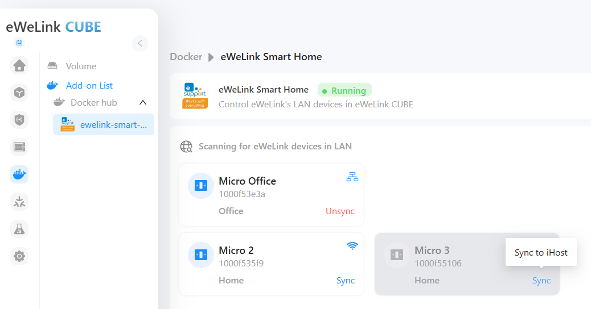  

### 3.2. Matter Bridge. Спаривание. Main page
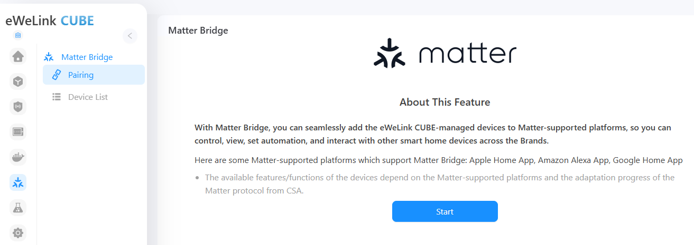  

### 3.3. Matter Bridge. Спаривание. Preparation
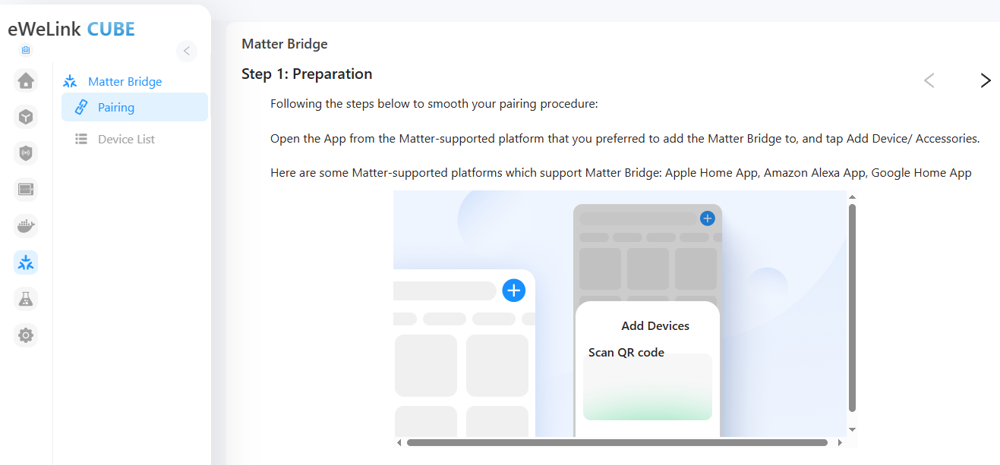  

### 3.4. Matter Bridge. Спаривание. Pairing
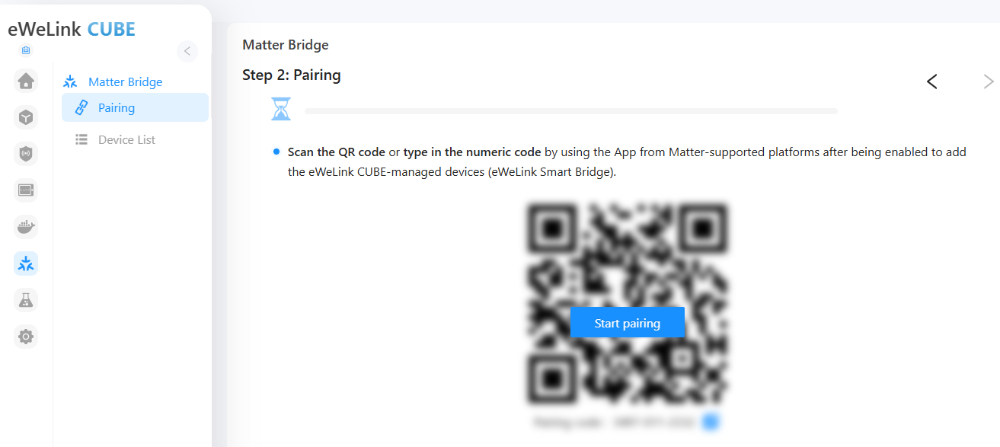  

### 3.5. Matter Bridge. Спаривание. Pairing code
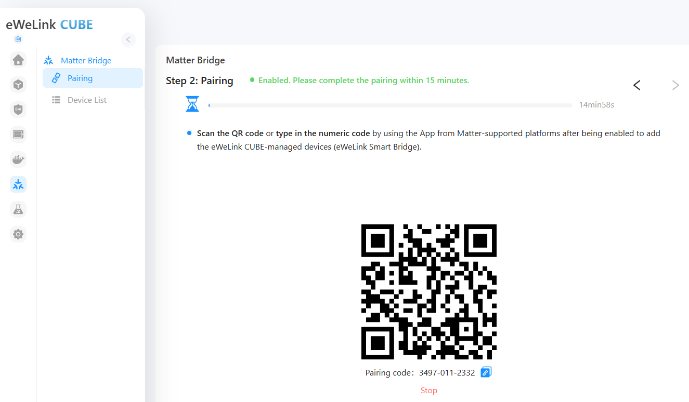  

### 3.6. Matter Bridge. Спаривание. Добавлено в Home Assistant
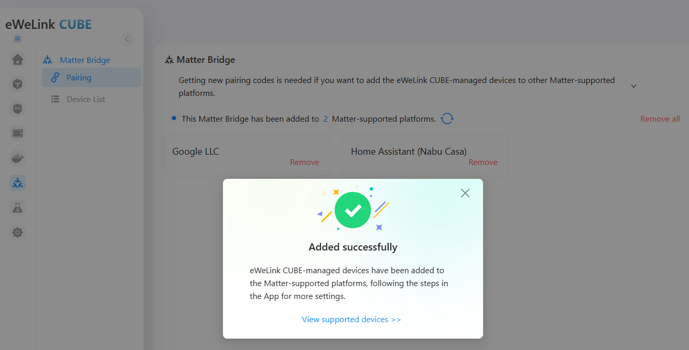  

### 3.7. Matter Bridge. Спаривание. Добавлено в Home Assistant
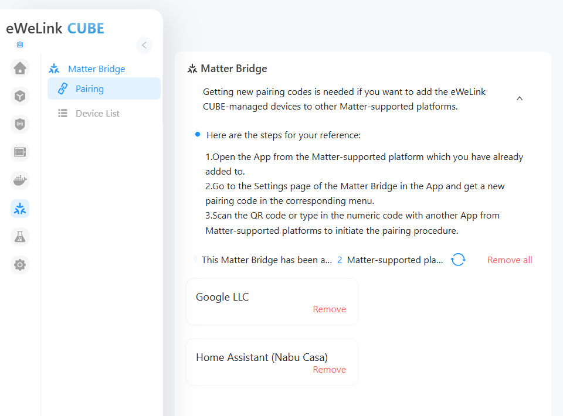  

### 3.8. Поделиться устройством в Home Assistant с Yandex Smarthome
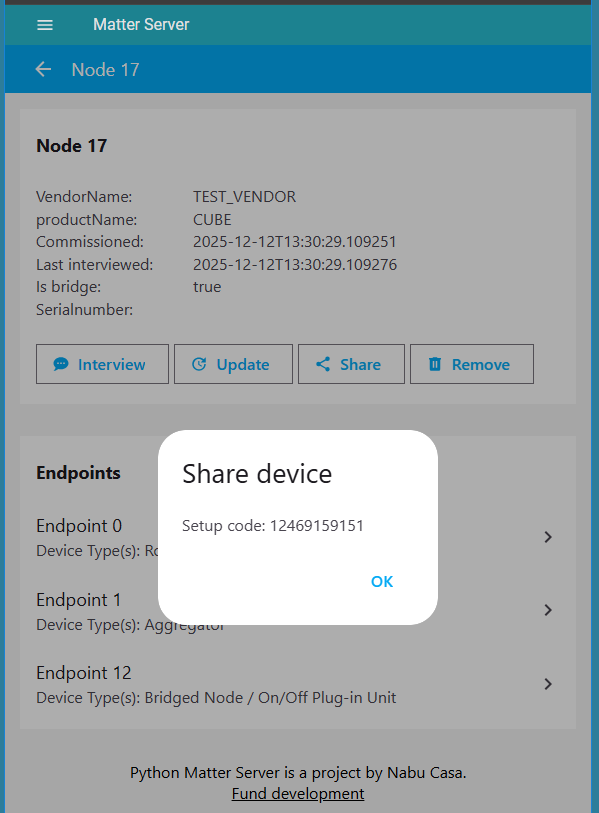  

### 3.9. Matter Bridge. Спаривание. Добавлено в Home Assistant и Yandex Smarthome
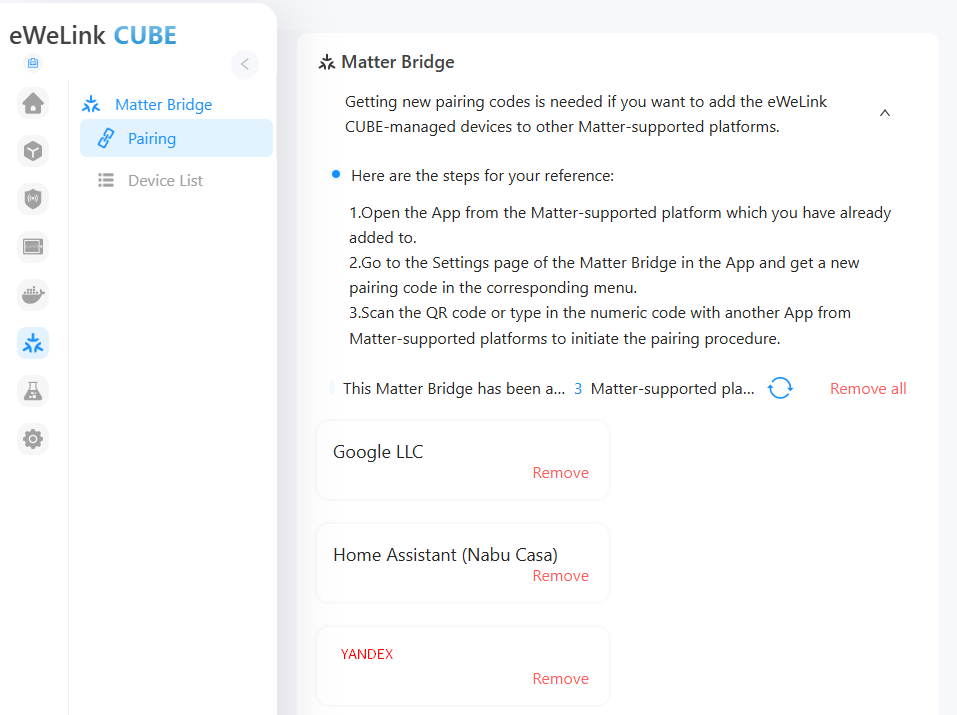  

### 3.10. Matter Bridge. Device List. Sonoff Micro
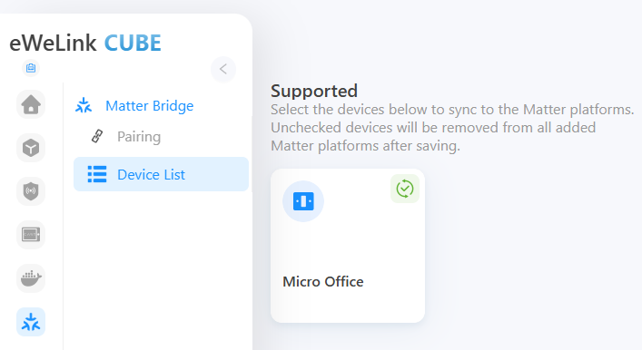  

### 3.11. Matter Bridge. Device List. Sonoff Micro
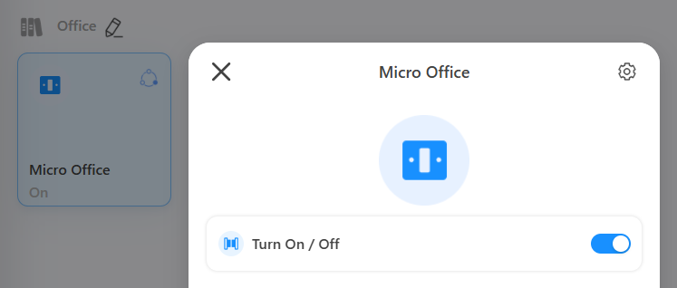  

### 3.12. Matter Bridge. Device List. Sonoff Micro
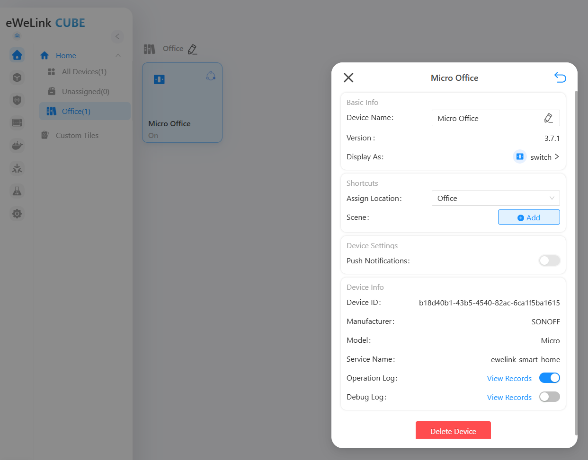  

### 3.13. Home Assistant. Matter Server. CubeOS
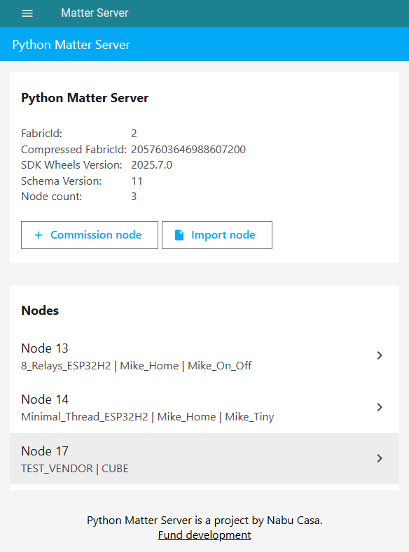  

### 3.14. Home Assistant. Matter Server. CubeOS
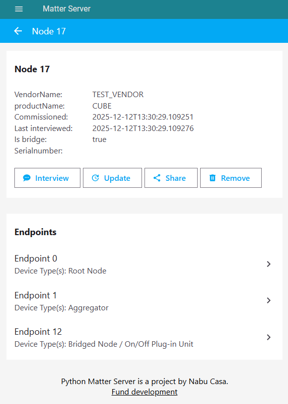  

### 3.15. Home Assistant. Matter Server. CubeOS
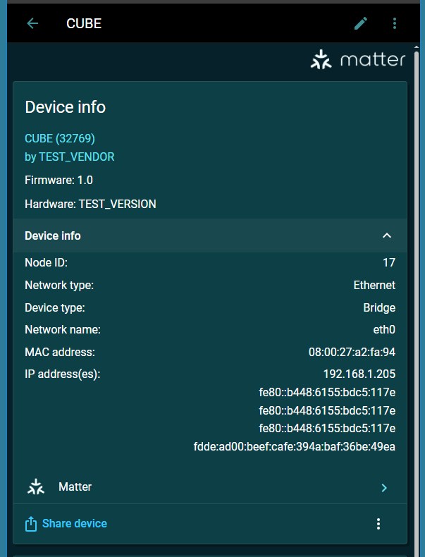  

### 3.16. Home Assistant. Matter Server. Sonoff Micro
  

### 3.17. Yandex Smarthome. Cab 379
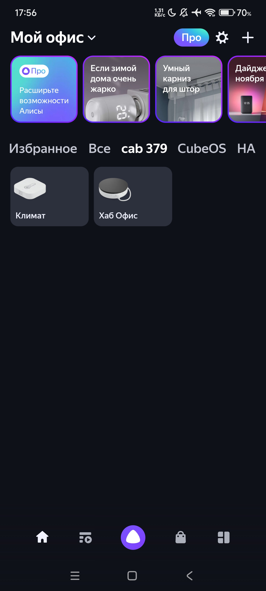  

### 3.18. Yandex Smarthome. CubeOS
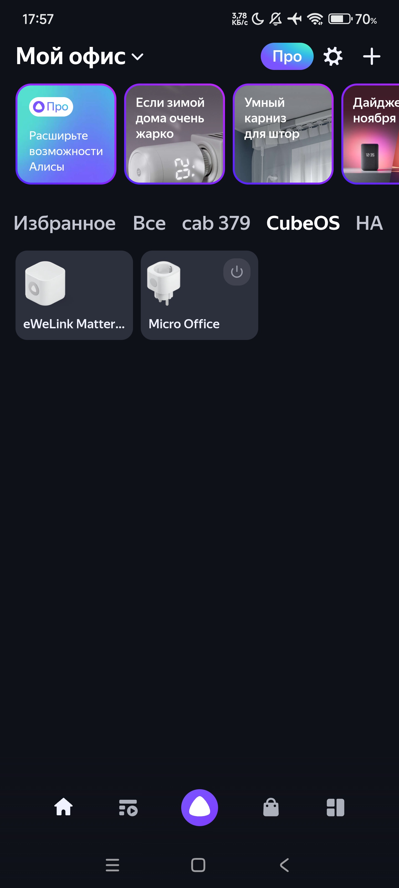  

### 3.19. Yandex Smarthome. Home Assistant
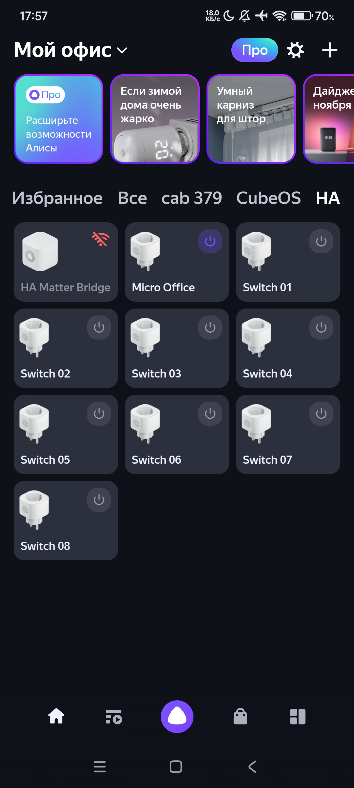  

### 3.20. Yandex Smarthome. Yandex Hub
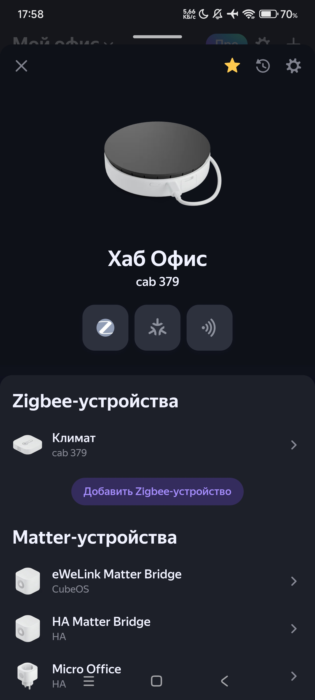  

### 3.21. Yandex Smarthome. Yandex Hub
  
