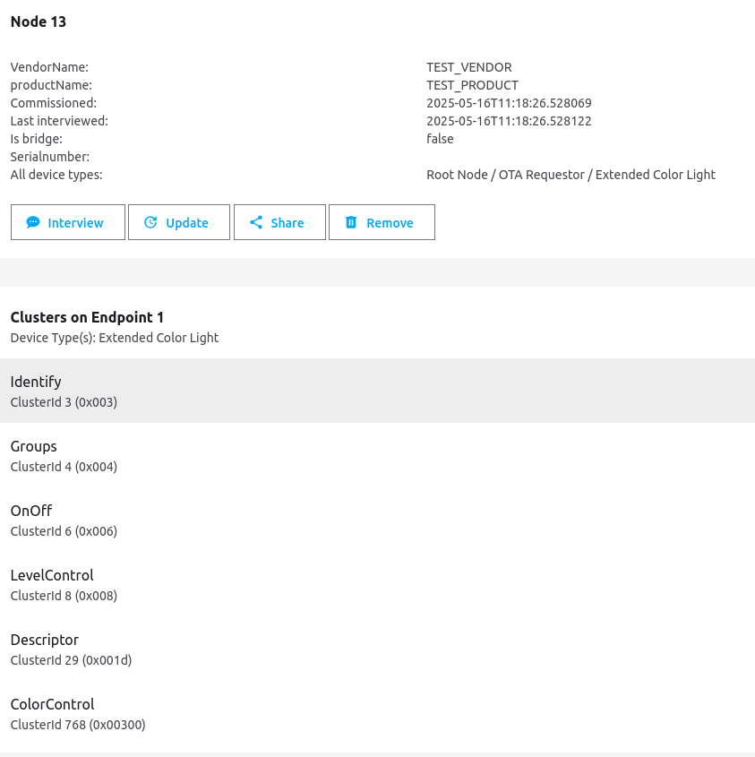

# Create a Home Assistant configuration using an office network with Wi-Fi router

### 1) Used (IP address + Device):
- 192.168.0.1     TP-Link Router TL-WR841N
- 192.168.0.100   Raspberry Pi 4B+ with Ubuntu 22.04
- 192.168.0.101   Redmi Note 14 Pro (smartphone)
- 192.168.0.102   Dexp H21 (tablet)
- 192.168.0.103   Doogee S88Pro (smartphone)
- 192.168.0.104   Mi Max2 (smartphone)
- 192.168.0.200   Espressif OpenThread Border Router
- 192.168.0.201   SMLight SLZB-06 (WiFi connection)
- 192.168.0.202   SMLight SLZB-06 (Ethernet connection)

SSID for TP-Link router: MIKE_OFFICE  

  
### 2) To do a hard reset of SLZB-06 device
For this, turn on the device with the button pressed, when the LEDs start to flash, release the button.

<!--
### 3) Configure Wi-Fi and "Matter-over-thread" mode for SLZB-06
- Open: http://192.168.0.202/ (Ethernet connection)
- Mode -> Connection mode -> Wi-Fi connection
- Network -> Wi-Fi Setup -> Scan for Wi-Fi networks
- Choose: SSID = MIKE_OFFICE, Password: ###### -> Save
- Dashboard -> Wi-Fi status -> IP Address = 192.168.0.201
- Open: http://192.168.0.201/ (Wi-Fi connection with internet access)
- Mode -> Radio CC2652P mode -> switch to: Matter-over-Thread -> Save
- Mode -> Connection mode -> Ethernet connection -> Save
- Open: http://192.168.0.202/ (Ethernet connection)
-->

### 3) Configure Wi-Fi and "Matter-over-thread" mode for SLZB-06
- Find WiFi network of type "SLZB-06_198226" (open network)
- Connect
- Open http://slzb-06.local in browser
- Configure SLZB-06:
  - Mode -> Radio CC2652P mode -> switch to: Matter-over-Thread
  - Using Wi-Fi connection:
    - Mode -> Connection mode -> switch to: Wi-Fi connection -> Save
    - Network -> Wi-Fi Setup -> Scan for Wi-Fi networks
    - Choose: SSID = MIKE_OFFICE, Password: ######
    - Network -> Wi-Fi Setup -> ON: DHCP status for Wi-Fi -> Save
    - Open: http://192.168.0.201/ (Wi-Fi connection)
  - Using Ethernet connection:
    - Mode -> Connection mode -> switch to: Ethernet connection -> Save
    - Network -> Ethernet options -> ON: DHCP status -> Save
    - Open: http://192.168.0.202/ (Ethernet connection)

### 4) in Home Assistant (integration)
- Settings -> Devices & Services -> Add integration
- Choose: SMLIGHT SLZB
- Enter host: **192.168.0.202:6638**

### 5) in Home Assistant (add-on)
- Settings -> Add-ons -> Add-on store
- Choose: OpenThread Border Router
- Configuration:
~~~
device: /dev/ttyAMA0
baudrate: "460800"
flow_control: false
autoflash_firmware: false
otbr_log_level: notice
firewall: true
nat64: false
network_device: 192.168.0.202:6638
~~~
Here:
- "device" - any unused port

If there is no serial port in the OTBR settings window, you can connect a development board based on Espressif chips, such as the ESP32-H2, flashed with a minimal firmware for working on the Thread network, such as [mike_h2_tiny](../apps/mike_h2_tiny), to the Raspberry Pi via USB. In this case, you can use the port created by the ESP32-H2 chip in the OTBR settings.  
  
  

~~~
device: >-
  /dev/serial/by-id/usb-Espressif_USB_JTAG_serial_debug_unit-if00
baudrate: "460800"
flow_control: false
autoflash_firmware: false
otbr_log_level: notice
firewall: true
nat64: false
network_device: 192.168.0.202:6638
~~~

  
### 6) in Home Assistant
- Settings -> Devices & Services -> Thread -> CONFIGURE -> icon "Thread network information"
Get value of "Active dataset TLVs"  
*0e080000000000010000000300000f4a0300001835060004001fffe002080ad80fc8f565fb430708fd36c110b5afda0e05101450a03ab4223e9cf9907f0f548c1145030e68612d7468726561642d646462640102ddbd0410591801aa6198c76746fdc2fc023c97490c0402a0f7f8*  
- Parse using tlv-parser:
~~~
t:  14 (ACTIVETIMESTAMP), l: 8, v: 0x0000000000010000
t:   0 (CHANNEL), l: 3, v: 0x00000f
t:  53 (CHANNELMASK), l: 6, v: 0x0004001fffe0
t:   2 (EXTPANID), l: 8, v: 0x0ad80fc8f565fb43
t:   7 (MESHLOCALPREFIX), l: 8, v: 0xfd36c110b5afda0e
t:   5 (NETWORKKEY), l: 16, v: 0x1450a03ab4223e9cf9907f0f548c1145
t:   3 (NETWORKNAME), l: 14, v: 'ha-thread-ddbd'
t:   1 (PANID), l: 2, v: 0xddbd
t:   4 (PSKC), l: 16, v: 0x591801aa6198c76746fdc2fc023c9749
t:  12 (SECURITYPOLICY), l: 4, v: 0x02a0f7f8
~~~
Get value of "NETWORKKEY":  
*1450a03ab4223e9cf9907f0f548c1145*  

### 7) Join Thread networks
Web-interface of Espressif OpenThread Border Router:  
http://192.168.0.200/index.html  
- Available Thread Networks:
  - Press "SCAN" button
  - Press "Join" button, fill the "Network Key" with *1450a03ab4223e9cf9907f0f548c1145* and press "Submit"
  
There is both OTBR in the same Thread network now.  

### 8) Pairing end devices
**Attempt #1**  
The end device is created from the "esp-matter light" example using ESP32-H2 as a target.  
When trying to add a new Matter device to Home Assistant:  
- Doogee S88Pro smartphone: "Matter is currently unavailable"
- Dexp H21 tablet, after reading the QR code of a new end device: "No Wi-Fi connection"
- Redmi Note 14 Pro smartphone, the pairing process was interrupted at the stage "Failed to generate device credentials. An error occurred while generating device credentials"
  
**Attempt #2**  
The end device is created from the "Espressif Launchpad" example using ESP32-H2 as a target.  
- Redmi Note 14 Pro smartphone, the pairing process was successful => end device was added to:
  - the Thread network as router (can be seen at http://192.168.0.200/index.html)
  - the Matter-over-Thread device (can be seen in Home Assistant "Matter Server" add-on)

  

  
