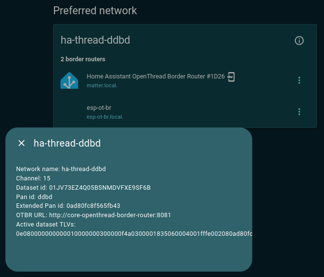
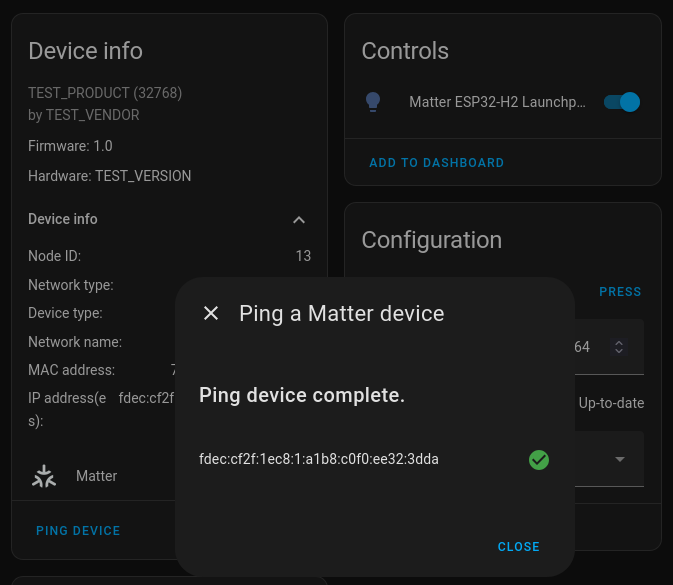
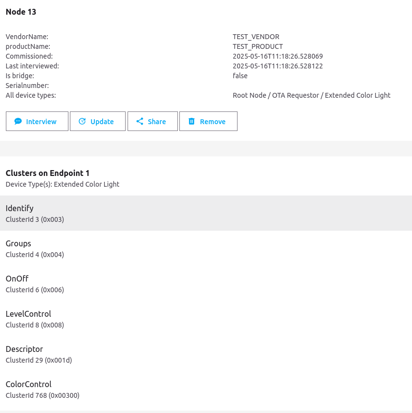

# Create a Home Assistant configuration using an office network without Wi-Fi router

### 1) Used (IP address + Device), IP addresses are taken from the access point's DHCP server and will change when the access point is rebooted:  
- XXX.YYY.ZZZ.87    Redmi Note 14 Pro (smartphone) - Access Point and Gateway
- XXX.YYY.ZZZ.171   Xiaomi Mi 12S Ultra (smartphone) - just as a Mobile App for Home Assistant
- XXX.YYY.ZZZ.29    Dexp Mini Entry (PC, Ubuntu)
- XXX.YYY.ZZZ.196   Dexp H21 (tablet)
- XXX.YYY.ZZZ.157   Espressif OpenThread Border Router
- XXX.YYY.ZZZ.176   Xiaomi Watch 2
- XXX.YYY.ZZZ.42    SMLight SLZB-06 (WiFi connection)

SSID for access point: MIKE_REDMI_NOTE_14

  
### 2) To do a hard reset of SLZB-06 device
For this, turn on the device with the button pressed, when the LEDs start to flash, release the button.

### 3) Configure Wi-Fi and "Matter-over-thread" mode for SLZB-06
- Find WiFi network of type "SLZB-06_198226" (open network)
- Connect
- Open http://slzb-06.local in browser
- Configure SLZB-06:
  - Network -> Wi-Fi Setup -> Scan for Wi-Fi networks
  - Choose: SSID = MIKE_REDMI_NOTE_14, Password: ###### -> Save
  - Dashboard -> Wi-Fi status -> DHCP
  - Open: http://XXX.YYY.ZZZ.42/ (Wi-Fi connection with internet access)
  - Mode -> Radio CC2652P mode -> switch to: Matter-over-Thread -> Save

### 4) in Home Assistant (integration)
- Settings -> Devices & Services -> Add integration
- Choose: SMLIGHT SLZB
- Enter host: **XXX.YYY.ZZZ.42:6638**

### 5) in Home Assistant (add-on)
- Settings -> Add-ons -> Add-on store
- Choose: OpenThread Border Router
- Configuration:
~~~
device: /dev/ttyAMA0
baudrate: "460800"
flow_control: false
autoflash_firmware: false
otbr_log_level: notice
firewall: true
nat64: false
network_device: XXX.YYY.ZZZ.42:6638
~~~
Here:
- "device" - any unused port

### 6) in Home Assistant
- Settings -> Devices & Services -> Thread -> CONFIGURE -> icon "Thread network information"
Get value of "Active dataset TLVs"  
*0e080000000000010000000300000f4a0300001835060004001fffe002080ad80fc8f565fb430708fd36c110b5afda0e05101450a03ab4223e9cf9907f0f548c1145030e68612d7468726561642d646462640102ddbd0410591801aa6198c76746fdc2fc023c97490c0402a0f7f8*  
- Parse using tlv-parser:
~~~
t:  14 (ACTIVETIMESTAMP), l: 8, v: 0x0000000000010000
t:   0 (CHANNEL), l: 3, v: 0x00000f
t:  53 (CHANNELMASK), l: 6, v: 0x0004001fffe0
t:   2 (EXTPANID), l: 8, v: 0x0ad80fc8f565fb43
t:   7 (MESHLOCALPREFIX), l: 8, v: 0xfd36c110b5afda0e
t:   5 (NETWORKKEY), l: 16, v: 0x1450a03ab4223e9cf9907f0f548c1145
t:   3 (NETWORKNAME), l: 14, v: 'ha-thread-ddbd'
t:   1 (PANID), l: 2, v: 0xddbd
t:   4 (PSKC), l: 16, v: 0x591801aa6198c76746fdc2fc023c9749
t:  12 (SECURITYPOLICY), l: 4, v: 0x02a0f7f8
~~~
Get value of "NETWORKKEY":  
*1450a03ab4223e9cf9907f0f548c1145*  

### 7) Join Thread networks
Web-interface of Espressif OpenThread Border Router:  
http://XXX.YYY.ZZZ.157/index.html  
- Available Thread Networks:
  - Press "SCAN" button
  - Press "Join" button, fill the "Network Key" with *1450a03ab4223e9cf9907f0f548c1145* and press "Submit"
  
There is both OTBR in the same Thread network now.  

### 8) Pairing end devices
**Attempt #1**  
The end device is created from the "esp-matter mike_on_off" using ESP32-H2 as a target.  
When trying to add a new Matter device to Home Assistant:  
- Redmi Note 14 Pro smartphone, the pairing process was interrupted at the stage "Connecting to device..."

**Attempt #2**  
The end device is created from the "esp-matter multiple_on_off_plugin_units" example using ESP32-H2 as a target.  
- Redmi Note 14 Pro smartphone, the pairing process was successful
Then the ESP32-H2 is flashed using "esp-matter mike_on_off", the target device is interviewed in the Home Assistant "Matter Server" add-on, and it works correctly with the new firmware!

  

  
