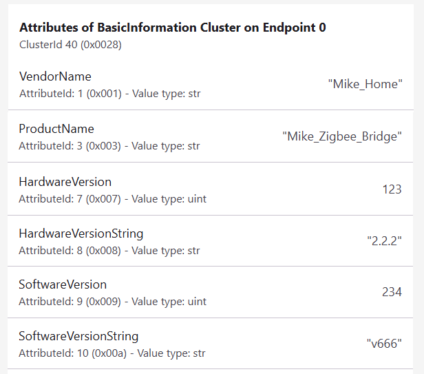

# ESP-Matter: Changing the values of software and hardware configuration parameters
For Matter devices programmed with ESP-Matter, the default values are *ProductName*=**TEST_PRODUCT**, *VendorName*=**TEST_VENDOR** and *HardwareVersionString*=**TEST_VERSION**. So, distinguishing one device from another, for example, in Home Assistant, is quite difficult. This article describes ESP-Matter settings for changing these parameters.  

The main default parameters are located in the file *~/esp-matter/connectedhomeip/connectedhomeip/src/include/platform/CHIPDeviceConfig.h* (it is clear that editing them there is, to put it mildly, not entirely correct):  
~~~
- #define CHIP_DEVICE_CONFIG_DEVICE_VENDOR_NAME "TEST_VENDOR"
- #define CHIP_DEVICE_CONFIG_DEVICE_VENDOR_ID 0xFFF1
- #define CHIP_DEVICE_CONFIG_DEVICE_PRODUCT_NAME "TEST_PRODUCT"
- #define CHIP_DEVICE_CONFIG_DEVICE_PRODUCT_ID 0x8001
- #define CHIP_DEVICE_CONFIG_DEFAULT_DEVICE_HARDWARE_VERSION_STRING "TEST_VERSION"
- #define CHIP_DEVICE_CONFIG_DEFAULT_DEVICE_HARDWARE_VERSION 0
- #define CHIP_DEVICE_CONFIG_DEVICE_SOFTWARE_VERSION_STRING "1.0"
- #define CHIP_DEVICE_CONFIG_DEVICE_SOFTWARE_VERSION 1
- #define CHIP_DEVICE_CONFIG_TEST_SERIAL_NUMBER "TEST_SN"
- #define CHIP_DEVICE_CONFIG_DEVICE_NAME "Test Kitchen"
~~~
  
What we can see in Home Assistant. The first example (Node 5) shows a device with default settings. The second example (Node 13) shows a device with more user-friendly settings.  
  
  
### 1. Example of a device with default settings:  
  

Default parameters in the description of the Matter node:  
  

Default parameters in the description of the BasicInformation cluster:  
  

Default contents of the CMakeLists.txt file:  
[sw-hw_conf_04-CMakeLists.txt](MATTER_SW-HW_CONF/sw-hw_conf_04-CMakeLists.txt)  
~~~
set(PROJECT_VER "1.0")
set(PROJECT_VER_NUMBER 1)

project(mike_on_off)
~~~
  
### 2. Example of a device with more user-friendly settings:  
  
  
Changed parameters in the description of the Matter node:  
  

Add settings for **VendorName**, **ProductName**, and **HardwareVersionString** in the *CMakeLists.txt* file. The *PROJECT_VER* and *PROJECT_VER_NUMBER* parameters are used in ESP-Matter to set the values of **SoftwareVersionString** and **SoftwareVersion**, respectively. Change the *PROJECT_VER* value.  
[sw-hw_conf_06-CMakeLists.txt](MATTER_SW-HW_CONF/sw-hw_conf_06-CMakeLists.txt)  
~~~
#-- BasicInformationCluster (ClusterId 40, 0x0028), Endpoint 0
#-- AttributeId 1: VendorName
set(DEVICE_VENDOR_NAME "Mike_Home")
#-- AttributeId 3: ProductName
set(DEVICE_PRODUCT_NAME "Mike_On_Off")
#-- AttributeId 5: NodeLabel
set(DEVICE_NODE_LABEL "8_Relays_ESP32H2")
#-- AttributeId 6: Location
set(DEVICE_LOCATION "Home")
#-- AttributeId 7: HardwareVersion
set(CONFIG_DEFAULT_DEVICE_HARDWARE_VERSION "See: sdkconfig.default")
#-- AttributeId 8: HardwareVersionString
set(DEVICE_HARDWARE_VERSION_STRING "2.2.2")
#-- AttributeId 9: SoftwareVersion
set(PROJECT_VER_NUMBER 1)
#-- AttributeId 10: SoftwareVersionString
set(PROJECT_VER "1.1.1")

#-- Define custom options for the compiler
add_compile_definitions(
    CONFIG_CUSTOM_DEVICE_NODE_LABEL="${DEVICE_NODE_LABEL}"
    CONFIG_CUSTOM_DEVICE_LOCATION="${DEVICE_LOCATION}"
)

#-- Set predefined options for the compiler
idf_build_set_property(COMPILE_OPTIONS "-DCHIP_DEVICE_CONFIG_DEVICE_VENDOR_NAME=\"${DEVICE_VENDOR_NAME}\"" APPEND)
idf_build_set_property(COMPILE_OPTIONS "-DCHIP_DEVICE_CONFIG_DEVICE_PRODUCT_NAME=\"${DEVICE_PRODUCT_NAME}\"" APPEND)
idf_build_set_property(COMPILE_OPTIONS "-DCHIP_DEVICE_CONFIG_DEFAULT_DEVICE_HARDWARE_VERSION_STRING=\"${DEVICE_HARDWARE_VERSION_STRING}\"" APPEND)

project(mike_on_off)
~~~
  
Add settings for **HardwareVersion** and **SoftwareVersion** to *sdkconfig.defaults* (they cannot be specified directly in *CMakeLists.txt*) and specify that the PROJECT_VER will be taken from the config:  
[sw-hw_conf_07-sdkconfig.defaults](MATTER_SW-HW_CONF/sw-hw_conf_07-sdkconfig.defaults)  
~~~
# Device Identification Options
CONFIG_DEFAULT_DEVICE_HARDWARE_VERSION=123
CONFIG_DEVICE_SOFTWARE_VERSION_NUMBER=234

# Application manager
CONFIG_APP_PROJECT_VER_FROM_CONFIG=y
CONFIG_APP_PROJECT_VER="v666"
~~~

As we can see, **VendorName**, **ProductName**, and **HardwareVersionString** is correctly set from the *CMakeLists.txt* settings. The integer values of **HardwareVersion** and **SoftwareVersion** and the string value of **SoftwareVersionString**, is set from the *sdkconfig.defaults* settings  
  

For PROJECT_VER, disable usage from config:  
[sw-hw_conf_09-sdkconfig.defaults](MATTER_SW-HW_CONF/sw-hw_conf_09-sdkconfig.defaults)  
~~~
# Device Identification Options
CONFIG_DEFAULT_DEVICE_HARDWARE_VERSION=123
CONFIG_DEVICE_SOFTWARE_VERSION_NUMBER=234

# Application manager
CONFIG_APP_PROJECT_VER_FROM_CONFIG=n
CONFIG_APP_PROJECT_VER="v666"
~~~

As we can see, the values of **SoftwareVersion** and **SoftwareVersionString** are now taken from the *CMakeLists.txt* settings  
  

The **NodeLabel** parameter cannot be set in the project configuration, so we will change them programmatically:
~~~
void set_basic_attributes_esp_matter()
{
  uint16_t endpoint_id = 0x0000;

  //-- Set NodeLabel
  char node_label[] = CONFIG_CUSTOM_DEVICE_NODE_LABEL;
  esp_matter_attr_val_t node_label_val = esp_matter_char_str(node_label, strlen(node_label));
  esp_err_t err = esp_matter::attribute::update(
    endpoint_id,
    chip::app::Clusters::BasicInformation::Id,
    chip::app::Clusters::BasicInformation::Attributes::NodeLabel::Id,
    &node_label_val
  );
}
~~~
The value for **CONFIG_CUSTOM_DEVICE_NODE_LABEL** is defined in *CMakeLists.txt*.  
Unfortunately, the **Location** attribute has administrator privileges, so we cannot change its value.  
~~~
#define GENERATED_ACCESS_WRITE_ATTRIBUTE__CLUSTER
...
0x00000028, /* Cluster: Basic Information, Attribute: NodeLabel, Privilege: manage */ \
0x00000028, /* Cluster: Basic Information, Attribute: Location, Privilege: administer */ \
...
~~~

### Devices with Custom Firmware in Google Home
Google Home can connect Matter-over-Thread devices with custom firmware, but this requires meeting certain technical requirements in the developer console.  
See: [Build a Matter device](https://developers.home.google.com/codelabs/matter-device?hl=en)  
**Basic requirements for connection:**  
- *Identification (VID/PID):* The firmware must specify a Vendor ID (VID) and Product ID (PID). For development and testing, you can use test IDs (e.g., VID 0xFFF1 and PIDs from 0x8000 to 0x801F).  
- *Developer Console:* You must create a project in the Google Home Developer Console, specify the VID/PID pairing you are using, and create an integration.  
- *Account:* The user adding the device in the Google Home app must be an owner or member of that project in the developer console.  
  
Add parameters for the VENDOR_ID and PRODUCT_ID of the custom firmware to sdkconfig.defaults:  
~~~
CONFIG_DEVICE_VENDOR_ID=0xFFF1
CONFIG_DEVICE_PRODUCT_ID=0x8001
~~~
After flashing, these parameters can be found in the description of BasicInformationCluster (ClusterId 40, 0x0028), Endpoint 0:  
- AttributeId 2: VendorID  
- AttributeId 4: ProductID  
  
The decimal value of VendorID (0xFFF1) will be 65521.  
The decimal value of ProductID (0x8001) will be 32769.  
  
  
In the developer console, create a new Matter device and add the same parameters for it:  
  
  
