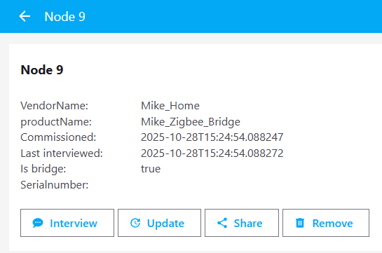

# ESP-Matter: Changing the values of software and hardware configuration parameters
For Matter devices programmed with ESP-Matter, the default values are *ProductName*=**TEST_PRODUCT** and *VendorName*=**TEST_VENDOR**. So, distinguishing one device from another, for example, in Home Assistant, is quite difficult. This article describes ESP-Matter settings for changing these parameters.  
  
  
### 1. Example of a device with default settings:  
Default parameters in the description of the Matter node:  
  

Default parameters in the description of the BasicInformation cluster:  
  

Default contents of the CMakeLists.txt file:  
[sw-hw_conf_04-CMakeLists.txt](sw-hw_conf_04-CMakeLists.txt)  
~~~
set(PROJECT_VER "1.0")
set(PROJECT_VER_NUMBER 1)

project(mike_on_off)
~~~
  
### 2. Example of a device with more correct settings:  
Changed parameters in the description of the Matter node:  
  

Add settings for **VendorName**, **ProductName**, and **HardwareVersionString** in the *CMakeLists.txt* file. The *PROJECT_VER* and *PROJECT_VER_NUMBER* parameters are used in ESP-Matter to set the values of **SoftwareVersionString** and **SoftwareVersion**, respectively. Change the *PROJECT_VER* value.  
[sw-hw_conf_06-CMakeLists.txt](sw-hw_conf_06-CMakeLists.txt)  
~~~
set(DEVICE_VENDOR_NAME "Mike_Home")
set(DEVICE_PRODUCT_NAME "Mike_Zigbee_Bridge")
set(DEVICE_HARDWARE_VERSION_STRING "2.2.2")
set(PROJECT_VER "1.1.1")
set(PROJECT_VER_NUMBER 1)

idf_build_set_property(COMPILE_OPTIONS "-DCHIP_DEVICE_CONFIG_DEVICE_VENDOR_NAME=\"${DEVICE_VENDOR_NAME}\"" APPEND)
idf_build_set_property(COMPILE_OPTIONS "-DCHIP_DEVICE_CONFIG_DEVICE_PRODUCT_NAME=\"${DEVICE_PRODUCT_NAME}\"" APPEND)
idf_build_set_property(COMPILE_OPTIONS "-DCHIP_DEVICE_CONFIG_DEFAULT_DEVICE_HARDWARE_VERSION_STRING=\"${DEVICE_HARDWARE_VERSION_STRING}\"" APPEND)

project(zigbee_bridge)
~~~
  
Add settings for **HardwareVersion** and **SoftwareVersion** to *sdkconfig.defaults* (they cannot be specified directly in *CMakeLists.txt*) and specify that the PROJECT_VER will be taken from the config:  
[sw-hw_conf_07-sdkconfig.defaults](sw-hw_conf_07-sdkconfig.defaults)  
~~~
# Device Identification Options
CONFIG_DEFAULT_DEVICE_HARDWARE_VERSION=123
CONFIG_DEVICE_SOFTWARE_VERSION_NUMBER=234

# Application manager
CONFIG_APP_PROJECT_VER_FROM_CONFIG=y
CONFIG_APP_PROJECT_VER="v666"
~~~

As we can see, **VendorName**, **ProductName**, and **HardwareVersionString** is correctly set from the *CMakeLists.txt* settings. The integer values of **HardwareVersion** and **SoftwareVersion** and the string value of **SoftwareVersionString**, is set from the *sdkconfig.defaults* settings  
  

For PROJECT_VER, disable usage from config:  
[sw-hw_conf_09-sdkconfig.defaults](sw-hw_conf_09-sdkconfig.defaults)  
~~~
# Device Identification Options
CONFIG_DEFAULT_DEVICE_HARDWARE_VERSION=123
CONFIG_DEVICE_SOFTWARE_VERSION_NUMBER=234

# Application manager
CONFIG_APP_PROJECT_VER_FROM_CONFIG=n
CONFIG_APP_PROJECT_VER="v666"
~~~

As we can see, the values of **SoftwareVersion** and **SoftwareVersionString** are now taken from the *CMakeLists.txt* settings  
  
  
In summary, what we can see in Home Assistant:  
  
  
  
  
