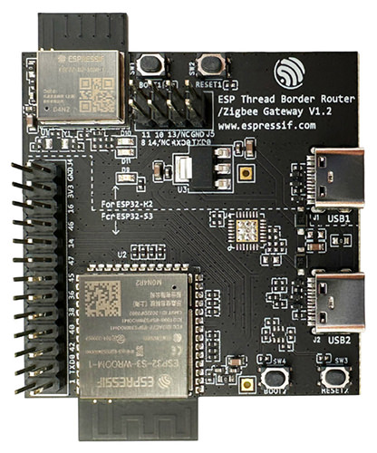
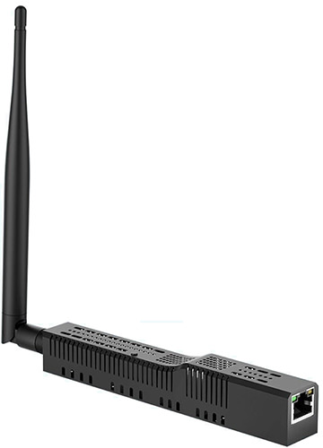
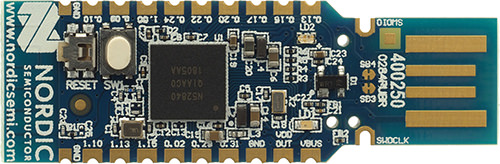
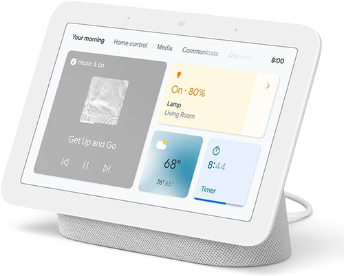
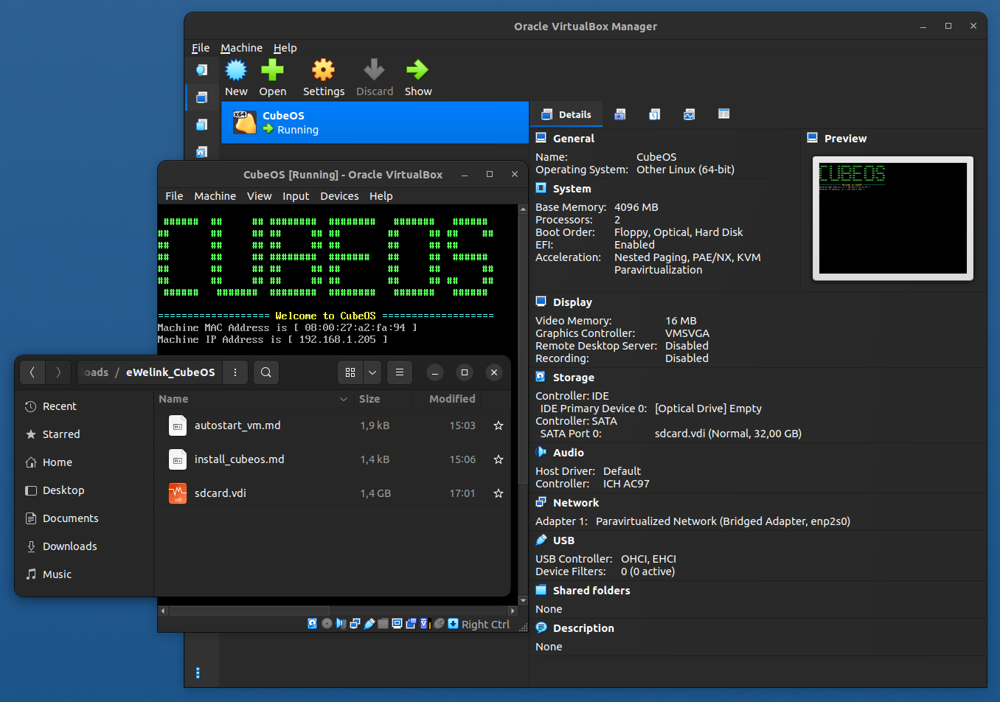

# Comparison of Thread Border Routers

### 1. Espressif Thread Border Router & Zigbee Gateway
- **Completely open source ESP-IDF SDK and ESP-Matter framework with comprehensive documentation and numerous examples!**  
  
  

### 2. SmLight SLZB-06 (SLZB-06P7)
- Connects programmatically to a "free" port on a computer running Home Assistant. However, if such a port is not available (for example, on a Raspberry Pi running HAOS), it requires a chip (e.g., an ESP32-H2 SuperMini) to be attached to the USB port, with firmware (e.g., openthread/ot_rcp) that would identify the chip as a device.  
- Configured in Home Assistant via the "OpenThread Border Router" add-on, which cannot be duplicated, meaning it's impossible to create a second OTBR.  
- If the adapter is disconnected from power/network (SLZB-06) or network (SLZB-06P7), problems may occur reconnecting it, requiring to restart Home Assistant or even the computer it's installed on.  
- Since the adapter is based on two chips (TI CC2652P and Espressif ESP32), flashing the chips directly is not possible. Flashing the chips is only possible from the manufacturer's website, which establishes a software dependency between both adapter chips.  
- The firmware code is not open source, so it's impossible to make changes to it.  
  
  

### 3. Nordic Semiconductor nRF52840 USB Dongle
- This is only an RCP module! OTBR itself is installed software-based on the computer to which the adapters are connected. This means that to create a fully functional OTBR, we need a computer with an OS and OTBR software installed.  
- OTBR requires hard-coded computer ports to which the adapters will be connected as RCPs. Therefore, if these ports are occupied by other devices, RCP activation will not occur, and OTBR will not start.  
  
  
  

### 4. Google Nest Hub 2nd Gen
- Directly connects only Matter/Thread devices certified by the Connectivity Standards Alliance. Otherwise, connection is not guaranteed!  
- Connection with Home Assistant is possible via the Home-Assistant-Matter-Hub add-on (allows sharing Matter devices with other hubs, including the Google Nest Hub) – but this is definitely not an achievement of Google Home!  
  
  
  

<!--
### 5. eWelink CubeOS
- Requires a dedicated computer (Raspberry Pi) or virtual machine to install software.  
- On Raspberry Pi, it won't boot from an SSD connected to the computer's USB port. It only boots from an SD card, which is, of course, extremely unreliable and short-lived!  
  
  
-->
