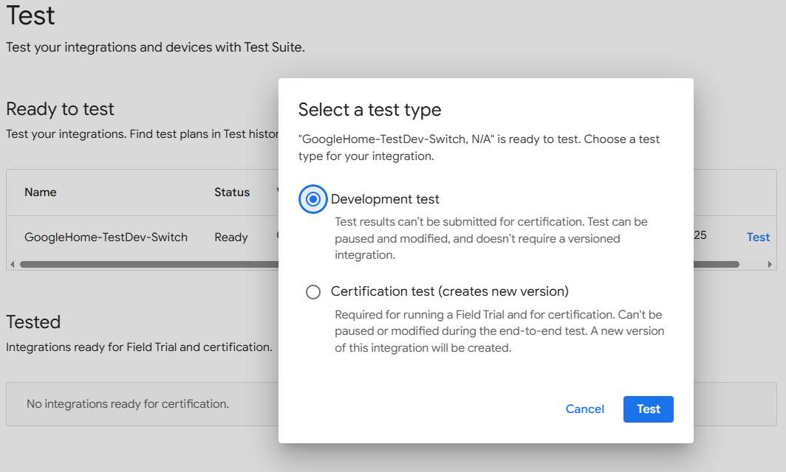

# Google Home

### Pairing ESP32 End Device
When pairing with ESP32 End Device the operating system will ask you to allow to pair an "uncertified device" which we need to allow. If we want to avoid this message you optionally can register the relevant details for your uncertified devices in our Google Account. For this open the Google Developer Console to add an Integration and [setup](https://developers.home.google.com/matter/get-started?hl=en) the device there.  
We should use **0xFFF1** as *VendorID* and **0x8000** as *ProductId* because ESP32 End Device uses this by default.  
~~~
#
# Device Identification Options
#
CONFIG_DEVICE_VENDOR_ID=0xFFF1
CONFIG_DEVICE_PRODUCT_ID=0x8000
~~~
[Test your integrations and devices with Test Suite](https://console.home.google.com/projects/[our-project-name]/matter/test)  
  
  