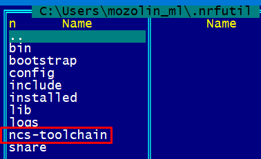
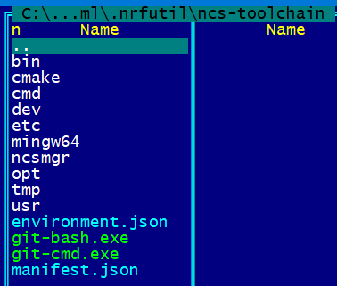
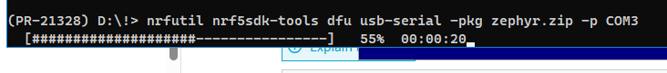
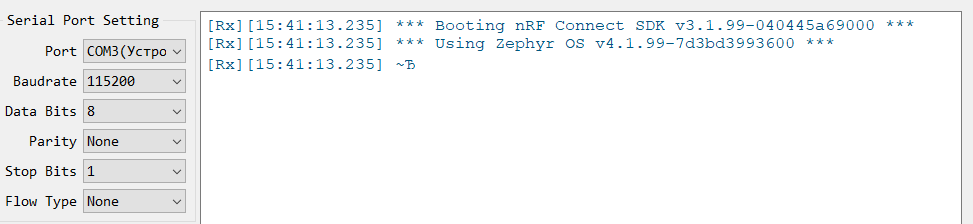
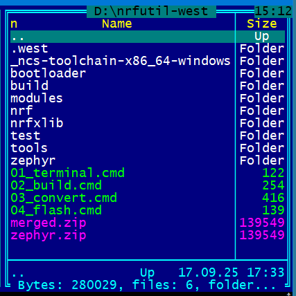

# Как создать RCP прошивку для nRF52840 USB Dongle с помощью nrfutil и west (Windows)

### 1) Links
**"Configuring radio co-processor"**  
[https://docs.nordicsemi.com/bundle/ncs-latest/page/nrf/protocols/thread/tools.html#configuring_a_radio_co-processor](https://docs.nordicsemi.com/bundle/ncs-latest/page/nrf/protocols/thread/tools.html#configuring_a_radio_co-processor)  

**Installing west**  
[https://docs.zephyrproject.org/latest/develop/west/install.html](https://docs.zephyrproject.org/latest/develop/west/install.html)  

### 2) Установить west
~~~
pip3 install -U west
~~~

### 3) Узнать версию ncs-toolchain в config.json
[config.json](https://files.nordicsemi.cn/ui/repos/tree/General/NCS/external/bundles/config.json)  
Например, "ncs-toolchain-x86_64-windows-0b393f9e1b.tar.gz"  

### 4) Скачать ncs-toolchain и распаковать
[ncs-toolchain-x86_64-windows](https://publicburan.blob.core.windows.net/artifactory/NCS/external/bundles/v3/ncs-toolchain-x86_64-windows-0b393f9e1b.tar.gz)  
например, в C:\\Users\\[username]\\.nrfutil\\ncs-toolchain:  
  
  
  
  

  
### 5) Запустить терминал
~~~
nrfutil sdk-manager toolchain launch --toolchain-path "C:\Users\[username]\.nrfutil\ncs-toolchain" --terminal
~~~
**Все остальные скрипты/программы выполняются из запущенного Powershell-терминала...**  

### 6) Установить nRF Connect SDK
~~~
west init -m https://github.com/nrfconnect/sdk-nrf
west update
~~~

### 7) Build the Thread: Co-processor sample
~~~
west build -p always -b nrf52840dongle/nrf52840 nrf/samples/openthread/coprocessor/
~~~
~~~
Memory region      Used Size  Region Size  %age Used
        FLASH:      139020 B       988 KB     13.74%
          RAM:       36544 B       256 KB     13.94%
     IDT_LIST:          0 GB        32 KB      0.00%
Generating ../merged.hex
~~~
Файл merged.hex будет находиться в папке build/  
Файл zephyr.hex будет находиться в папке build/coprocessor/zephyr/  
Оба файла содержат корректную прошивку RCP для nRF52840 USB Dongle.  

### 8) Generate the RCP firmware package
~~~
nrfutil nrf5sdk-tools pkg generate --hw-version 52 --sd-req=0x00  --application build/merged.hex --application-version 1 merged.zip
nrfutil nrf5sdk-tools pkg generate --hw-version 52 --sd-req=0x00  --application build/coprocessor/zephyr/zephyr.hex --application-version 1 zephyr.zip
~~~
~~~
|===============================================================|
|##      ##    ###    ########  ##    ## #### ##    ##  ######  |
|##  ##  ##   ## ##   ##     ## ###   ##  ##  ###   ## ##    ## |
|##  ##  ##  ##   ##  ##     ## ####  ##  ##  ####  ## ##       |
|##  ##  ## ##     ## ########  ## ## ##  ##  ## ## ## ##   ####|
|##  ##  ## ######### ##   ##   ##  ####  ##  ##  #### ##    ## |
|##  ##  ## ##     ## ##    ##  ##   ###  ##  ##   ### ##    ## |
| ###  ###  ##     ## ##     ## ##    ## #### ##    ##  ######  |
|===============================================================|
|You are not providing a signature key, which means the DFU     |
|files will not be signed, and are vulnerable to tampering.     |
|This is only compatible with a signature-less bootloader and is|
|not suitable for production environments.                      |
|===============================================================|
Zip created at merged.zip
~~~

### 9) Set nRF52840 Dongle
Connect the nRF52840 Dongle to the USB port. Press the RESET button on the dongle to put it into the DFU mode. The LED on the dongle starts blinking red.

### 10) Install firmware
Install the RCP firmware package onto the dongle by running the following command, with `COM3` replaced with the device node name of your nRF52840 Dongle
~~~
nrfutil nrf5sdk-tools dfu usb-serial -pkg merged.zip -p COM3
~~~
или  
~~~
nrfutil nrf5sdk-tools dfu usb-serial -pkg zephyr.zip -p COM3
~~~
  
  
  
  
  

  
# Section Contents
- [Installing nRF Util and its packages](01_nrfutil.md)  
- [Creating RCP firmware for the nRF52840 USB Dongle](02_firmware.md)  
- [Installing and Configuring OTBR on Ubuntu](03_otbr.md)  
  