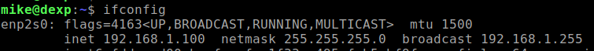
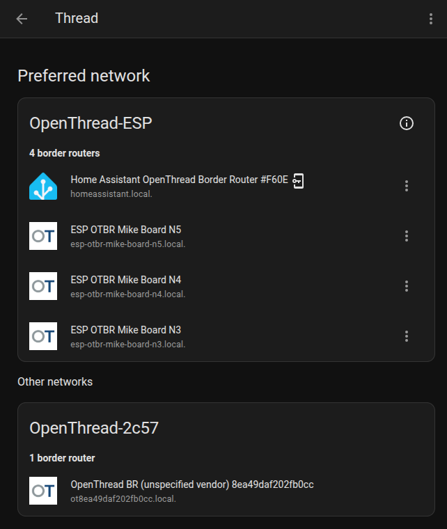
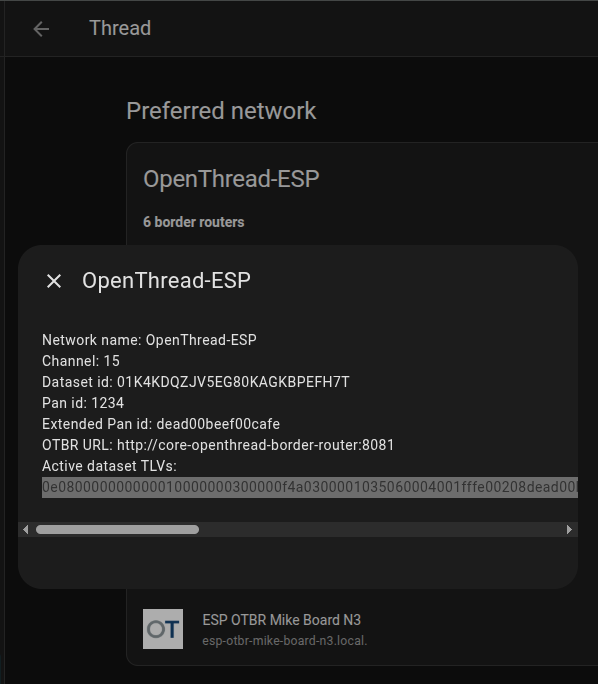
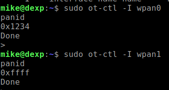
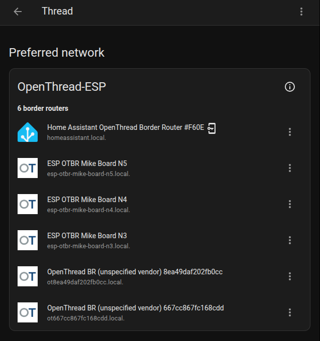

# Установка и настройка OTBR под Ubuntu

### 1) Links
**"Native Install"**  
[https://openthread.io/guides/border-router/build-native](https://openthread.io/guides/border-router/build-native)  
  
**Form Thread Network**  
[https://openthread.io/guides/border-router/form-network](https://openthread.io/guides/border-router/form-network)  

### 2) Установки OTBR по умолчанию
Clone ot-br-posix from GitHub:
~~~
git clone --depth=1 https://github.com/openthread/ot-br-posix
~~~
Получить список используемых интерфейсов Ubuntu:
~~~
ifconfig
~~~
Нас будет интересовать Ethernet:  
  
  
  
Set up the Thread Border Router:
~~~
cd ot-br-posix
./script/bootstrap
INFRA_IF_NAME=enp2s0 ./script/setup
~~~
  
  
  
  
  
  

### 3) Установка второго экземпляра OTBR

Создаём/исправляем настройки для первого экземпляра OTBR:  
- [otbr-agent.service](ubuntu/usr/lib/systemd/system/otbr-agent.service)
- [otbr-web.service](ubuntu/usr/lib/systemd/system/otbr-web.service)
- [otbr-agent](ubuntu/etc/default/otbr-agent)
- [otbr-web](ubuntu/etc/default/otbr-web)

Создаём/исправляем настройки для первого экземпляра OTBR:  
- [otbr-agent-2.service](ubuntu/usr/lib/systemd/system/otbr-agent-2.service) + создать symlink /etc/systemd/system/otbr-agent-2.service
- [otbr-web-2.service](ubuntu/usr/lib/systemd/system/otbr-web-2.service) + создать symlink /etc/systemd/system/otbr-web-2.service
- [otbr-agent-2](ubuntu/etc/default/otbr-agent-2)
- [otbr-web-2](ubuntu/etc/default/otbr-web-2)
  
  
  
  
  
  
  
  
  
# Section Contents
- [Installing nRF Util and its packages](01_nrfutil.md)  
- [Creating RCP firmware for the nRF52840 USB Dongle](02_firmware.md)  
- [Installing and Configuring OTBR on Ubuntu](03_otbr.md)  
  