# Office LAN with Internet Access
### Example of creating a local network in an office.
**Project idea**  
Creating an environment for developing and testing a Matter/Thread network.  
  
**Limitations**  
Unfortunately, it is not possible to create a local network without internet access for this project. An internet connection is required when compiling C++ applications, as they use components loaded during firmware builds.  
  
**Implementation diagram**  
  
  
### Features
- Internet access via a smartphone hotspot  
- Fixed IP addresses for all devices  
- Home Assistant on a dedicated Raspberry Pi microcomputer  
- Connecting Thread end devices via the Home Assistant app on a smartphone  
- OpenThread Border Router (Espressif)  
- OpenThread Border Router (SmLight SLZB-06)  
- OpenThread Border Router (nRF52840 USB Dongle)  
- Yandex Hub + Yandex Smart Home for connecting and displaying Matter devices  
- Dedicated Ubuntu computer for creating ESP-Matter firmware for Thread end devices  
- Office computer with a Wi-Fi connection to the local network  

### Hardware
| IP            | Protocol         | Model                      | Vendor                |
|--------------:|:----------------:|:---------------------------|:----------------------|
|   192.168.1.1 | Wi-Fi / Ethernet | Netis N5 Router            | Netis                 |
| 192.168.1.100 | Ethernet         | DEXP Mini Ethernet         | DEXP                  |
| 192.168.1.101 | Ethernet         | HA Office Ethernet         | HA                    |
| 192.168.1.150 | Wi-Fi            | DEXP Mini Wi-Fi            | DEXP                  |
| 192.168.1.151 | Wi-Fi            | HA Office Wi-Fi            | HA                    |
| 192.168.1.152 | Wi-Fi            | Redmi Note 14 Wi-Fi        | HA                    |
| 192.168.1.153 | Wi-Fi            | Xiaomi 12S Ultra           | Xiaomi                |
| 192.168.1.201 | Ethernet         | SmLight SLZB-06 Ethernet   | SmLight               |
| 192.168.1.202 | Ethernet         | OTBR #4 Ethernet           | Espressif             |
| 192.168.1.203 | Ethernet         | OTBR #5 Ethernet           | Espressif             |
| 192.168.1.204 | Ethernet         | Yandex Hub Ethernet        | Yandex                |
| 192.168.1.234 | Wi-Fi            | HP Office PC               | HP                    |
| 192.168.1.250 | Wi-Fi            | OTBR #3 Wi-Fi              | Espressif             |
| 192.168.1.251 | Wi-Fi            | SmLight SLZB-06 Wi-Fi      | SmLight               |
| 192.168.1.252 | Wi-Fi            | OTBR #4 Wi-Fi              | Espressif             |
| 192.168.1.253 | Wi-Fi            | OTBR #5 Wi-Fi              | Espressif             |
  
- **Redmi Note 14 Smartphone**  
  Connected to ***mobile internet*** and creates a Wi-Fi hotspot.
- **Netis N5 Router**  
  Connected via ***Wi-Fi*** to an access point created on the Redmi Note 14 smartphone.  
  Using a router allows to create a local network with its own addressing, independent of the access point.
- **TP-Link LS1008 Switch**  
  Connected via ***Ethernet*** to the Netis N5 router output.  
  Used to expand the number of Ethernet outputs, as the Netis N5 router only has three.
- **DEXP Mini**  
  Connected via ***Ethernet*** to the TP-Link LS1008 switch.  
  Runs under Ubuntu. Used for compiling C++ ESP-IDF/ESP-Matter applications.
- **HA Office**  
  Connected via ***Ethernet*** to a TP-Link LS1008 switch.  
  Runs on a Raspberry Pi 4 running HAOS. Used to run Home Assistant systems.
- **SmLight SLZB-06**  
  Connected via ***Ethernet*** to a TP-Link LS1008 switch.  
  Used to create an OpenThread Boarder Router.
- **ESP OTBR #4**  
  Connected via ***Ethernet*** to a TP-Link LS1008 switch.  
  Used to create an OpenThread Boarder Router.
- **ESP OTBR #5**  
  Connected via ***Ethernet*** to a TP-Link LS1008 switch.  
  Used to create an OpenThread Boarder Router.
- **Yandex Hub**  
  Connected via ***Ethernet*** to a TP-Link LS1008 switch.  
  Used to connect Matter devices.
- **ESP OTBR #3**  
  Connected via ***Wi-Fi*** to a TP-Link LS1008 switch.  
  Used to create an OpenThread Boarder Router.
- **HP Office PC**  
  Connected via ***Wi-Fi*** to a TP-Link LS1008 switch.  
  Runs under Windows 10. Used for more convenient editing of C++ application source code and Home Assistant scripts. Folders containing source code are connected to the Windows system via Samba services installed on computers running ESP-IDF/ESP-Matter (under Ubuntu) and Home Assistant (under HAOS), respectively.
- **Xiaomi 12S Ultra**  
  Connected via ***Wi-Fi*** to a TP-Link LS1008 switch.  
  Used to connect Matter end devices to the Thread network via the Home Assistant mobile app.

### Thread Network
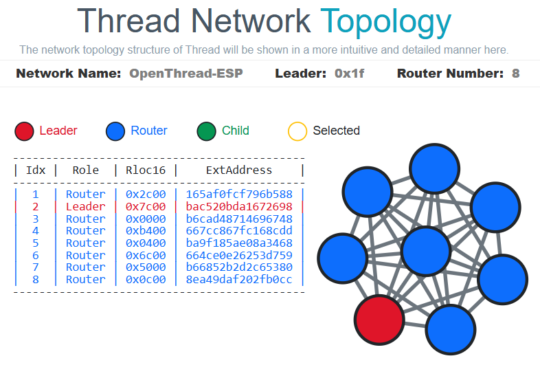  
  
- **SmLight SLZB-06**  
  Connected via Ethernet to a TP-Link LS1008 switch.  
  Used to create an OpenThread Boarder Router. To configure the Home Assistant add-on correctly, we need either a free COM port available on our computer running Home Assistant, or an artificially created COM port by connecting an external RCP module via USB.  
  Firmware: [flasher](https://smlight.tech/flasher).
- **ESP OTBR #3 Wi-Fi**  
  Connected via Wi-Fi to a TP-Link LS1008 switch.  
  Used to create an OpenThread Boarder Router.  
  Firmware: [esp-thread-br](https://github.com/mozolin/esp-thread-br).
- **ESP OTBR #4 Ethernet**  
  Connected via Ethernet to a TP-Link LS1008 switch.  
  Used to create an OpenThread Boarder Router.  
  Firmware: [esp-thread-br](https://github.com/mozolin/esp-thread-br).
- **ESP OTBR #5 Ethernet**  
  Connected via Ethernet to a TP-Link LS1008 switch.  
  Used to create an OpenThread Boarder Router.  
  Firmware: [esp-thread-br](https://github.com/mozolin/esp-thread-br).
- **nRF52840 Dongle 1**  
  Connected via USB to a DEXP Mini computer (running Ubuntu).  
  Used as an RPC module to create an OpenThread Boarder Router under Ubuntu.  
  Firmware: [nRFUtil](https://www.nordicsemi.com/Products/Development-tools/nRF-Util).
- **nRF52840 Dongle 2**  
  Connected via USB to a DEXP Mini computer (running Ubuntu).  
  Used as an RPC module to create an OpenThread Boarder Router under Ubuntu.  
  Firmware: [nRFUtil](https://www.nordicsemi.com/Products/Development-tools/nRF-Util).
- **ESP32-H2 Mike Tiny RP4 RCP**  
  Connected via USB to an HA Office computer (running HAOS on a Raspberry Pi 4).  
  Used as an RPC module to create an OpenThread Boarder Router (based on SmLight SLZB-06) in the "OpenThread Boarder Router" Home Assistant add-on.  
  Firmware: [mike_h2_tiny](https://github.com/mozolin/matter-thread/tree/main/apps/mike_h2_tiny).
- **ESP32-H2 Mike Tiny**  
  The "Mike Tiny" app runs on an ESP32-H2 chip and provides minimal functionality to connect to the Thread network.  
  Firmware: [mike_h2_tiny](https://github.com/mozolin/matter-thread/tree/main/apps/mike_h2_tiny).
- **ESP32-H2 Mike OnOff**  
  The "Mike OnOff" app runs on an ESP32-H2 chip and controls 8 relays to connect to the Thread network.  
  Firmware: [mike_on_off](https://github.com/mozolin/matter-thread/tree/main/apps/mike_on_off).

**Thread Network**  
  
  
**List of Matter end devices**  
  
    
**Matter Server**  
  
  
**Mike OnOff end devices (built on ESP32-H2)**  
  
  
**Mike Tiny end devices (built on ESP32-H2)**  
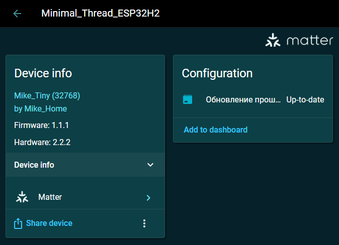  
  
**Addon "OpenThread Border Router"**  
  
  
**List of OpenThread Border Routers**  
  
  
**Addon "SMLIGHT SMZB"**  
  
  
**SMLight SMZB-06 Settings: Connection Mode**  
  
  
**SMLight SMZB-06 Settings: Dashboard**  
  
  
**SMLight SMZB-06 Settings: Device Info**  
  
  
**SMLight SMZB-06 Settings: Ethernet Status**  
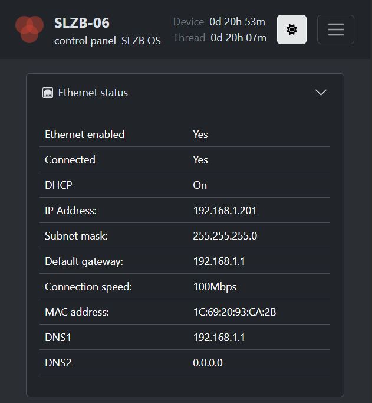  
  
**SMLight SMZB-06 Settings: Mode**  
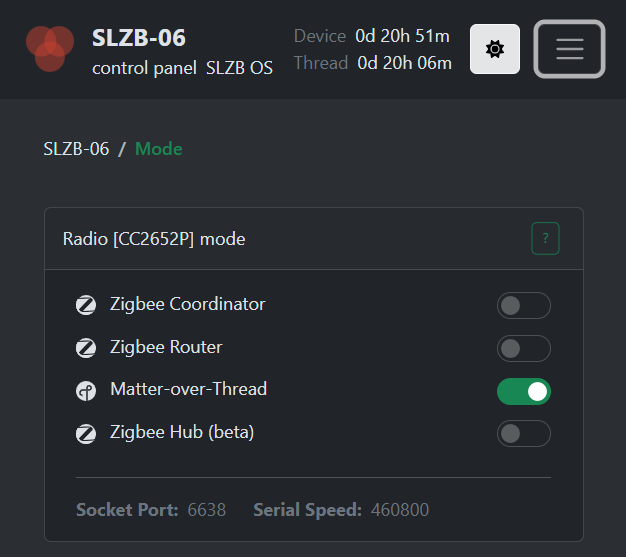  
  

### Setting up the Netis N5 router
- Main page "Advanced Setup"  
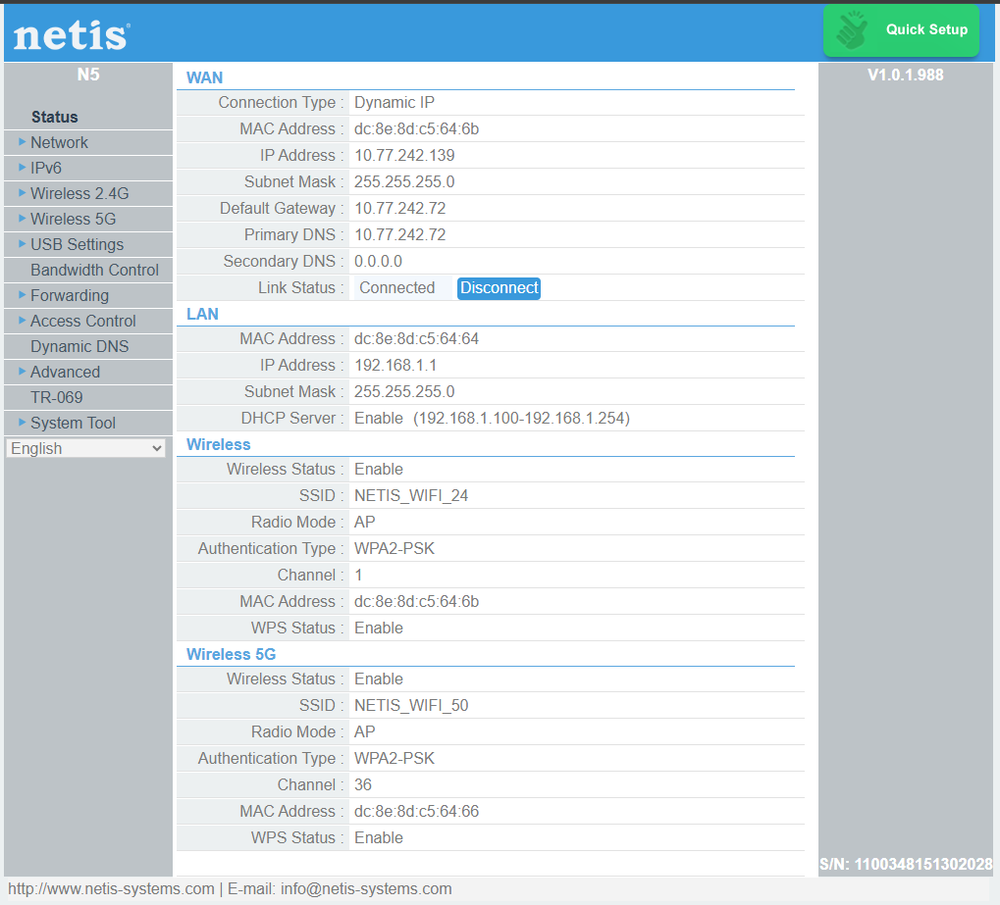  
  
- Connecting via Wi-Fi to an access point created on a Redmi Note 14 smartphone.  
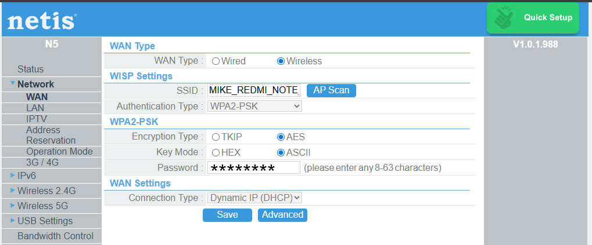  

- Setting up a local network  
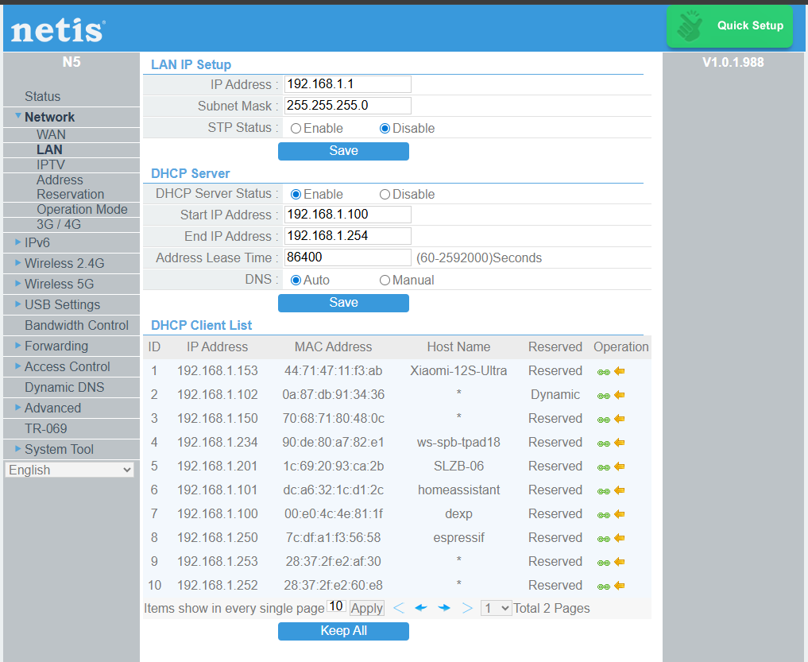  
  
- Binding MAC addresses to IP addresses for all devices on the network (address reservation)  
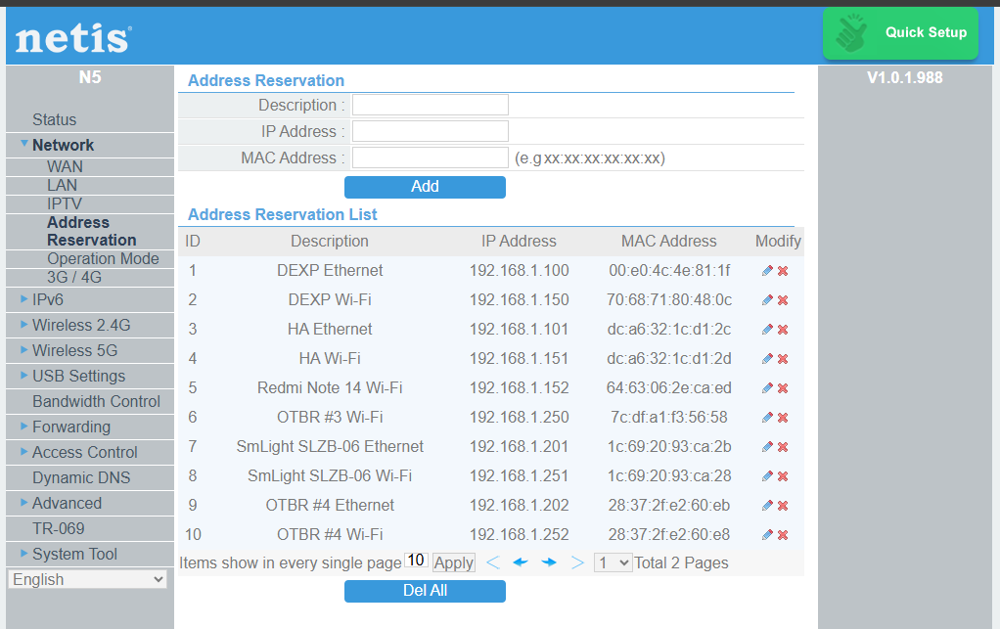  

- Setting the router operating mode to "Router"  
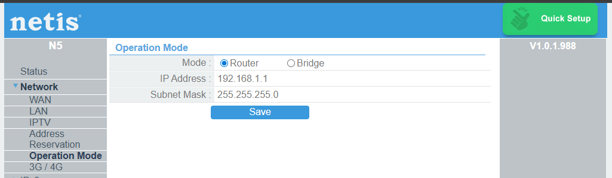  
  
- Using IP4/IP6  
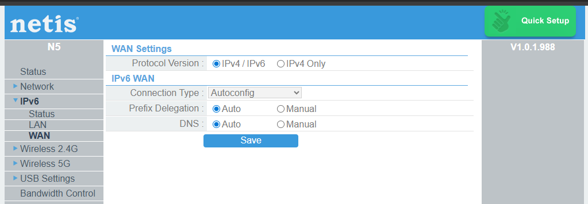  
  
- Setting up an access point on Router for connecting wireless devices on the 2.4GHz band  
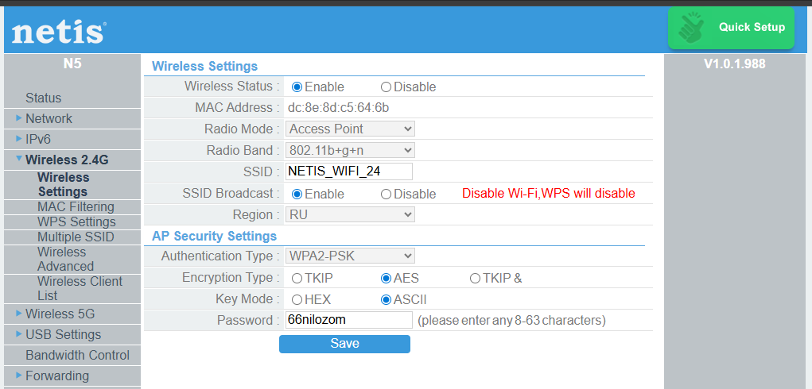  
  
- Configuring WPS on 2.4GHz  
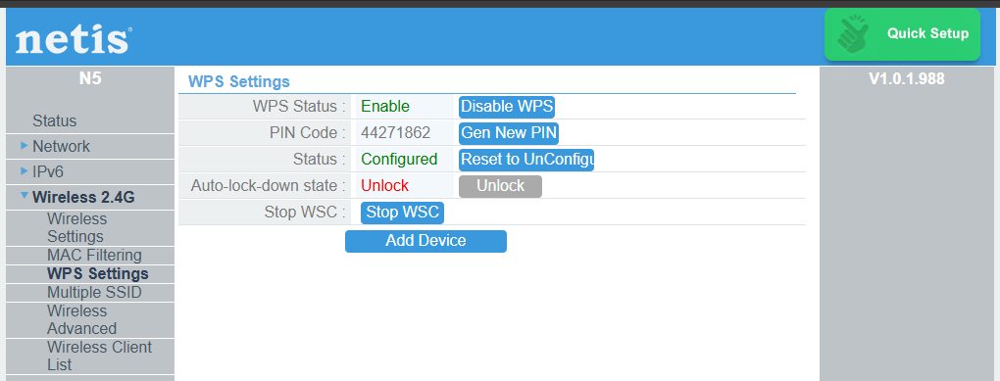  
  
- Disabling "AP Isolation" on 2.4GHz  
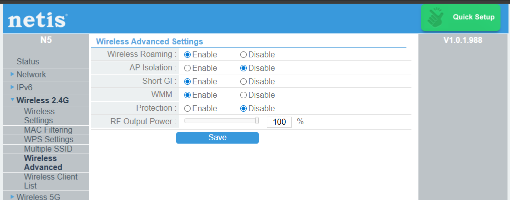  

- Configuring an access point on a router for connecting wireless devices on the 5GHz band  
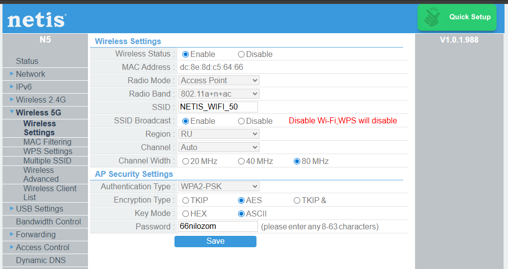  

- Configuring WPS on 5GHz  
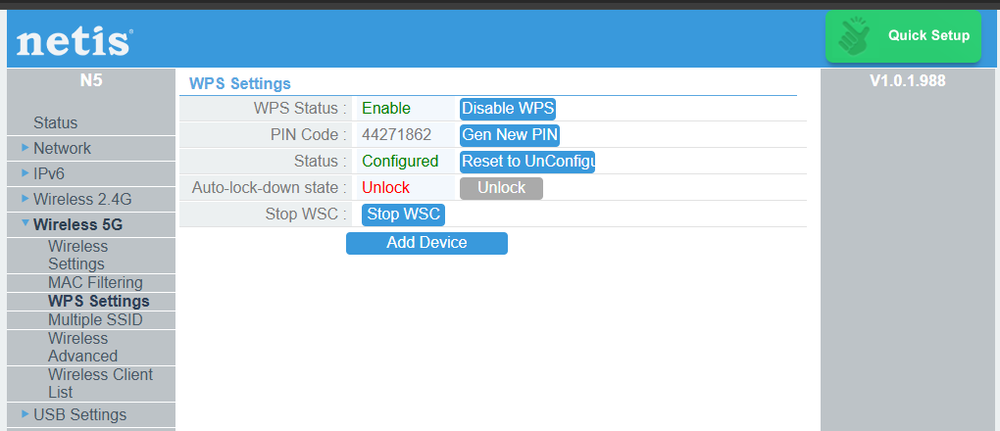  

- Disabling "AP Isolation" on 5GHz  
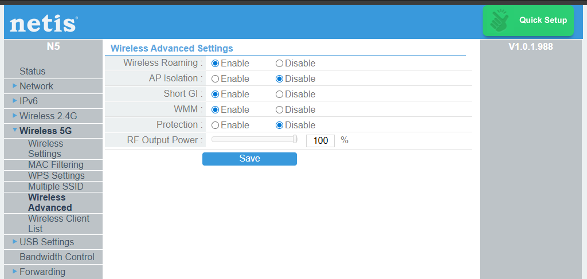  
  
