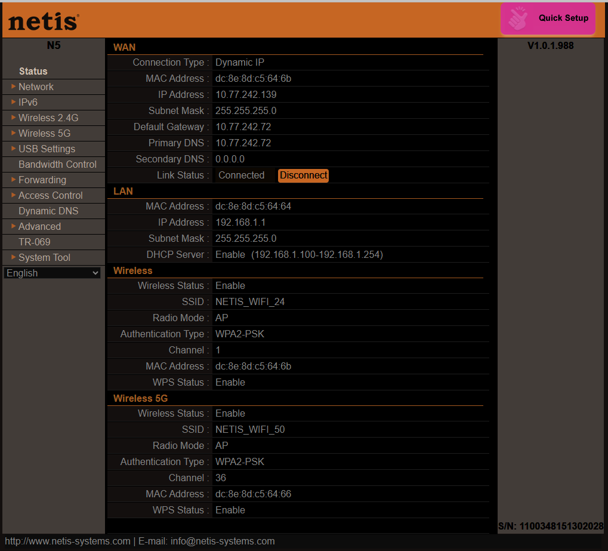

# Office LAN with Internet Access
Example of creating a local network in an office. Features:  
- Internet access via a smartphone hotspot  
- Fixed IP addresses for all devices  
- Home Assistant on a dedicated Raspberry Pi microcomputer  
- Connecting Thread end devices via the Home Assistant app on a smartphone  
- OpenThread Border Router (Espressif)  
- OpenThread Border Router (SmLight SLZB-06)  
- OpenThread Border Router (nRF52840 USB Dongle)  
- Yandex Hub + Yandex Smart Home for connecting and displaying Matter devices  
- Dedicated Ubuntu computer for creating ESP-Matter firmware for Thread end devices  
- Office computer with a Wi-Fi connection to the local network  
  
  
  
  
  
  
  
  
  
  
  
  
  
  
  
  
  
  
  
  
  
  
  
  
  
  
  
  
  
