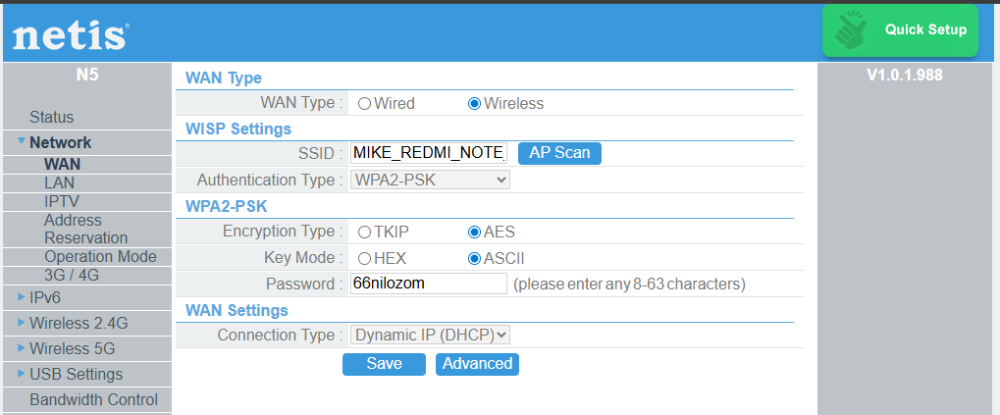

# Office LAN with Internet Access
Example of creating a local network in an office.

### Features
- Internet access via a smartphone hotspot  
- Fixed IP addresses for all devices  
- Home Assistant on a dedicated Raspberry Pi microcomputer  
- Connecting Thread end devices via the Home Assistant app on a smartphone  
- OpenThread Border Router (Espressif)  
- OpenThread Border Router (SmLight SLZB-06)  
- OpenThread Border Router (nRF52840 USB Dongle)  
- Yandex Hub + Yandex Smart Home for connecting and displaying Matter devices  
- Dedicated Ubuntu computer for creating ESP-Matter firmware for Thread end devices  
- Office computer with a Wi-Fi connection to the local network  

### Hardware
| IP            | MAC               | Protocol         | Model                      | Vendor                |
|--------------:|:-----------------:|:----------------:|:---------------------------|:----------------------|
|   192.168.1.1 | DC:8E:8D:C5:64:64 | Wi-Fi / Ethernet | Netis N5 Router            | Netis                 |
| 192.168.1.100 | 00:E0:4C:4E:81:1F | Ethernet         | DEXP Mini Ethernet         | DEXP                  |
| 192.168.1.101 | DC:A6:32:1C:D1:2C | Ethernet         | HA Office Ethernet         | HA                    |
| 192.168.1.123 | 00:0A:F5:C1:A3:4D | Wi-Fi            | Xiaomi Watch 2             | Xiaomi                |
| 192.168.1.150 | 70:68:71:80:48:0C | Wi-Fi            | DEXP Mini Wi-Fi            | DEXP                  |
| 192.168.1.151 | DC:A6:32:1C:D1:2D | Wi-Fi            | HA Office Wi-Fi            | HA                    |
| 192.168.1.152 | 64:63:06:2E:CA:ED | Wi-Fi            | Redmi Note 14 Wi-Fi        | HA                    |
| 192.168.1.153 | 44:71:47:11:F3:AB | Wi-Fi            | Xiaomi 12S Ultra           | Xiaomi                |
| 192.168.1.201 | 1C:69:20:93:CA:2B | Ethernet         | SmLight SLZB-06 Ethernet   | SmLight               |
| 192.168.1.202 | 28:37:2F:E2:60:EB | Ethernet         | OTBR #4 Ethernet           | Espressif             |
| 192.168.1.203 | 28:37:2F:E2:AF:33 | Ethernet         | OTBR #5 Ethernet           | Espressif             |
| 192.168.1.204 | 3C:0B:4F:11:15:09 | Ethernet         | Yandex Hub Ethernet        | Yandex                |
| 192.168.1.234 | 14:DA:E9:B0:AE:18 | Wi-Fi            | HP Office PC               | HP                    |
| 192.168.1.234 | 90:DE:80:A7:82:E1 | Wi-Fi            | Realtek 8812BU (USB HP PC) | Realtek Semiconductor |
| 192.168.1.250 | 7C:DF:A1:F3:56:58 | Wi-Fi            | OTBR #3 Wi-Fi              | Espressif             |
| 192.168.1.251 | 1C:69:20:93:CA:28 | Wi-Fi            | SmLight SLZB-06 Wi-Fi      | SmLight               |
| 192.168.1.252 | 28:37:2F:E2:60:E8 | Wi-Fi            | OTBR #4 Wi-Fi              | Espressif             |
| 192.168.1.253 | 28:37:2F:E2:AF:30 | Wi-Fi            | OTBR #5 Wi-Fi              | Espressif             |

  
  
  
  
  
  
  
  
  
  
  
  
  
  
  
  
  
  
  
  
  
  
  
  
  
  
  
  
  
