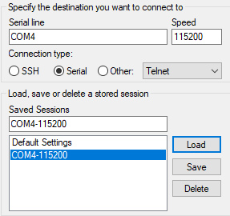
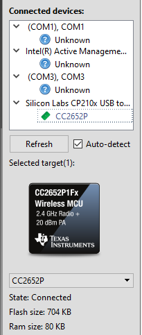
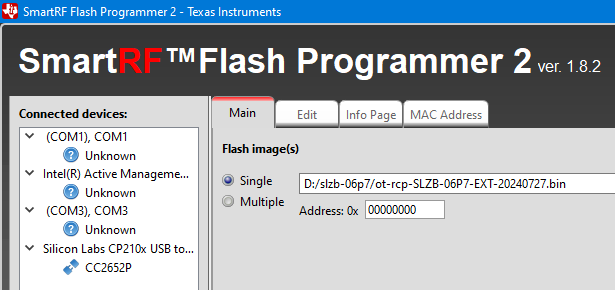
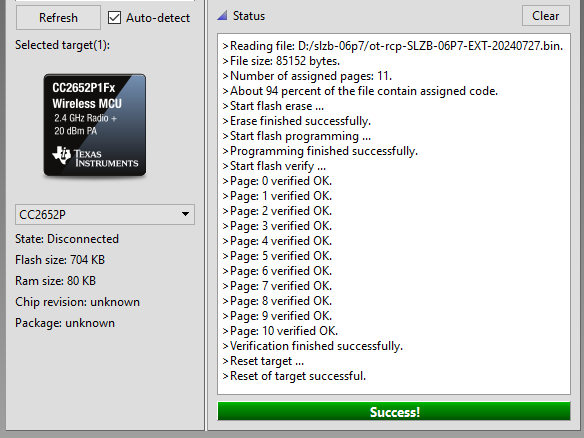
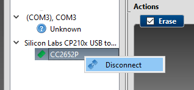
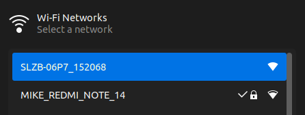
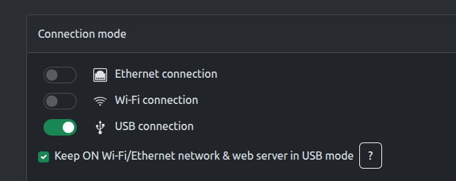
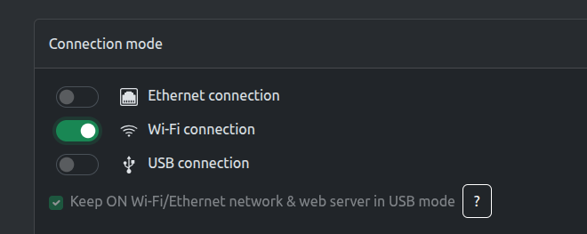

# Flash SmLight SLZB-06P7
If there is no prompt (>) when connecting to the COM port via PuTTY or screen and the version command does not respond, this means that the RCP firmware on the CC2652P7 chip is not active or was not written correctly. This is key information!
  

## 1) Reset to USB boot mode
Disconnect the USB cable from SmLight SLZB-06P7, press and hold the Reset button, connect the USB cable. Wait about 4 seconds, release and press the Reset button once again. Reset to USB boot mode is done if in addition to the yellow LED, the blue LED is constantly lit. It is possible that you won't be able to enter this mode the first time - try again and again...

## 2) Flash using SmartRF Flash Programmer 2 from TI
- select the port and specify the chip type
  

- select the firmware file
  

- flash
  

- disconnect
  

## 3) Connect to the internal Wi-Fi network
  

## 4) Current mode after flashing - USB connection
  

## 5) Change mode to Wi-Fi connection
  
