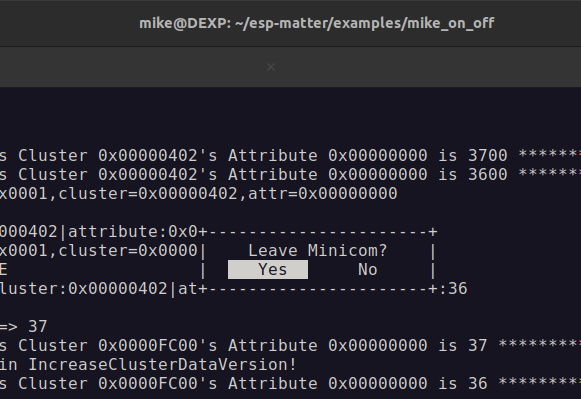

# UBUNTU: SHOULD BE INSTALLED

## To execute SUDO WITHOUT PASSWORD and get user "mike" a root access
Add user to "sudo" group:  
~~~
sudo usermod -aG sudo mike
~~~
Open /etc/sudoers and add the line:  
> mike ALL=(ALL:ALL) NOPASSWD: ALL  
  
To check:
~~~
grep '^sudo:' /etc/group
sudo ls
~~~

## MICRO is a terminal-based text editor
https://github.com/zyedidia/micro  
https://forum.garudalinux.org/t/mastering-the-micro-text-editor/32889  
~~~
sudo apt install micro
~~~
To set Micro as default editor, edit/add the following in ~/.selected_editor (for both, the current user and root):  
> SELECTED_EDITOR="/bin/micro"

Install some plugins for Micro:  
https://micro-editor.github.io/plugins.html  
~~~
micro -plugin install editorconfig   # https://github.com/10sr/editorconfig-micro
micro -plugin install manipulator    # https://github.com/NicolaiSoeborg/manipulator-plugin
micro -plugin install autofmt        # https://github.com/a11ce/micro-autofmt
micro -plugin install filemanager    # ???
~~~

## XSCREENSAVER
https://www.debugpoint.com/install-change-autostart-setup-screensaver-ubuntu-linux/
Install
~~~
sudo apt install xscreensaver
~~~
Check
~~~
xscreensaver --help
~~~
Autostart: add an item to Startup Application:
> Name:    XScreenSaver
> Command: xscreensaver -nosplash
> Comment: Run XScreenSaver in the background
~~~
sudo apt remove gnome-screensaver
~~~

Disable Wayland: in /etc/gdm3/custom.conf set:  
> WaylandEnable=false

<!--
## Anbox?
https://github.com/anbox/anbox  
-->

## AVAHI + MDNS
How to use the Avahi mDNS/DNS-SD daemon:  
https://sleeplessbeastie.eu/2023/07/05/how-to-use-the-avahi-daemon/  
  
In case of error like "Not loading module atk-bridge":
~~~
apt purge --simulate libatk-adaptor (without sudo)
sudo apt purge libatk-adaptor
sudo reboot
sudo apt install libatk-adaptor
sudo reboot
~~~

## RUN .APPIMAGE
1) Making it executable:
~~~
chmod a+x exampleName.AppImage
~~~
2) Execute it (not as root!):
~~~
./exampleName.AppImage
~~~
3) if error "error loading libfuse.so.2" occured, install this lib:
~~~
sudo apt install libfuse2
~~~

## TERMINALS AND MONITORS
### Minicom
~~~
sudo apt install minicom
minicom -help
minicom -D /dev/ttyACM0
~~~
Exit from the terminal: Ctrl+A => X  
  

### Screen
~~~
sudo apt install screen
screen /dev/ttyACM0 115200
~~~
Exit from the terminal: Ctrl+A => D  
This is the most common way to exit a screen session while keeping its processes and applications running.  
  
Exit from the terminal: Ctrl+A => K  
This method closes the screen session and any processes running within it.  

### Cu
~~~
sudo apt install cu
cu -l /dev/ttyACM0 -s 115200
~~~
Exit from the terminal: type ~. (tilde + dot) and press Enter  

## CHECK SOME...

### Scan IPs
How to scan for IP Addresses on your Network:
~~~
arp -a
~~~
> ? (10.41.235.157) at 7c:df:a1:f3:56:58 [ether] on wlp1s0
> ? (10.41.235.87) at 1e:2b:1e:e3:39:ba [ether] on wlp1s0
> ? (172.30.32.2) at 9e:81:96:26:69:4a [ether] on hassio

### Screenshots
1) Press PrtScn and select a screen area, window and the entire screen
2) Press (not everywhere!) Win + right mouse button, select "Take Screenshot" - a copy of the entire screen

### Terminal Tabs
Ctrl+PgUp: Switch to the previous tab  
Ctrl+PgDn: Switch to the next tab  

### Language layout
Win+Space: Switch between languages  

