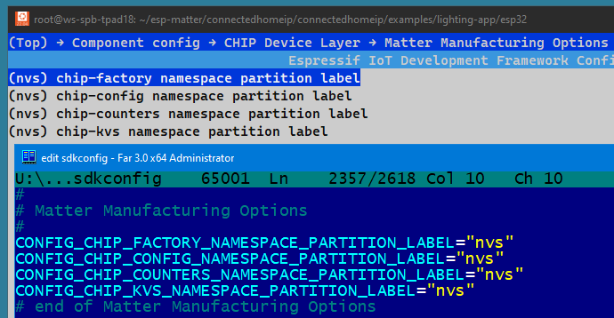

# Matter Manufacturing Partitions Generator Utility
Github: https://github.com/espressif/esp-matter-tools/tree/main/mfg_tool  
Espressif: https://docs.espressif.com/projects/esp-matter/en/latest/esp32/production.html#the-esp-matter-mfg-tool-example  

~~~
python3 -m pip install esp-matter-mfg-tool
~~~
Apps from "connectedhomeip/connectedhomeip/examples" folder.  
Example: ~/esp-matter/connectedhomeip/connectedhomeip/examples/lighting-app/esp32  
~~~
cd ~/esp-matter/connectedhomeip/connectedhomeip/examples/lighting-app/esp32
idf.py menuconfig
~~~
See: https://github.com/espressif/connectedhomeip/tree/9b8fffe0bb4e7ba7aac319f5905070a3476db7cb/examples/lighting-app/esp32  
https://github.com/espressif/connectedhomeip/blob/9b8fffe0bb4e7ba7aac319f5905070a3476db7cb/docs/platforms/esp32/build_app_and_commission.md  

#### THERE IS NO "ESP MATTER" ITEM AT ALL IN THE MENUCONFIG!
[Component config → ESP Matter → Device Instance Info Provider options → Device Instance Info - Factory]  
[Component config → ESP Matter → DAC Provider options → Attestation - Factory]  
[Component config → ESP Matter → DAC Provider options → Attestation - Secure Cert]  

#### THE MENUCONFIG CONTAINS THE FOLLOWING ITEMS:  
[Component config → CHIP Device Layer → Commissioning options → Use ESP32 Factory Data Provider]  
[Component config → CHIP Device Layer → Commissioning options → Use ESP32 Device Instance Info Provider]  
  
  
  
  
